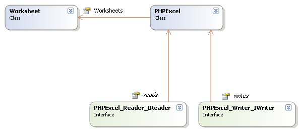
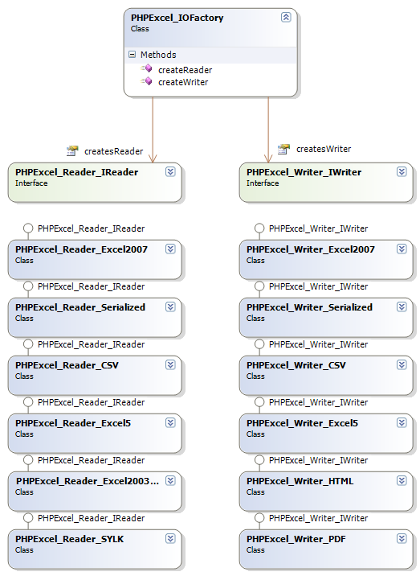
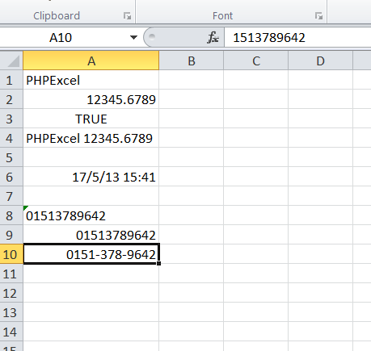
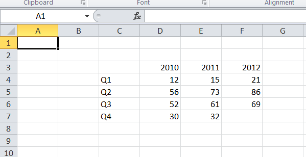
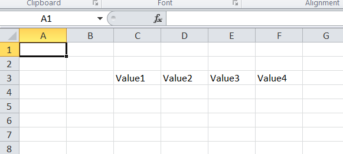
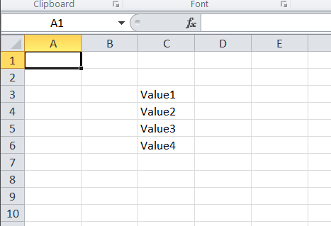

# Welcome to PhpSpreadsheet's documentation


PhpSpreadsheet is a library written in pure PHP and providing a set of
classes that allow you to read from and to write to different
spreadsheet file formats, like Excel and LibreOffice Calc.

# Getting started

## Software requirements

The following software is required to develop using PhpSpreadsheet:

-   PHP version 5.6 or newer
-   PHP extension php\_zip enabled (see
    [FAQ](./faq.md#php-complains-about-ziparchive-not-being-found))
-   PHP extension php\_xml enabled
-   PHP extension php\_gd2 enabled (if not compiled in)

## Installation instructions

Installation is quite easy: copy the contents of the Classes folder to
any location within your application source directories.

*Example:*

If your web root folder is /var/www/ you may want to create a subfolder
called /var/www/Classes/ and copy the files into that folder so you end
up with files:

    /var/www/Classes/PHPExcel.php
    /var/www/Classes/PHPExcel/Calculation.php
    /var/www/Classes/PHPExcel/Cell.php
    ...

## Getting started

A good way to get started is to run some of the tests included in the
download. Copy the "Examples" folder next to your "Classes" folder from
above so you end up with:

    /var/www/Examples/01simple.php
    /var/www/Examples/02types.php
    ...

Start running the tests by pointing your browser to the test scripts:

http://example.com/Tests/01simple.php
http://example.com/Tests/02types.php ...

**Note:** It may be necessary to modify the include/require statements
at the beginning of each of the test scripts if your "Classes" folder
from above is named differently.

## Useful links and tools

There are some links and tools which are very useful when developing
using PhpSpreadsheet.

### OpenXML / SpreadsheetML

-   [File format
    documentation](http://www.ecma-international.org/news/TC45_current_work/TC45_available_docs.htm)
-   [OpenXML Explained
    e-book](http://openxmldeveloper.org/articles/1970.aspx)
-   [Microsoft Office Compatibility Pack for Word, Excel, and PowerPoint
    2007 File
    Formats](http://www.microsoft.com/downloads/details.aspx?familyid=941b3470-3ae9-4aee-8f43-c6bb74cd1466&displaylang=en)
-   [OpenXML Package Explorer](http://www.codeplex.com/PackageExplorer/)

# Architecture

## Schematical



## AutoLoader

PhpSpreadsheet relies on Composer autoloader. So before working with
PhpSpreadsheet in standalone, be sure to run `composer install`. Or add it to a
pre-existing project with `composer require phpoffice/phpspreadsheet`.

## Spreadsheet in memory

PhpSpreadsheet's architecture is built in a way that it can serve as an
in-memory spreadsheet. This means that, if one would want to create a
web based view of a spreadsheet which communicates with PhpSpreadsheet's
object model, he would only have to write the front-end code.

Just like desktop spreadsheet software, PhpSpreadsheet represents a
spreadsheet containing one or more worksheets, which contain cells with
data, formulas, images, ...

## Readers and writers

On its own, the `Spreadsheet` class does not provide the functionality
to read from or write to a persisted spreadsheet (on disk or in a
database). To provide that functionality, readers and writers can be
used.

By default, the PhpSpreadsheet package provides some readers and
writers, including one for the Open XML spreadsheet format (a.k.a. Excel
2007 file format). You are not limited to the default readers and
writers, as you are free to implement the
\PhpOffice\PhpSpreadsheet\Reader\IReader and
\PhpOffice\PhpSpreadsheet\Writer\IWriter interface in a custom class.



## Fluent interfaces

PhpSpreadsheet supports fluent interfaces in most locations. This means
that you can easily "chain" calls to specific methods without requiring
a new PHP statement. For example, take the following code:

``` php
$spreadsheet->getProperties()->setCreator("Maarten Balliauw");
$spreadsheet->getProperties()->setLastModifiedBy("Maarten Balliauw");
$spreadsheet->getProperties()->setTitle("Office 2007 XLSX Test Document");
$spreadsheet->getProperties()->setSubject("Office 2007 XLSX Test Document");
$spreadsheet->getProperties()->setDescription("Test document for Office 2007 XLSX, generated using PHP classes.");
$spreadsheet->getProperties()->setKeywords("office 2007 openxml php");
$spreadsheet->getProperties()->setCategory("Test result file");
```

This can be rewritten as:

``` php
$spreadsheet->getProperties()
    ->setCreator("Maarten Balliauw")
    ->setLastModifiedBy("Maarten Balliauw")
    ->setTitle("Office 2007 XLSX Test Document")
    ->setSubject("Office 2007 XLSX Test Document")
    ->setDescription("Test document for Office 2007 XLSX, generated using PHP classes.")
    ->setKeywords("office 2007 openxml php")
    ->setCategory("Test result file");
```

> **Using fluent interfaces is not required** Fluent interfaces have
> been implemented to provide a convenient programming API. Use of them
> is not required, but can make your code easier to read and maintain.
> It can also improve performance, as you are reducing the overall
> number of calls to PhpSpreadsheet methods: in the above example, the
> `getProperties()` method is being called only once rather than 7 times
> in the non-fluent version.

# Creating a spreadsheet

## The `Spreadsheet` class

The `Spreadsheet` class is the core of PhpSpreadsheet. It contains
references to the contained worksheets, document security settings and
document meta data.

To simplify the PhpSpreadsheet concept: the `Spreadsheet` class
represents your workbook.

Typically, you will create a workbook in one of two ways, either by
loading it from a spreadsheet file, or creating it manually. A third
option, though less commonly used, is cloning an existing workbook that
has been created using one of the previous two methods.

### Loading a Workbook from a file

Details of the different spreadsheet formats supported, and the options
available to read them into a Spreadsheet object are described fully in
the [Reading Files](../topics/reading-files.md) document.

``` php
$inputFileName = './sampleData/example1.xls';

/** Load $inputFileName to a Spreadsheet object **/
$spreadsheet = \PhpOffice\PhpSpreadsheet\IOFactory::load($inputFileName);
```

### Creating a new workbook

If you want to create a new workbook, rather than load one from file,
then you simply need to instantiate it as a new Spreadsheet object.

``` php
/** Create a new Spreadsheet Object **/
$spreadsheet = new \PhpOffice\PhpSpreadsheet\Spreadsheet();
```

A new workbook will always be created with a single worksheet.

## Clearing a Workbook from memory

The PhpSpreadsheet object contains cyclic references (e.g. the workbook
is linked to the worksheets, and the worksheets are linked to their
parent workbook) which cause problems when PHP tries to clear the
objects from memory when they are unset(), or at the end of a function
when they are in local scope. The result of this is "memory leaks",
which can easily use a large amount of PHP's limited memory.

This can only be resolved manually: if you need to unset a workbook,
then you also need to "break" these cyclic references before doing so.
PhpSpreadsheet provides the disconnectWorksheets() method for this
purpose.

``` php
$spreadsheet->disconnectWorksheets();
unset($spreadsheet);
```

# Worksheets

A worksheet is a collection of cells, formulae, images, graphs, etc. It
holds all data necessary to represent a spreadsheet worksheet.

When you load a workbook from a spreadsheet file, it will be loaded with
all its existing worksheets (unless you specified that only certain
sheets should be loaded). When you load from non-spreadsheet files (such
as a CSV or HTML file) or from spreadsheet formats that don't identify
worksheets by name (such as SYLK), then a single worksheet called
"WorkSheet1" will be created containing the data from that file.

When you instantiate a new workbook, PhpSpreadsheet will create it with
a single worksheet called "WorkSheet1".

The `getSheetCount()` method will tell you the number of worksheets in
the workbook; while the `getSheetNames()` method will return a list of
all worksheets in the workbook, indexed by the order in which their
"tabs" would appear when opened in MS Excel (or other appropriate
Spreadsheet program).

Individual worksheets can be accessed by name, or by their index
position in the workbook. The index position represents the order that
each worksheet "tab" is shown when the workbook is opened in MS Excel
(or other appropriate Spreadsheet program). To access a sheet by its
index, use the `getSheet()` method.

``` php
// Get the second sheet in the workbook
// Note that sheets are indexed from 0
$spreadsheet->getSheet(1);
```

If you don't specify a sheet index, then the first worksheet will be
returned.

Methods also exist allowing you to reorder the worksheets in the
workbook.

To access a sheet by name, use the `getSheetByName()` method, specifying
the name of the worksheet that you want to access.

``` php
// Retrieve the worksheet called 'Worksheet 1'
$spreadsheet->getSheetByName('Worksheet 1');
```

Alternatively, one worksheet is always the currently active worksheet,
and you can access that directly. The currently active worksheet is the
one that will be active when the workbook is opened in MS Excel (or
other appropriate Spreadsheet program).

``` php
// Retrieve the current active worksheet
$spreadsheet->getActiveSheet();
```

You can change the currently active sheet by index or by name using the
`setActiveSheetIndex()` and `setActiveSheetIndexByName()` methods.

## Adding a new Worksheet

You can add a new worksheet to the workbook using the `createSheet()`
method of the `Spreadsheet` object. By default, this will be created as
a new "last" sheet; but you can also specify an index position as an
argument, and the worksheet will be inserted at that position, shuffling
all subsequent worksheets in the collection down a place.

``` php
$spreadsheet->createSheet();
```

A new worksheet created using this method will be called
"Worksheet&lt;n&gt;" where "&lt;n&gt;" is the lowest number possible to
guarantee that the title is unique.

Alternatively, you can instantiate a new worksheet (setting the title to
whatever you choose) and then insert it into your workbook using the
addSheet() method.

``` php
// Create a new worksheet called "My Data"
$myWorkSheet = new \PhpOffice\PhpSpreadsheet\Worksheet($spreadsheet, 'My Data');

// Attach the "My Data" worksheet as the first worksheet in the Spreadsheet object
$spreadsheet->addSheet($myWorkSheet, 0);
```

If you don't specify an index position as the second argument, then the
new worksheet will be added after the last existing worksheet.

## Copying Worksheets

Sheets within the same workbook can be copied by creating a clone of the
worksheet you wish to copy, and then using the addSheet() method to
insert the clone into the workbook.

``` php
$clonedWorksheet = clone $spreadsheet->getSheetByName('Worksheet 1');
$clonedWorksheet->setTitle('Copy of Worksheet 1')
$spreadsheet->addSheet($clonedWorksheet);
```

You can also copy worksheets from one workbook to another, though this
is more complex as PhpSpreadsheet also has to replicate the styling
between the two workbooks. The addExternalSheet() method is provided for
this purpose.

    $clonedWorksheet = clone $spreadsheet1->getSheetByName('Worksheet 1');
    $spreadsheet->addExternalSheet($clonedWorksheet);

In both cases, it is the developer's responsibility to ensure that
worksheet names are not duplicated. PhpSpreadsheet will throw an
exception if you attempt to copy worksheets that will result in a
duplicate name.

## Removing a Worksheet

You can delete a worksheet from a workbook, identified by its index
position, using the removeSheetByIndex() method

``` php
$sheetIndex = $spreadsheet->getIndex(
    $spreadsheet->getSheetByName('Worksheet 1')
);
$spreadsheet->removeSheetByIndex($sheetIndex);
```

If the currently active worksheet is deleted, then the sheet at the
previous index position will become the currently active sheet.

# Accessing cells

Accessing cells in a Spreadsheet should be pretty straightforward. This
topic lists some of the options to access a cell.

## Setting a cell value by coordinate

Setting a cell value by coordinate can be done using the worksheet's
`setCellValue()` method.

``` php
// Set cell A1 with a string value
$spreadsheet->getActiveSheet()->setCellValue('A1', 'PhpSpreadsheet');

// Set cell A2 with a numeric value
$spreadsheet->getActiveSheet()->setCellValue('A2', 12345.6789);

// Set cell A3 with a boolean value
$spreadsheet->getActiveSheet()->setCellValue('A3', TRUE);

// Set cell A4 with a formula
$spreadsheet->getActiveSheet()->setCellValue(
    'A4',
    '=IF(A3, CONCATENATE(A1, " ", A2), CONCATENATE(A2, " ", A1))'
);
```

Alternatively, you can retrieve the cell object, and then call the
cell’s setValue() method:

``` php
$spreadsheet->getActiveSheet()
    ->getCell('B8')
    ->setValue('Some value');
```

**Excel DataTypes**

MS Excel supports 7 basic datatypes - string - number - boolean - null -
formula - error - Inline (or rich text) string

By default, when you call the worksheet's `setCellValue()` method or the
cell's `setValue()` method, PhpSpreadsheet will use the appropriate
datatype for PHP nulls, booleans, floats or integers; or cast any string
data value that you pass to the method into the most appropriate
datatype, so numeric strings will be cast to numbers, while string
values beginning with “=” will be converted to a formula. Strings that
aren't numeric, or that don't begin with a leading "=" will be treated
as genuine string values.

This "conversion" is handled by a cell "value binder", and you can write
custom "value binders" to change the behaviour of these "conversions".
The standard PhpSpreadsheet package also provides an "advanced value
binder" that handles a number of more complex conversions, such as
converting strings with a fractional format like "3/4" to a number value
(0.75 in this case) and setting an appropriate "fraction" number format
mask. Similarly, strings like "5%" will be converted to a value of 0.05,
and a percentage number format mask applied, and strings containing
values that look like dates will be converted to Excel serialized
datetimestamp values, and a corresponding mask applied. This is
particularly useful when loading data from csv files, or setting cell
values from a database.

Formats handled by the advanced value binder include - TRUE or FALSE
(dependent on locale settings) are converted to booleans. - Numeric
strings identified as scientific (exponential) format are converted to
numbers. - Fractions and vulgar fractions are converted to numbers, and
an appropriate number format mask applied. - Percentages are converted
to numbers, divided by 100, and an appropriate number format mask
applied. - Dates and times are converted to Excel timestamp values
(numbers), and an appropriate number format mask applied. - When strings
contain a newline character ("\n"), then the cell styling is set to
wrap.

You can read more about value binders later in this section of the
documentation.

### Setting a date and/or time value in a cell

Date or time values are held as timestamp in Excel (a simple floating
point value), and a number format mask is used to show how that value
should be formatted; so if we want to store a date in a cell, we need to
calculate the correct Excel timestamp, and set a number format mask.

``` php
// Get the current date/time and convert to an Excel date/time
$dateTimeNow = time();
$excelDateValue = \PhpOffice\PhpSpreadsheet\Shared\Date::PHPToExcel( $dateTimeNow );
// Set cell A6 with the Excel date/time value
$spreadsheet->getActiveSheet()->setCellValue(
    'A6',
    $excelDateValue
);
// Set the number format mask so that the excel timestamp will be displayed as a human-readable date/time
$spreadsheet->getActiveSheet()->getStyle('A6')
    ->getNumberFormat()
    ->setFormatCode(
        \PhpOffice\PhpSpreadsheet\Style\NumberFormat::FORMAT_DATE_DATETIME
    );
```

### Setting a number with leading zeroes

By default, PhpSpreadsheet will automatically detect the value type and
set it to the appropriate Excel numeric datatype. This type conversion
is handled by a value binder, as described in the section of this
document entitled "Using value binders to facilitate data entry".

Numbers don't have leading zeroes, so if you try to set a numeric value
that does have leading zeroes (such as a telephone number) then these
will be normally be lost as the value is cast to a number, so
"01513789642" will be displayed as 1513789642.

There are two ways you can force PhpSpreadsheet to override this
behaviour.

Firstly, you can set the datatype explicitly as a string so that it is
not converted to a number.

``` php
// Set cell A8 with a numeric value, but tell PhpSpreadsheet it should be treated as a string
$spreadsheet->getActiveSheet()->setCellValueExplicit(
    'A8',
    "01513789642",
    \PhpOffice\PhpSpreadsheet\Cell\DataType::TYPE_STRING
);
```

Alternatively, you can use a number format mask to display the value
with leading zeroes.

``` php
// Set cell A9 with a numeric value
$spreadsheet->getActiveSheet()->setCellValue('A9', 1513789642);
// Set a number format mask to display the value as 11 digits with leading zeroes
$spreadsheet->getActiveSheet()->getStyle('A9')
    ->getNumberFormat()
    ->setFormatCode(
        '00000000000'
    );
```

With number format masking, you can even break up the digits into groups
to make the value more easily readable.

``` php
// Set cell A10 with a numeric value
$spreadsheet->getActiveSheet()->setCellValue('A10', 1513789642);
// Set a number format mask to display the value as 11 digits with leading zeroes
$spreadsheet->getActiveSheet()->getStyle('A10')
    ->getNumberFormat()
    ->setFormatCode(
        '0000-000-0000'
    );
```



**Note** that not all complex format masks such as this one will work
when retrieving a formatted value to display "on screen", or for certain
writers such as HTML or PDF, but it will work with the true spreadsheet
writers (Xlsx and Xls).

## Setting a range of cells from an array

It is also possible to set a range of cell values in a single call by
passing an array of values to the `fromArray()` method.

``` php
$arrayData = array(
    array(NULL, 2010, 2011, 2012),
    array('Q1',   12,   15,   21),
    array('Q2',   56,   73,   86),
    array('Q3',   52,   61,   69),
    array('Q4',   30,   32,    0),
);
$spreadsheet->getActiveSheet()
    ->fromArray(
        $arrayData,  // The data to set
        NULL,        // Array values with this value will not be set
        'C3'         // Top left coordinate of the worksheet range where
                     //    we want to set these values (default is A1)
    );
```



If you pass a 2-d array, then this will be treated as a series of rows
and columns. A 1-d array will be treated as a single row, which is
particularly useful if you're fetching an array of data from a database.

``` php
$rowArray = array('Value1', 'Value2', 'Value3', 'Value4');
$spreadsheet->getActiveSheet()
    ->fromArray(
        $rowArray,   // The data to set
        NULL,        // Array values with this value will not be set
        'C3'         // Top left coordinate of the worksheet range where
                     //    we want to set these values (default is A1)
    );
```



If you have a simple 1-d array, and want to write it as a column, then
the following will convert it into an appropriately structured 2-d array
that can be fed to the `fromArray()` method:

``` php
$rowArray = array('Value1', 'Value2', 'Value3', 'Value4');
$columnArray = array_chunk($rowArray, 1);
$spreadsheet->getActiveSheet()
    ->fromArray(
        $columnArray,   // The data to set
        NULL,           // Array values with this value will not be set
        'C3'            // Top left coordinate of the worksheet range where
                        //    we want to set these values (default is A1)
    );
```



## Retrieving a cell value by coordinate

To retrieve the value of a cell, the cell should first be retrieved from
the worksheet using the `getCell()` method. A cell's value can be read
using the `getValue()` method.

``` php
// Get the value fom cell A1
$cellValue = $spreadsheet->getActiveSheet()->getCell('A1')
    ->getValue();
```

This will retrieve the raw, unformatted value contained in the cell.

If a cell contains a formula, and you need to retrieve the calculated
value rather than the formula itself, then use the cell's
`getCalculatedValue()` method. This is further explained in .

``` php
// Get the value fom cell A4
$cellValue = $spreadsheet->getActiveSheet()->getCell('A4')
    ->getCalculatedValue();
```

Alternatively, if you want to see the value with any cell formatting
applied (e.g. for a human-readable date or time value), then you can use
the cell's `getFormattedValue()` method.

``` php
// Get the value fom cell A6
$cellValue = $spreadsheet->getActiveSheet()->getCell('A6')
    ->getFormattedValue();
```

## Setting a cell value by column and row

Setting a cell value by coordinate can be done using the worksheet's
`setCellValueByColumnAndRow()` method.

``` php
// Set cell B5 with a string value
$spreadsheet->getActiveSheet()->setCellValueByColumnAndRow(1, 5, 'PhpSpreadsheet');
```

**Note** that column references start with '0' for column 'A', rather
than from '1'.

## Retrieving a cell value by column and row

To retrieve the value of a cell, the cell should first be retrieved from
the worksheet using the getCellByColumnAndRow method. A cell’s value can
be read again using the following line of code:

``` php
// Get the value fom cell B5
$cellValue = $spreadsheet->getActiveSheet()->getCellByColumnAndRow(1, 5)
    ->getValue();
```

If you need the calculated value of a cell, use the following code. This
is further explained in .

``` php
// Get the value fom cell A4
$cellValue = $spreadsheet->getActiveSheet()->getCellByColumnAndRow(0, 4)
    ->getCalculatedValue();
```

## Retrieving a range of cell values to an array

It is also possible to retrieve a range of cell values to an array in a
single call using the `toArray()`, `rangeToArray()` or
`namedRangeToArray()` methods.

``` php
$dataArray = $spreadsheet->getActiveSheet()
    ->rangeToArray(
        'C3:E5',     // The worksheet range that we want to retrieve
        NULL,        // Value that should be returned for empty cells
        TRUE,        // Should formulas be calculated (the equivalent of getCalculatedValue() for each cell)
        TRUE,        // Should values be formatted (the equivalent of getFormattedValue() for each cell)
        TRUE         // Should the array be indexed by cell row and cell column
    );
```

These methods will all return a 2-d array of rows and columns. The
`toArray()` method will return the whole worksheet; `rangeToArray()`
will return a specified range or cells; while `namedRangeToArray()` will
return the cells within a defined `named range`.

## Looping through cells

### Looping through cells using iterators

The easiest way to loop cells is by using iterators. Using iterators,
one can use foreach to loop worksheets, rows within a worksheet, and
cells within a row.

Below is an example where we read all the values in a worksheet and
display them in a table.

``` php
$reader = \PhpOffice\PhpSpreadsheet\IOFactory::createReader('Xlsx');
$reader->setReadDataOnly(TRUE);
$spreadsheet = $reader->load("test.xlsx");

$worksheet = $spreadsheet->getActiveSheet();

echo '<table>' . PHP_EOL;
foreach ($worksheet->getRowIterator() as $row) {
    echo '<tr>' . PHP_EOL;
    $cellIterator = $row->getCellIterator();
    $cellIterator->setIterateOnlyExistingCells(FALSE); // This loops through all cells,
                                                       //    even if a cell value is not set.
                                                       // By default, only cells that have a value
                                                       //    set will be iterated.
    foreach ($cellIterator as $cell) {
        echo '<td>' .
             $cell->getValue() .
             '</td>' . PHP_EOL;
    }
    echo '</tr>' . PHP_EOL;
}
echo '</table>' . PHP_EOL;
```

Note that we have set the cell iterator's
`setIterateOnlyExistingCells()` to FALSE. This makes the iterator loop
all cells within the worksheet range, even if they have not been set.

The cell iterator will return a **NULL** as the cell value if it is not
set in the worksheet. Setting the cell iterator's
setIterateOnlyExistingCells() to FALSE will loop all cells in the
worksheet that can be available at that moment. This will create new
cells if required and increase memory usage! Only use it if it is
intended to loop all cells that are possibly available.

### Looping through cells using indexes

One can use the possibility to access cell values by column and row
index like (0,1) instead of 'A1' for reading and writing cell values in
loops.

Note: In PhpSpreadsheet column index is 0-based while row index is
1-based. That means 'A1' \~ (0,1)

Below is an example where we read all the values in a worksheet and
display them in a table.

``` php
$reader = \PhpOffice\PhpSpreadsheet\IOFactory::createReader('Xlsx');
$reader->setReadDataOnly(TRUE);
$spreadsheet = $reader->load("test.xlsx");

$worksheet = $spreadsheet->getActiveSheet();
// Get the highest row and column numbers referenced in the worksheet
$highestRow = $worksheet->getHighestRow(); // e.g. 10
$highestColumn = $worksheet->getHighestColumn(); // e.g 'F'
$highestColumnIndex = \PhpOffice\PhpSpreadsheet\Cell::columnIndexFromString($highestColumn); // e.g. 5

echo '<table>' . "\n";
for ($row = 1; $row <= $highestRow; ++$row) {
    echo '<tr>' . PHP_EOL;
    for ($col = 0; $col <= $highestColumnIndex; ++$col) {
        echo '<td>' .
             $worksheet->getCellByColumnAndRow($col, $row)
                 ->getValue() .
             '</td>' . PHP_EOL;
    }
    echo '</tr>' . PHP_EOL;
}
echo '</table>' . PHP_EOL;
```

Alternatively, you can take advantage of PHP's "Perl-style" character
incrementors to loop through the cells by coordinate:

``` php
$reader = \PhpOffice\PhpSpreadsheet\IOFactory::createReader('Xlsx');
$reader->setReadDataOnly(TRUE);
$spreadsheet = $reader->load("test.xlsx");

$worksheet = $spreadsheet->getActiveSheet();
// Get the highest row number and column letter referenced in the worksheet
$highestRow = $worksheet->getHighestRow(); // e.g. 10
$highestColumn = $worksheet->getHighestColumn(); // e.g 'F'
// Increment the highest column letter
$highestColumn++;

echo '<table>' . "\n";
for ($row = 1; $row <= $highestRow; ++$row) {
    echo '<tr>' . PHP_EOL;
    for ($col = 'A'; $col != $highestColumn; ++$col) {
        echo '<td>' .
             $worksheet->getCell($col . $row)
                 ->getValue() .
             '</td>' . PHP_EOL;
    }
    echo '</tr>' . PHP_EOL;
}
echo '</table>' . PHP_EOL;
```

Note that we can't use a &lt;= comparison here, because 'AA' would match
as &lt;= 'B', so we increment the highest column letter and then loop
while \$col != the incremented highest column.

## Using value binders to facilitate data entry

Internally, PhpSpreadsheet uses a default
\PhpOffice\PhpSpreadsheet\Cell\IValueBinder implementation
(\PhpOffice\PhpSpreadsheet\Cell\DefaultValueBinder) to determine data
types of entered data using a cell's `setValue()` method (the
`setValueExplicit()` method bypasses this check).

Optionally, the default behaviour of PhpSpreadsheet can be modified,
allowing easier data entry. For example, a
\PhpOffice\PhpSpreadsheet\Cell\AdvancedValueBinder class is available.
It automatically converts percentages, number in scientific format, and
dates entered as strings to the correct format, also setting the cell's
style information. The following example demonstrates how to set the
value binder in PhpSpreadsheet:

``` php
/** PhpSpreadsheet */
require_once 'src/Boostrap.php';

// Set value binder
\PhpOffice\PhpSpreadsheet\Cell::setValueBinder( new \PhpOffice\PhpSpreadsheet\Cell\AdvancedValueBinder() );

// Create new Spreadsheet object
$spreadsheet = new \PhpOffice\PhpSpreadsheet\Spreadsheet();

// ...
// Add some data, resembling some different data types
$spreadsheet->getActiveSheet()->setCellValue('A4', 'Percentage value:');
// Converts the string value to 0.1 and sets percentage cell style
$spreadsheet->getActiveSheet()->setCellValue('B4', '10%');

$spreadsheet->getActiveSheet()->setCellValue('A5', 'Date/time value:');
// Converts the string value to an Excel datestamp and sets the date format cell style
$spreadsheet->getActiveSheet()->setCellValue('B5', '21 December 1983');
```

**Creating your own value binder is easy.** When advanced value binding
is required, you can implement the
\PhpOffice\PhpSpreadsheet\Cell\IValueBinder interface or extend the
\PhpOffice\PhpSpreadsheet\Cell\DefaultValueBinder or
\PhpOffice\PhpSpreadsheet\Cell\AdvancedValueBinder classes.

# Reading and writing to file

As you already know from part REF \_Ref191885438 \w \h 3.3 REF
\_Ref191885438 \h Readers and writers, reading and writing to a
persisted storage is not possible using the base PhpSpreadsheet classes.
For this purpose, PhpSpreadsheet provides readers and writers, which are
implementations of \PhpOffice\PhpSpreadsheet\Reader\IReader and
\PhpOffice\PhpSpreadsheet\Writer\IWriter.

## \PhpOffice\PhpSpreadsheet\IOFactory

The PhpSpreadsheet API offers multiple methods to create a
\PhpOffice\PhpSpreadsheet\Reader\IReader or
\PhpOffice\PhpSpreadsheet\Writer\IWriter instance:

Direct creation via \PhpOffice\PhpSpreadsheet\IOFactory. All examples
underneath demonstrate the direct creation method. Note that you can
also use the \PhpOffice\PhpSpreadsheet\IOFactory class to do this.

### Creating \PhpOffice\PhpSpreadsheet\Reader\IReader using \PhpOffice\PhpSpreadsheet\IOFactory

There are 2 methods for reading in a file into PhpSpreadsheet: using
automatic file type resolving or explicitly.

Automatic file type resolving checks the different
\PhpOffice\PhpSpreadsheet\Reader\IReader distributed with
PhpSpreadsheet. If one of them can load the specified file name, the
file is loaded using that \PhpOffice\PhpSpreadsheet\Reader\IReader.
Explicit mode requires you to specify which
\PhpOffice\PhpSpreadsheet\Reader\IReader should be used.

You can create a \PhpOffice\PhpSpreadsheet\Reader\IReader instance using
\PhpOffice\PhpSpreadsheet\IOFactory in automatic file type resolving
mode using the following code sample:

``` php
$spreadsheet = \PhpOffice\PhpSpreadsheet\IOFactory::load("05featuredemo.xlsx");
```

A typical use of this feature is when you need to read files uploaded by
your users, and you don’t know whether they are uploading xls or xlsx
files.

If you need to set some properties on the reader, (e.g. to only read
data, see more about this later), then you may instead want to use this
variant:

``` php
$reader = \PhpOffice\PhpSpreadsheet\IOFactory::createReaderForFile("05featuredemo.xlsx");
$reader->setReadDataOnly(true);
$reader->load("05featuredemo.xlsx");
```

You can create a \PhpOffice\PhpSpreadsheet\Reader\IReader instance using
\PhpOffice\PhpSpreadsheet\IOFactory in explicit mode using the following
code sample:

``` php
$reader = \PhpOffice\PhpSpreadsheet\IOFactory::createReader("Xlsx");
$spreadsheet = $reader->load("05featuredemo.xlsx");
```

Note that automatic type resolving mode is slightly slower than explicit
mode.

### Creating \PhpOffice\PhpSpreadsheet\Writer\IWriter using \PhpOffice\PhpSpreadsheet\IOFactory

You can create a PhpOffice\PhpSpreadsheet\Writer\IWriter instance using
\PhpOffice\PhpSpreadsheet\IOFactory:

``` php
$writer = \PhpOffice\PhpSpreadsheet\IOFactory::createWriter($spreadsheet, "Xlsx");
$writer->save("05featuredemo.xlsx");
```

## Excel 2007 (SpreadsheetML) file format

Xlsx file format is the main file format of PhpSpreadsheet. It allows
outputting the in-memory spreadsheet to a .xlsx file.

### \PhpOffice\PhpSpreadsheet\Reader\Xlsx

#### Reading a spreadsheet

You can read an .xlsx file using the following code:

``` php
$reader = new \PhpOffice\PhpSpreadsheet\Reader\Xlsx();
$spreadsheet = $reader->load("05featuredemo.xlsx");
```

#### Read data only

You can set the option setReadDataOnly on the reader, to instruct the
reader to ignore styling, data validation, … and just read cell data:

``` php
$reader = new \PhpOffice\PhpSpreadsheet\Reader\Xlsx();
$reader->setReadDataOnly(true);
$spreadsheet = $reader->load("05featuredemo.xlsx");
```

#### Read specific sheets only

You can set the option setLoadSheetsOnly on the reader, to instruct the
reader to only load the sheets with a given name:

``` php
$reader = new \PhpOffice\PhpSpreadsheet\Reader\Xlsx();
$reader->setLoadSheetsOnly( array("Sheet 1", "My special sheet") );
$spreadsheet = $reader->load("05featuredemo.xlsx");
```

#### Read specific cells only

You can set the option setReadFilter on the reader, to instruct the
reader to only load the cells which match a given rule. A read filter
can be any class which implements
\PhpOffice\PhpSpreadsheet\Reader\IReadFilter. By default, all cells are
read using the \PhpOffice\PhpSpreadsheet\Reader\DefaultReadFilter.

The following code will only read row 1 and rows 20 – 30 of any sheet in
the Excel file:

``` php
class MyReadFilter implements \PhpOffice\PhpSpreadsheet\Reader\IReadFilter {

    public function readCell($column, $row, $worksheetName = '') {
        // Read title row and rows 20 - 30
        if ($row == 1 || ($row >= 20 && $row <= 30)) {
            return true;
        }
        return false;
    }
}

$reader = new \PhpOffice\PhpSpreadsheet\Reader\Xlsx();
$reader->setReadFilter( new MyReadFilter() );
$spreadsheet = $reader->load("06largescale.xlsx");
```

### \PhpOffice\PhpSpreadsheet\Writer\Xlsx

#### Writing a spreadsheet

You can write an .xlsx file using the following code:

``` php
$writer = new \PhpOffice\PhpSpreadsheet\Writer\Xlsx($spreadsheet);
$writer->save("05featuredemo.xlsx");
```

#### Formula pre-calculation

By default, this writer pre-calculates all formulas in the spreadsheet.
This can be slow on large spreadsheets, and maybe even unwanted. You can
however disable formula pre-calculation:

``` php
$writer = new \PhpOffice\PhpSpreadsheet\Writer\Xlsx($spreadsheet);
$writer->setPreCalculateFormulas(false);
$writer->save("05featuredemo.xlsx");
```

#### Office 2003 compatibility pack

Because of a bug in the Office2003 compatibility pack, there can be some
small issues when opening Xlsx spreadsheets (mostly related to formula
calculation). You can enable Office2003 compatibility with the following
code:

    $writer = new \PhpOffice\PhpSpreadsheet\Writer\Xlsx($spreadsheet);
    $writer->setOffice2003Compatibility(true);
    $writer->save("05featuredemo.xlsx");

**Office2003 compatibility should only be used when needed** Office2003
compatibility option should only be used when needed. This option
disables several Office2007 file format options, resulting in a
lower-featured Office2007 spreadsheet when this option is used.

## Excel 5 (BIFF) file format

Xls file format is the old Excel file format, implemented in
PhpSpreadsheet to provide a uniform manner to create both .xlsx and .xls
files. It is basically a modified version of [PEAR
Spreadsheet\_Excel\_Writer](http://pear.php.net/package/Spreadsheet_Excel_Writer),
although it has been extended and has fewer limitations and more
features than the old PEAR library. This can read all BIFF versions that
use OLE2: BIFF5 (introduced with office 95) through BIFF8, but cannot
read earlier versions.

Xls file format will not be developed any further, it just provides an
additional file format for PhpSpreadsheet.

**Excel5 (BIFF) limitations** Please note that BIFF file format has some
limits regarding to styling cells and handling large spreadsheets via
PHP.

### \PhpOffice\PhpSpreadsheet\Reader\Xls

#### Reading a spreadsheet

You can read an .xls file using the following code:

``` php
$reader = new \PhpOffice\PhpSpreadsheet\Reader\Xls();
$spreadsheet = $reader->load("05featuredemo.xls");
```

#### Read data only

You can set the option setReadDataOnly on the reader, to instruct the
reader to ignore styling, data validation, … and just read cell data:

``` php
$reader = new \PhpOffice\PhpSpreadsheet\Reader\Xls();
$reader->setReadDataOnly(true);
$spreadsheet = $reader->load("05featuredemo.xls");
```

#### Read specific sheets only

You can set the option setLoadSheetsOnly on the reader, to instruct the
reader to only load the sheets with a given name:

``` php
$reader = new \PhpOffice\PhpSpreadsheet\Reader\Xls();
$reader->setLoadSheetsOnly( array("Sheet 1", "My special sheet") );
$spreadsheet = $reader->load("05featuredemo.xls");
```

#### Read specific cells only

You can set the option setReadFilter on the reader, to instruct the
reader to only load the cells which match a given rule. A read filter
can be any class which implements
\PhpOffice\PhpSpreadsheet\Reader\IReadFilter. By default, all cells are
read using the \PhpOffice\PhpSpreadsheet\Reader\DefaultReadFilter.

The following code will only read row 1 and rows 20 to 30 of any sheet
in the Excel file:

``` php
class MyReadFilter implements \PhpOffice\PhpSpreadsheet\Reader\IReadFilter {

    public function readCell($column, $row, $worksheetName = '') {
        // Read title row and rows 20 - 30
        if ($row == 1 || ($row >= 20 && $row <= 30)) {
            return true;
        }
        return false;
    }
}

$reader = new \PhpOffice\PhpSpreadsheet\Reader\Xls();
$reader->setReadFilter( new MyReadFilter() );
$spreadsheet = $reader->load("06largescale.xls");
```

### \PhpOffice\PhpSpreadsheet\Writer\Xls

#### Writing a spreadsheet

You can write an .xls file using the following code:

``` php
$writer = new \PhpOffice\PhpSpreadsheet\Writer\Xls($spreadsheet);
$writer->save("05featuredemo.xls");
```

## Excel 2003 XML file format

Excel 2003 XML file format is a file format which can be used in older
versions of Microsoft Excel.

**Excel 2003 XML limitations** Please note that Excel 2003 XML format
has some limits regarding to styling cells and handling large
spreadsheets via PHP.

### \PhpOffice\PhpSpreadsheet\Reader\Xml

#### Reading a spreadsheet

You can read an Excel 2003 .xml file using the following code:

``` php
$reader = new \PhpOffice\PhpSpreadsheet\Reader\Xml();
$spreadsheet = $reader->load("05featuredemo.xml");
```

#### Read specific cells only

You can set the option setReadFilter on the reader, to instruct the
reader to only load the cells which match a given rule. A read filter
can be any class which implements
\PhpOffice\PhpSpreadsheet\Reader\IReadFilter. By default, all cells are
read using the \PhpOffice\PhpSpreadsheet\Reader\DefaultReadFilter.

The following code will only read row 1 and rows 20 to 30 of any sheet
in the Excel file:

``` php
class MyReadFilter implements \PhpOffice\PhpSpreadsheet\Reader\IReadFilter {

    public function readCell($column, $row, $worksheetName = '') {
        // Read title row and rows 20 - 30
        if ($row == 1 || ($row >= 20 && $row <= 30)) {
            return true;
        }
        return false;
    }

}

$reader = new \PhpOffice\PhpSpreadsheet\Reader\Xml();
$reader->setReadFilter( new MyReadFilter() );
$spreadsheet = $reader->load("06largescale.xml");
```

## Symbolic LinK (SYLK)

Symbolic Link (SYLK) is a Microsoft file format typically used to
exchange data between applications, specifically spreadsheets. SYLK
files conventionally have a .slk suffix. Composed of only displayable
ANSI characters, it can be easily created and processed by other
applications, such as databases.

**SYLK limitations** Please note that SYLK file format has some limits
regarding to styling cells and handling large spreadsheets via PHP.

### \PhpOffice\PhpSpreadsheet\Reader\Slk

#### Reading a spreadsheet

You can read an .slk file using the following code:

``` php
$reader = new \PhpOffice\PhpSpreadsheet\Reader\Slk();
$spreadsheet = $reader->load("05featuredemo.slk");
```

#### Read specific cells only

You can set the option setReadFilter on the reader, to instruct the
reader to only load the cells which match a given rule. A read filter
can be any class which implements
\PhpOffice\PhpSpreadsheet\Reader\IReadFilter. By default, all cells are
read using the \PhpOffice\PhpSpreadsheet\Reader\DefaultReadFilter.

The following code will only read row 1 and rows 20 to 30 of any sheet
in the SYLK file:

``` php
class MyReadFilter implements \PhpOffice\PhpSpreadsheet\Reader\IReadFilter {

    public function readCell($column, $row, $worksheetName = '') {
        // Read title row and rows 20 - 30
        if ($row == 1 || ($row >= 20 && $row <= 30)) {
            return true;
        }
        return false;
    }

}

$reader = new \PhpOffice\PhpSpreadsheet\Reader\Slk();
$reader->setReadFilter( new MyReadFilter() );
$spreadsheet = $reader->load("06largescale.slk");
```

## Open/Libre Office (.ods)

Open Office or Libre Office .ods files are the standard file format for
Open Office or Libre Office Calc files.

### \PhpOffice\PhpSpreadsheet\Reader\Ods

#### Reading a spreadsheet

You can read an .ods file using the following code:

``` php
$reader = new \PhpOffice\PhpSpreadsheet\Reader\Ods();
$spreadsheet = $reader->load("05featuredemo.ods");
```

#### Read specific cells only

You can set the option setReadFilter on the reader, to instruct the
reader to only load the cells which match a given rule. A read filter
can be any class which implements
\PhpOffice\PhpSpreadsheet\Reader\IReadFilter. By default, all cells are
read using the \PhpOffice\PhpSpreadsheet\Reader\DefaultReadFilter.

The following code will only read row 1 and rows 20 to 30 of any sheet
in the Calc file:

``` php
class MyReadFilter implements \PhpOffice\PhpSpreadsheet\Reader\IReadFilter {

    public function readCell($column, $row, $worksheetName = '') {
        // Read title row and rows 20 - 30
        if ($row == 1 || ($row >= 20 && $row <= 30)) {
            return true;
        }
        return false;
    }

}

$reader = new PhpOffice\PhpSpreadsheet\Reader\Ods();
$reader->setReadFilter( new MyReadFilter() );
$spreadsheet = $reader->load("06largescale.ods");
```

## CSV (Comma Separated Values)

CSV (Comma Separated Values) are often used as an import/export file
format with other systems. PhpSpreadsheet allows reading and writing to
CSV files.

**CSV limitations** Please note that CSV file format has some limits
regarding to styling cells, number formatting, ...

### \PhpOffice\PhpSpreadsheet\Reader\Csv

#### Reading a CSV file

You can read a .csv file using the following code:

``` php
$reader = new \PhpOffice\PhpSpreadsheet\Reader\Csv();
$spreadsheet = $reader->load("sample.csv");
```

#### Setting CSV options

Often, CSV files are not really “comma separated”, or use semicolon (;)
as a separator. You can instruct
\PhpOffice\PhpSpreadsheet\Reader\Csv some options before reading a CSV
file.

Note that \PhpOffice\PhpSpreadsheet\Reader\Csv by default assumes that
the loaded CSV file is UTF-8 encoded. If you are reading CSV files that
were created in Microsoft Office Excel the correct input encoding may
rather be Windows-1252 (CP1252). Always make sure that the input
encoding is set appropriately.

``` php
$reader = new \PhpOffice\PhpSpreadsheet\Reader\Csv();
$reader->setInputEncoding('CP1252');
$reader->setDelimiter(';');
$reader->setEnclosure('');
$reader->setLineEnding("\r\n");
$reader->setSheetIndex(0);

$spreadsheet = $reader->load("sample.csv");
```

#### Read a specific worksheet

CSV files can only contain one worksheet. Therefore, you can specify
which sheet to read from CSV:

``` php
$reader->setSheetIndex(0);
```

#### Read into existing spreadsheet

When working with CSV files, it might occur that you want to import CSV
data into an existing `Spreadsheet` object. The following code loads a
CSV file into an existing \$spreadsheet containing some sheets, and
imports onto the 6th sheet:

``` php
$reader = new \PhpOffice\PhpSpreadsheet\Reader\Csv();
$reader->setDelimiter(';');
$reader->setEnclosure('');
$reader->setLineEnding("\r\n");
$reader->setSheetIndex(5);

$reader->loadIntoExisting("05featuredemo.csv", $spreadsheet);
```

### \PhpOffice\PhpSpreadsheet\Writer\Csv

#### Writing a CSV file

You can write a .csv file using the following code:

``` php
$writer = new \PhpOffice\PhpSpreadsheet\Writer\Csv($spreadsheet);
$writer->save("05featuredemo.csv");
```

#### Setting CSV options

Often, CSV files are not really “comma separated”, or use semicolon (;)
as a separator. You can instruct
\PhpOffice\PhpSpreadsheet\Writer\Csv some options before writing a CSV
file:

``` php
$writer = new \PhpOffice\PhpSpreadsheet\Writer\Csv($spreadsheet);
$writer->setDelimiter(';');
$writer->setEnclosure('');
$writer->setLineEnding("\r\n");
$writer->setSheetIndex(0);

$writer->save("05featuredemo.csv");
```

#### Write a specific worksheet

CSV files can only contain one worksheet. Therefore, you can specify
which sheet to write to CSV:

``` php
$writer->setSheetIndex(0);
```

#### Formula pre-calculation

By default, this writer pre-calculates all formulas in the spreadsheet.
This can be slow on large spreadsheets, and maybe even unwanted. You can
however disable formula pre-calculation:

``` php
$writer = new \PhpOffice\PhpSpreadsheet\Writer\Csv($spreadsheet);
$writer->setPreCalculateFormulas(false);
$writer->save("05featuredemo.csv");
```

#### Writing UTF-8 CSV files

A CSV file can be marked as UTF-8 by writing a BOM file header. This can
be enabled by using the following code:

``` php
$writer = new \PhpOffice\PhpSpreadsheet\Writer\Csv($spreadsheet);
$writer->setUseBOM(true);
$writer->save("05featuredemo.csv");
```

#### Decimal and thousands separators

If the worksheet you are exporting contains numbers with decimal or
thousands separators then you should think about what characters you
want to use for those before doing the export.

By default PhpSpreadsheet looks up in the server's locale settings to
decide what characters to use. But to avoid problems it is recommended
to set the characters explicitly as shown below.

English users will want to use this before doing the export:

``` php
\PhpOffice\PhpSpreadsheet\Shared\StringHelper::setDecimalSeparator('.');
\PhpOffice\PhpSpreadsheet\Shared\StringHelper::setThousandsSeparator(',');
```

German users will want to use the opposite values.

``` php
\PhpOffice\PhpSpreadsheet\Shared\StringHelper::setDecimalSeparator(',');
\PhpOffice\PhpSpreadsheet\Shared\StringHelper::setThousandsSeparator('.');
```

Note that the above code sets decimal and thousand separators as global
options. This also affects how HTML and PDF is exported.

## HTML

PhpSpreadsheet allows you to read or write a spreadsheet as HTML format,
for quick representation of the data in it to anyone who does not have a
spreadsheet application on their PC, or loading files saved by other
scripts that simply create HTML markup and give it a .xls file
extension.

**HTML limitations** Please note that HTML file format has some limits
regarding to styling cells, number formatting, ...

### \PhpOffice\PhpSpreadsheet\Reader\Html

#### Reading a spreadsheet

You can read an .html or .htm file using the following code:

``` php
$reader = new \PhpOffice\PhpSpreadsheet\Reader\Html();

$spreadsheet = $reader->load("05featuredemo.html");
```

**HTML limitations** Please note that HTML reader is still experimental
and does not yet support merged cells or nested tables cleanly

### \PhpOffice\PhpSpreadsheet\Writer\Html

Please note that \PhpOffice\PhpSpreadsheet\Writer\Html only outputs the
first worksheet by default.

#### Writing a spreadsheet

You can write a .htm file using the following code:

``` php
$writer = new \PhpOffice\PhpSpreadsheet\Writer\Html($spreadsheet);

$writer->save("05featuredemo.htm");
```

#### Write all worksheets

HTML files can contain one or more worksheets. If you want to write all
sheets into a single HTML file, use the following code:

``` php
$writer->writeAllSheets();
```

#### Write a specific worksheet

HTML files can contain one or more worksheets. Therefore, you can
specify which sheet to write to HTML:

``` php
$writer->setSheetIndex(0);
```

#### Setting the images root of the HTML file

There might be situations where you want to explicitly set the included
images root. For example, one might want to see

``` html

```

instead of

``` html
.
```

You can use the following code to achieve this result:

``` php
$writer->setImagesRoot('http://www.example.com');
```

#### Formula pre-calculation

By default, this writer pre-calculates all formulas in the spreadsheet.
This can be slow on large spreadsheets, and maybe even unwanted. You can
however disable formula pre-calculation:

``` php
$writer = new \PhpOffice\PhpSpreadsheet\Writer\Html($spreadsheet);
$writer->setPreCalculateFormulas(false);

$writer->save("05featuredemo.htm");
```

#### Embedding generated HTML in a web page

There might be a situation where you want to embed the generated HTML in
an existing website. \PhpOffice\PhpSpreadsheet\Writer\Html provides
support to generate only specific parts of the HTML code, which allows
you to use these parts in your website.

Supported methods:

-   generateHTMLHeader()
-   generateStyles()
-   generateSheetData()
-   generateHTMLFooter()

Here's an example which retrieves all parts independently and merges
them into a resulting HTML page:

``` php
<?php
$writer = new \PhpOffice\PhpSpreadsheet\Writer\Html($spreadsheet);
echo $writer->generateHTMLHeader();
?>

<style>
<!--
html {
    font-family: Times New Roman;
    font-size: 9pt;
    background-color: white;
}

<?php
echo $writer->generateStyles(false); // do not write <style> and </style>
?>

-->
</style>

<?php
echo $writer->generateSheetData();
echo $writer->generateHTMLFooter();
?>
```

#### Writing UTF-8 HTML files

A HTML file can be marked as UTF-8 by writing a BOM file header. This
can be enabled by using the following code:

``` php
$writer = new \PhpOffice\PhpSpreadsheet\Writer\Html($spreadsheet);
$writer->setUseBOM(true);

$writer->save("05featuredemo.htm");
```

#### Decimal and thousands separators

See section \PhpOffice\PhpSpreadsheet\Writer\Csv how to control the
appearance of these.

## PDF

PhpSpreadsheet allows you to write a spreadsheet into PDF format, for
fast distribution of represented data.

**PDF limitations** Please note that PDF file format has some limits
regarding to styling cells, number formatting, ...

### \PhpOffice\PhpSpreadsheet\Writer\Pdf

PhpSpreadsheet’s PDF Writer is a wrapper for a 3rd-Party PDF Rendering
library such as tcPDF, mPDF or DomPDF. You must now install a PDF
rendering library yourself; but PhpSpreadsheet will work with a number
of different libraries.

Currently, the following libraries are supported:

Library | Downloadable from                   | PhpSpreadsheet Internal Constant
--------|-------------------------------------|---------------------------------
tcPDF   | https://github.com/tecnickcom/tcpdf | PDF_RENDERER_TCPDF
mPDF    | https://github.com/mpdf/mpdf        | PDF_RENDERER_MPDF
domPDF  | https://github.com/dompdf/dompdf    | PDF_RENDERER_DOMPDF

The different libraries have different strengths and weaknesses. Some
generate better formatted output than others, some are faster or use
less memory than others, while some generate smaller .pdf files. It is
the developers choice which one they wish to use, appropriate to their
own circumstances.

Before instantiating a Writer to generate PDF output, you will need to
indicate which Rendering library you are using.

``` php
$rendererName = \PhpOffice\PhpSpreadsheet\Settings::PDF_RENDERER_MPDF;
\PhpOffice\PhpSpreadsheet\Settings::setPdfRendererName($rendererName);
```

#### Writing a spreadsheet

Once you have identified the Renderer that you wish to use for PDF
generation, you can write a .pdf file using the following code:

``` php
$writer = new \PhpOffice\PhpSpreadsheet\Writer\Pdf($spreadsheet);
$writer->save("05featuredemo.pdf");
```

Please note that \PhpOffice\PhpSpreadsheet\Writer\Pdf only outputs the
first worksheet by default.

#### Write all worksheets

PDF files can contain one or more worksheets. If you want to write all
sheets into a single PDF file, use the following code:

``` php
$writer->writeAllSheets();
```

#### Write a specific worksheet

PDF files can contain one or more worksheets. Therefore, you can specify
which sheet to write to PDF:

``` php
$writer->setSheetIndex(0);
```

#### Formula pre-calculation

By default, this writer pre-calculates all formulas in the spreadsheet.
This can be slow on large spreadsheets, and maybe even unwanted. You can
however disable formula pre-calculation:

``` php
$writer = new \PhpOffice\PhpSpreadsheet\Writer\Pdf($spreadsheet);
$writer->setPreCalculateFormulas(false);

$writer->save("05featuredemo.pdf");
```

#### Decimal and thousands separators

See section \PhpOffice\PhpSpreadsheet\Writer\Csv how to control the
appearance of these.

## Generating Excel files from templates (read, modify, write)

Readers and writers are the tools that allow you to generate Excel files
from templates. This requires less coding effort than generating the
Excel file from scratch, especially if your template has many styles,
page setup properties, headers etc.

Here is an example how to open a template file, fill in a couple of
fields and save it again:

``` php
$spreadsheet = \PhpOffice\PhpSpreadsheet\IOFactory::load('template.xlsx');

$worksheet = $spreadsheet->getActiveSheet();

$worksheet->getCell('A1')->setValue('John');
$worksheet->getCell('A2')->setValue('Smith');

$writer = \PhpOffice\PhpSpreadsheet\IOFactory::createWriter($spreadsheet, 'Xls');
$writer->save('write.xls');
```

Notice that it is ok to load an xlsx file and generate an xls file.

# Credits

Please refer to the internet page [contributor
list](https://github.com/PHPOffice/PhpSpreadsheet/graphs/contributors)
for up-to-date credits.
