# Behind the Mask

When we look at a spreadsheet in MS Excel, we normally see it neatly formatted so that it is easy for a human to read.

Internally, that spreadsheet comprises a set of values that are normally either numbers or text (occasionally boolean `TRUE` or `FALSE`); or a formula that results in a number, text or boolean value. Unlike PHP, MS Excel doesn't differentiate between `integer` or `float`; but all numbers can be presented as integer or with decimals, as dates or percentages, as currency, even made to look like telephone numbers.
A zero value can be made to look like `0` or `0.00`, like `-`, or even like a text string `zero`. Positive values can be displayed in one colour, negative values in another.

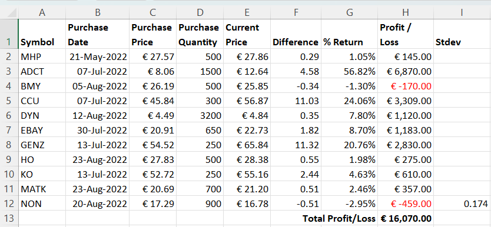
Behind this Stock Portfolio table example, with the exception of the headings and the stock symbols, every value is a number; but each column is rendered in a manner that provides meaning to our human eye -
`Purchase Date` as a day-month-year date; `Purchase Price` and `Current Price` as monetary values with a currency code; `Purchase Quantity` as an integer value and `Difference` as a float with 2 decimals; `% Return` as a percentage; and `Profit/Loss` as a monetary value with a currency code, thousands separator, and negative values highlighted in red; `Stdev` with 3 decimals -
and all styled by using a Number Format Mask.

## Reading a Cell Value

PhpSpreadsheet provides three methods for reading a Cell value.
If we use the Cell's `getValue()` method, we are retrieving the underlying value (or the formula) for that cell. If the Cell contains a formula, then we can use the `getCalculatedValue()` method to see the result of evaluating that formula. If we want to see the value as it is displayed in MS Excel, then we need to use `getFormattedValue()`.

Reading Cells from the Worksheet shown above:
```php
var_dump($worksheet->getCell('C4')->getValue());
var_dump($worksheet->getCell('C4')->getCalculatedValue());
var_dump($worksheet->getCell('C4')->getFormattedValue());

var_dump($worksheet->getCell('H4')->getValue());
var_dump($worksheet->getCell('H4')->getCalculatedValue());
var_dump($worksheet->getCell('H4')->getFormattedValue());
```
we see the different results for cell `C4` (a simple numeric value formatted as a Currency) and cell `H4` (a formula that evaluates to a numeric value, and formatted as a Currency):
```
float(26.19)
float(26.19)
string(9) "€ 26.19"

string(8) "=$F4*$D4"
float(-170)
string(11) "€ -170.00"
```
Note that getting the formatted value will always evaluate a formula to render the result.

### Reading a Cell's Formatting Mask

PhpSpreadsheet also provides methods that allow us to look at the format mask itself:
```php
var_dump($worksheet->getCell('C4')
    ->getStyle()->getNumberFormat()->getFormatCode());

var_dump($worksheet->getCell('H4')
    ->getStyle()->getNumberFormat()->getFormatCode());
```
and we can see the Format Masks for those cells:
```
string(20) "[$€-413]\ #,##0.00"

string(48) "[$€-413]\ #,##0.00;[Red][$€-413]\ \-#,##0.00"
```
> **Note**: that the space and sign in the mask are non-breaking characters, so they are rendered to output as "\ " and "\-" respectively when var_dumped. This prevents breaking the displayed value across two lines.

## Setting a Cell's Formatting Mask

When you are using a spreadsheet application like MS Excel, the application will try to decide what Format Mask should be used for a cell as you enter the value, based on that value and your locale settings; and with varying degrees of success.
If the value looks like a Currency, then it will be converted to a number and an appropriate Currency Mask set; similarly if you type something that looks like a percentage; and it is often a joke that Excel identifies many values as Dates (even if that was never the intent), and sets a Date Format Mask.
The default Mask if no specific type can be identified from the value is "General". 

PhpSpreadsheet doesn't do this by default. If you enter a value in a cell, then it will not convert that value from a string containing a currency symbol to a number: it will remain a string. Nor will it change any existing Format Mask: and if that value is a new cell, then it will be assigned a default Format Mask of "General".
It will convert a string value to a numeric if it looks like a number with or without decimals (but without leading zeroes), or in scientific format; but it still won't change the Format Mask.

```php
// Set Cell C21 using a formatted string value
$worksheet->getCell('C20')->setValue('€ -1234.567');

// The Cell value should be the string that we set
var_dump($worksheet->getCell('C20')->getValue());
// The Format Mask should be "General"
var_dump($worksheet->getCell('C20')
    ->getStyle()->getNumberFormat()->getFormatCode());
// The formatted value should still be the string that we set
var_dump($worksheet->getCell('C20')->getFormattedValue());

// Set Cell C21 using a numeric value
$worksheet->getCell('C21')->setValue('-1234.567');

// The numeric string value should have been converted to a float
var_dump($worksheet->getCell('C21')->getValue());
// The Format Mask should be "General"
var_dump($worksheet->getCell('C21')
    ->getStyle()->getNumberFormat()->getFormatCode());
var_dump($worksheet->getCell('C21')->getFormattedValue());

// Change the Format Mask for C21 to a Currency mask
$worksheet->getCell('C21')
        ->getStyle()->getNumberFormat()->setFormatCode('€ #,##0;€ -#,##0');

// The float value should still be the same
var_dump($worksheet->getCell('C21')->getValue());
// The Format Mask should be the new mask that we set
var_dump($worksheet->getCell('C21')
    ->getStyle()->getNumberFormat()->getFormatCode());
// The value should now be formatted as a Currency
var_dump($worksheet->getCell('C21')->getFormattedValue());
```
giving
```php
string(13) "€ -1234.567"
string(7) "General"
string(13) "€ -1234.567"

float(-1234.567)
string(7) "General"
string(9) "-1234.567"

float(-1234.567)
string(20) "€ #,##0;€ -#,##0"
string(10) "€ -1,235"
```

If you wish to emulate the MS Excel behaviour, and automatically convert string values that represent Currency, Dates, Fractions, Percentages, etc. then the Advanced Value Binder attempts to identify these, to convert to a number, and to set an appropriate Format Mask.

You can do this by changing the Value Binder, which will then apply every time you set a Cell value.
```php
// Old method using static property
Cell::setValueBinder(new AdvancedValueBinder());
// Preferred method using dynamic property since 3.4.0
$spreadsheet->setValueBinder(new AdvancedValueBinder());

// Set Cell C21 using a formatted string value
$worksheet->getCell('C20')->setValue('€ -12345.6789');

// The Cell value is a float of -12345.6789
var_dump($worksheet->getCell('C20')->getValue());
// The format code is "[$€]#,##0.00_-"
var_dump($worksheet->getCell('C20')
    ->getStyle()->getNumberFormat()->getFormatCode());
// The formatted value is  "€-12,345.68 "
var_dump($worksheet->getCell('C20')->getFormattedValue());
```

Or (since version 1.28.0) you can specify a Value Binder to use just for that one call to set the Cell's value.

```php
// Set Cell C21 using a formatted string value, but using a Value Binder
$worksheet->getCell('C20')->setValue('€ -12345.6789', new AdvancedValueBinder());

// The Cell value is a float of -12345.6789
var_dump($worksheet->getCell('C20')->getValue());
// The format code is "[$€]#,##0.00_-"
var_dump($worksheet->getCell('C20')
    ->getStyle()->getNumberFormat()->getFormatCode());
// The formatted value is  "€-12,345.68 "
var_dump($worksheet->getCell('C20')->getFormattedValue());
```
While PhpSpreadsheet's Advanced Value Binder isn't as "sophisticated" as MS Excel at recognising formats that should be converted to numbers, or at setting a mask that exactly matches the entered value, it can simplify entering data from formatted strings; and is particularly useful when reading untyped or loosely formatted files like a CSV.

> **Warning**: Remember that setting a Cell value explicitly bypasses the Value Binder, so you will always have to set the Format Mask manually if you are using `setValueExplicit()` to set Cell values.

## Using Formatting Masks in the TEXT() Function

We can also use Number Formatting Masks directly in Excel's `TEXT()` Function, without setting the mask for a Cell.

```php
$worksheet->getCell('A1')->setValue(12345.678);
$worksheet->getCell('B1')
    ->setValue('#.00" Surplus";-#.00" Deficit";"Out of Stock"');
$worksheet->getCell('C1')->setValue('=TEXT(A1,B1)');

var_dump($worksheet->getCell('C1')->getCalculatedValue()); // 12,345.68 Surplus


$worksheet->getCell('A2')->setValue(-12345.678);
$worksheet->getCell('C2')
    ->setValue('=TEXT(A2,"#,##0.00"" Surplus"";-#,##0.00"" Deficit"";""Out of Stock""")');

var_dump($worksheet->getCell('C2')->getCalculatedValue()); // -12,345.68 Deficit
```
Remember that you'll need to escape double quotes in the mask argument by double double-quoting them if you pass the mask directly as an string.
It's generally easier to read if you store the mask as text in a cell, and then pass the cell reference as the mask argument.

## Changing a Cell's Formatting Mask

In PhpSpreadsheet we can change a Cell's Formatting Mask at any time just by setting a new FormatCode for that Cell.
The library provides a number of "pre-defined" Masks as Constants in the `NumberFormat` class, prefixed with 'FORMAT_', but isn't limited to these values - the mask itself is just a string value - and the value passed to `setFormatCode()` can be any valid Excel Format Mask string.
> **Note**: The Mask value isn't validated: it's up to you, as the developer, to ensure that you set a meaningful Mask value. 

And while Excel applies an initial Mask to every Cell when we enter a value (even if it's just the default "General"), we can still always change that Mask.
This is managed through the "Number" block in the "Home" ribbon.

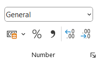

This provides us with some simple options for increasing or decreasing the number of decimals displayed, if we want a thousands separator, a currency code to use, etc.

But if we use the "pull down" for that block, we access the "Number" tab of "Format Cells" that provides a lot more options.

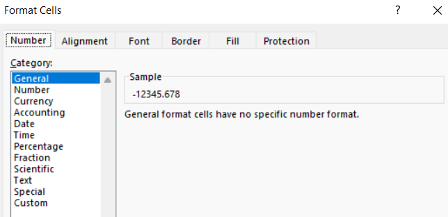

This gives us access to a number of "Wizards" for different "Categories" of masking, as well as "Custom", which allows us to build our own masks.

Since version 1.28.0, PhpSpreadsheet has also provided a set of "Wizards", allowing for the easier creation of Mask values for most Categories.
In many cases, you will need to enable PHP's `Intl` extension in order to use the Wizards.

## Mask Categories

I'll describe "Custom" Mask values later in this article; but let's take a look at the "Wizard" options for each "Category" first.

### General

This is the default Mask, and is "adaptive".
Numbers will appear with as many decimals as have been entered for the value (to the limit of a 9 or 10 digit display; additional decimals will be rounded), while very large or very small values will display in Scientific format.

### Number

Excel's Number "Wizard"  allows you to specify the number of decimals, and whether to use a thousands separator (or not).
It also offers a few ways to display negative values (with or without a sign, highlighted in red).

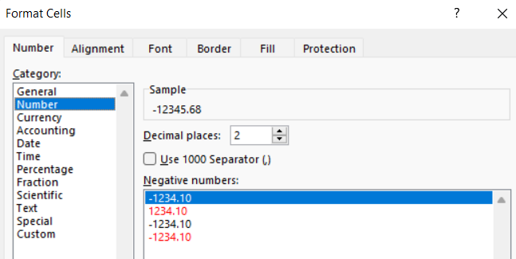

A typical mask will look something like '0.00' (2 decimals, with no thousands separator) or '#,##0.000' (3 decimals with a thousands separator).

The PhpSpreadsheet Number "Wizard" allows you to specify the number of decimals, and the use of a thousands separator.
The defaults are 2 decimal places, and to use a thousands separator.

```php
use PhpOffice\PhpSpreadsheet\Style\NumberFormat\Wizard\Number;

// Set Cell value
$worksheet->getCell('C20')->setValue(-12345.67890);

// Set Cell Style using the Number Wizard to build the Format Mask
$worksheet->getCell('C20')
    ->getStyle()->getNumberFormat()
    ->setFormatCode((string) new Number(3, Number::WITH_THOUSANDS_SEPARATOR));

var_dump($worksheet->getCell('C20')
    ->getStyle()->getNumberFormat()->getFormatCode()); // "#,##0.000"
var_dump($worksheet->getCell('C20')->getFormattedValue()); // "-12,345.679"
```

PhpSpreadsheet's Number Wizard doesn't yet offer options for displaying negative values; they will simply be masked so that they always display the sign.
But alternative masking for negative values is an option that may be added in the future.

### Currency

The Currency "Wizard" in MS Excel has similar options to the Number "Wizard", but also requires that you specify a currency code.

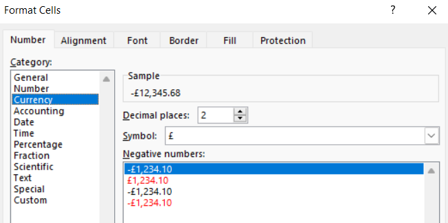

The "Symbol" dropdown provides a lot of locale-specific variants of the same currencies - for example '€ Netherlands', where the currency symbol is displayed before the value, and any negative sign appears before the currency "-€ 12,345.68"; or '€ France',  where the symbol is displayed after the value "-12,345.68 €".

The PhpSpreadsheet Currency "Wizard" allows you to specify the currency code, number of decimals, and the use of a thousands separator.
In addition, optionally, you can also specify whether the currency symbol should be leading or trailing, and whether it should be separated from the value or not.
Finally, you have a choice of 4 ways of specifying negative values - minus sign, minus sign with the field in red, parentheses, and parentheses with the field in red.
 
```php
use PhpOffice\PhpSpreadsheet\Style\NumberFormat\Wizard\Currency;
use PhpOffice\PhpSpreadsheet\Style\NumberFormat\Wizard\Number;

// Set Cell value
$worksheet->getCell('C20')->setValue(-12345.67890);

// Set Cell Style using the Currency Wizard to build the Format Mask
$currencyMask = new Currency(
    '€',
    2,
    Number::WITH_THOUSANDS_SEPARATOR,
    Currency::TRAILING_SYMBOL,
    Currency::SYMBOL_WITH_SPACING
);
$worksheet->getCell('C20')
    ->getStyle()->getNumberFormat()
    ->setFormatCode($currencyMask);

var_dump($worksheet->getCell('C20')
    ->getStyle()->getNumberFormat()->getFormatCode()); // #,##0.00 €
var_dump($worksheet->getCell('C20')->getFormattedValue()); // -12,345.68 €
```
A typical Currency mask might look something like '#,##0.00 €', with the currency symbol as a literal.

The Currency Code itself may be a literal character, as here with the `€` symbol; or it can be wrapped in square braces with a `$` symbol to indicate that this is a currency and the next character as the currency symbol to use, and then (optionally) a locale code or an LCID (Locale ID) like `[$€-de-DE]` or `[$€-1031]`.

I wouldn't recommend using LCIDs in your code, a locale code is a lot easier to recognise and understand; but if you do need to reference LCIDs, then you can find a list [here](https://learn.microsoft.com/en-us/openspecs/office_standards/ms-oe376/6c085406-a698-4e12-9d4d-c3b0ee3dbc4a).

Alternatively, if you have PHP's `Intl` extension installed, you can specify a currency code and a locale code.
If you use this option, then locale values must be a valid formatted locale string (e.g. `en-GB`, `fr`, `uz-Arab-AF`); and the Wizard will use the format defined in ICU (International Components for Unicode): any values that you provide for placement of the currency symbol, etc. will be ignored.
The only argument that won't be ignored is an explicit value of 0 for the decimals, which will create a mask to display only major currency units.

```php
use PhpOffice\PhpSpreadsheet\Style\NumberFormat\Wizard\Currency;
use PhpOffice\PhpSpreadsheet\Style\NumberFormat\Wizard\Number;

// Set Cell value
$worksheet->getCell('C21')->setValue(-12345.67890);

// Set Cell Style using the Currency Wizard to build the Format Mask for a locale
$localeCurrencyMask = new Currency(
    '€',
    locale: 'de_DE'
);
$worksheet->getCell('C21')
    ->getStyle()->getNumberFormat()
    ->setFormatCode($localeCurrencyMask);

var_dump($worksheet->getCell('C21')
    ->getStyle()->getNumberFormat()->getFormatCode()); // #,##0.00 [$€-de-DE]
var_dump($worksheet->getCell('C21')->getFormattedValue()); // -12,345.68 €
```
If we use the locale in the "Wizard", then a typical mask might look like '#,##0.00 [$€-de-DE]', with the currency wrapped in braces, a `$` to indicate that this is a localised value, and the locale included.
 > Note: The Wizard does not accept LCIDs.

### Accounting

Excel's Accounting "Wizard" is like the Currency "Wizard", but without the options for presenting negative values.
Presentation of zero and negative values is dependent on the currency and locale.

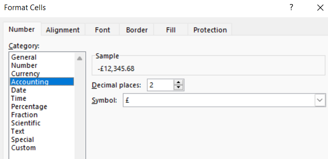

The options available for the PhpSpreadsheet Accounting "Wizard" are identical to those of the Currency "Wizard"; although the generated Mask is different.

```php
use PhpOffice\PhpSpreadsheet\Style\NumberFormat\Wizard\Accounting;
use PhpOffice\PhpSpreadsheet\Style\NumberFormat\Wizard\Currency;
use PhpOffice\PhpSpreadsheet\Style\NumberFormat\Wizard\Number;

// Set Cell value
$worksheet->getCell('C20')->setValue(-12345.67890);

// Set Cell Style using the Accounting Wizard to build the Format Mask
$currencyMask = new Accounting(
    '€',
    2,
    Number::WITH_THOUSANDS_SEPARATOR,
    Currency::TRAILING_SYMBOL,
    Currency::SYMBOL_WITH_SPACING
);
$worksheet->getCell('C20')
    ->getStyle()->getNumberFormat()
    ->setFormatCode($currencyMask);

var_dump($worksheet->getCell('C20')
    ->getStyle()->getNumberFormat()->getFormatCode()); // _-#,##0.00 €*_-
var_dump($worksheet->getCell('C20')->getFormattedValue()); //  -12,345.68 €
```
A typical Accounting mask might look something like '_-#,##0.00 €*_-', with the currency symbol as a literal; and with placement indicators like `_-`, that ensure the alignment of the currency symbols and decimal points of numbers in a column.

As with using a locale with the Currency "Wizard", when you use a locale with the Accounting "Wizard" the locale value must be valid, and any additional options will be ignored.
```php
use PhpOffice\PhpSpreadsheet\Style\NumberFormat\Wizard\Accounting;
use PhpOffice\PhpSpreadsheet\Style\NumberFormat\Wizard\Currency;
use PhpOffice\PhpSpreadsheet\Style\NumberFormat\Wizard\Number;

// Set Cell value
$worksheet->getCell('C21')->setValue(-12345.67890);

// Set Cell Style using the Accounting Wizard to build the Format Mask for a locale
$localeCurrencyMask = new Accounting(
    '€',
    locale: 'nl_NL'
);
$worksheet->getCell('C21')
    ->getStyle()->getNumberFormat()
    ->setFormatCode($localeCurrencyMask);

var_dump($worksheet->getCell('C21')
    ->getStyle()->getNumberFormat()->getFormatCode()); // [$€-nl-NL] #,##0.00;([$€-nl-NL] #,##0.00)
var_dump($worksheet->getCell('C21')->getFormattedValue()); // (€ 12,345.68)
```
If we use the locale in the "Wizard", then a typical mask might look like '[$€-nl-NL] #,##0.00;([$€-nl-NL] #,##0.00)', with the currency wrapped in braces, with a `$` to indicate that this is a localised value, and the locale included.
And in this case, there is masking for zero and for negative values, although without colour. An option to add colour to values is an option that may be added in a future release.

> **Warning**: Not all versions of the ICU (International Components for Unicode) support Accounting formats, so even if your PHP does have 'Intl' enabled, it may still not allow the use of locale for generating an Accounting Mask.

### Date

When you use the Excel Date "Wizard", you can select a locale and you'll then be presented with a number of date format options that are appropriate for that locale.

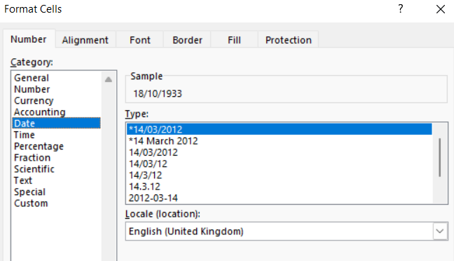

I've written in detail about Date Format Masks elsewhere in "The Dating Game"; but to summarise, here are the Mask codes used for Date formatting.

| Code  | Description                         | Example (January 3, 2023)             |
|-------|-------------------------------------|---------------------------------------|
| m     | Month number without a leading zero | 1                                     |
| mm    | Month number with a leading zero    | 01                                    |
| mmm   | Month name, short form              | Jan                                   |
| mmmm  | Month name, full form               | January                               |
| mmmmm | Month as the first letter           | J (stands for January, June and July) |
| d     | Day number without a leading zero   | 3                                     |
| dd    | Day number with a leading zero      | 03                                    |
| ddd   | Day of the week, short form         | Tue                                   |
| dddd  | Day of the week, full form          | Tuesday                               |
| yy    | Year (last 2 digits)                | 23                                    |
| yyyy  | Year (4 digits)                     | 2023                                  |


### Time

As with Dates, when you use the Excel Time "Wizard", you can select a locale and you'll then be presented with a number of time format options that are appropriate for that locale.

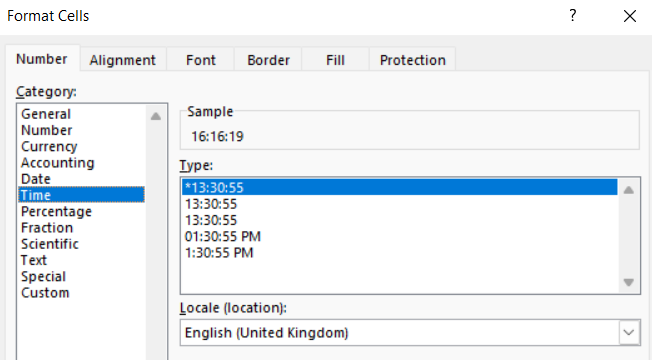

I've written in detail about Time Format Masks elsewhere in "The Dating Game"; but to summarise, here are the Mask codes used for Time formatting.

| Code   | Description                                                        | Displays as |
|--------|--------------------------------------------------------------------|-------------|
| h      | Hours without a leading zero                                       | 0-23        |
| hh     | Hours with a leading zero                                          | 00-23       |
| m      | Minutes without a leading zero                                     | 0-59        |
| mm     | Minutes with a leading zero                                        | 00-59       |
| s      | Seconds without a leading zero                                     | 0-59        |
| ss     | Seconds with a leading zero                                        | 00-59       |
| AM/PM  | Periods of the day <br/>(if omitted, 24-hour time format is used)  | AM or PM    |

Excel also supports Masks for Time Durations (note that spreadsheets using the 1904 base date can display negative durations, but those using the 1900 base date cannot). There is no "Wizard" for this; but the following Mask codes can be used to display Durations.

| Code    | Description                                                    | Displays as |
|---------|----------------------------------------------------------------|-------------|
| [h]:mm  | Elapsed time in hours                                          | e.g. 25:02  |
| [hh]:mm | Elapsed time in hours<br>with a leading zero if less than 10   | e.g. 05:02  |
| [mm]:ss | Elapsed time in minutes                                        | e.g. 63:46  |
| [m]:ss  | Elapsed time in minutes<br>with a leading zero if less than 10 | e.g. 03:46  |
| [s]     | Elapsed time in seconds                                        |             |
| [ss]    | Elapsed time in seconds<br>with a leading zero if less than 10 |             |

### Percentage

This is among the simplest of the Excel "Wizards", only allowing you to specify the number of decimals to be displayed.

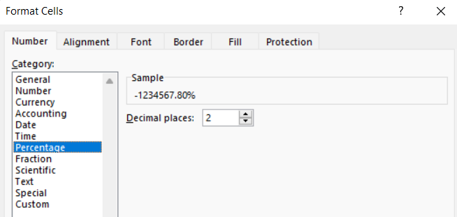

The Percentage mask looks like '0.00%'.

Using the `%` code in a mask will multiply the value by 100 before rendering it, and it will always also display the `%` sign.

The PhpSpreadsheet "Wizard" replicates this simple option; but also provides a locale option that allows locale-specific formatting, because there are a few locales where the percentage sign appears before the value rather than after it.
As with all locale use for the PhpSpreadsheet "Wizard", this is dependent on having the `Intl` extension enabled.

```php
use PhpOffice\PhpSpreadsheet\Style\NumberFormat\Wizard\Percentage;

// Set Cell value
$worksheet->getCell('C21')->setValue(-12345.67890);

// Set Cell Style using the Percentage Wizard to build the Format Mask for a locale
$localeCurrencyMask = new Percentage(
    locale: 'tr_TR'
);
$worksheet->getCell('C21')
    ->getStyle()->getNumberFormat()
    ->setFormatCode($localeCurrencyMask);

var_dump($worksheet->getCell('C21')
    ->getStyle()->getNumberFormat()->getFormatCode()); // %#,##0.00
var_dump($worksheet->getCell('C21')->getFormattedValue()); // %-12,345.68
```

### Fraction

MS Excel presents two different options for fractions: the first where the denominator is calculated internally to either 1, 2 or 3 digits; and the second (introduced only recently) where the denominator is fixed as 2, 4, 8 or 16.

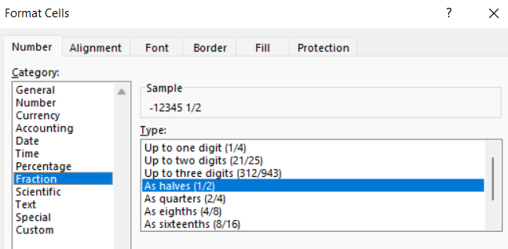

The Fraction mask looks like '# ?/???' where `#` indicates that the integer part of the value should be displayed, and then `?/???` to display the fraction with up to 3 digits in the denominator.
The mask using a fixed-denominator looks like '# ?/16', with the denominator value replacing the variable `?`.

If you use digit placeholders (`/??`) for the denominator, then Excel will calculate the lowest denominator that it can use for the fractional value. If you specify a fixed denominator (e.g. `/8`) then Excel will calculate the fraction in eighths.

> **Note:** The internal renderer in PhpSpreadsheet does not consider the number of digits for the denominator, but will simply try to identify the lowest value denominator that it can use.

There is currently no PhpSpreadsheet "Wizard" for Fraction Masks.

### Scientific

This is among the simplest of the Excel "Wizards", only allowing you to specify the number of decimals to be displayed.

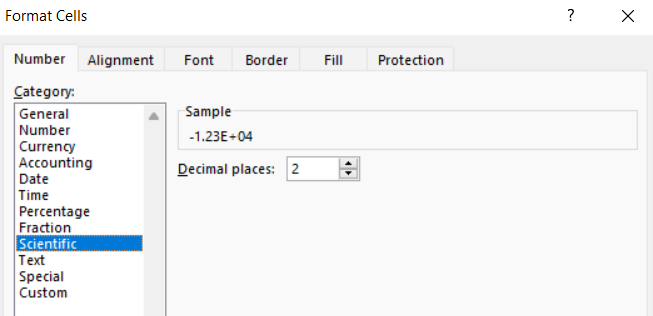

The Scientific mask looks like '0.00E+00'.

> **Note**: The internal rendering used by PhpSpreadsheet will display only as many digits as necessary for the exponent; while the Excel mask specifies a minimum of 2 digits, with a leading zero if necessary.

The PhpSpreadsheet "Wizard" replicates this simple option.
```php
use PhpOffice\PhpSpreadsheet\Style\NumberFormat\Wizard\Scientific;

// Set Cell value
$worksheet->getCell('C20')->setValue(-12345.67890);

// Set Cell Style using the Scientific Wizard to build the Format Mask
$scientificMask = new Scientific(
    4,
);
$worksheet->getCell('C20')
    ->getStyle()->getNumberFormat()
    ->setFormatCode($scientificMask);

var_dump($worksheet->getCell('C20')
    ->getStyle()->getNumberFormat()->getFormatCode()); // 0.0000E+00
var_dump($worksheet->getCell('C20')->getFormattedValue()); //  -1.2346E+4

// Set Cell value
$worksheet->getCell('C21')->setValue(-12345.67890);

// Set Cell Style using the Scientific Wizard to build the Format Mask for a locale
$localeScientificMask = new Scientific(
    3,
    locale: 'nl_NL'
);
$worksheet->getCell('C21')
    ->getStyle()->getNumberFormat()
    ->setFormatCode($localeScientificMask);

var_dump($worksheet->getCell('C21')
    ->getStyle()->getNumberFormat()->getFormatCode()); // 0.000E+00
var_dump($worksheet->getCell('C21')->getFormattedValue()); // -1.235E+4
```

If you specify a number of decimals to display, then the Scientific "Wizard" will apply that value, even when using a locale.

### Text

MS Excel's Text "Wizard" has no options, but simply sets a mask to `@`, meaning display the value exactly as it is entered.
Unlike `General`, which is adaptive, `@` will not change the displayed value in any way, except in one exceptional case (see note below).
Very large or very small values will not be displayed in Scientific format, and leading zeroes will be displayed.

>**Note:** If your cell contains Rich Text, then using `@` in a format mask will display it using the basic cell styling, ignoring the Rich Text styling.

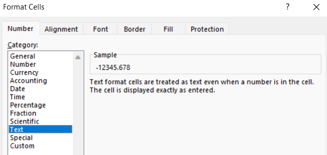

PhpSpreadsheet doesn't emulate this behaviour; it simply displays the value as PHP would render that value cast to a string, which mimics Excel's quirk with Rich Text values.

There is no PhpSpreadsheet "Wizard" for Text Masks.

### Special

Excel's Special format "Wizard" is a recent introduction: select a locale, and then you may be offered a number of options for formatting values in a manner that is appropriate to that locale, such as US phone numbers, social security numbers, or zip codes; typically with separators between groups of digits.
At this time, most locales have no special formats defined.

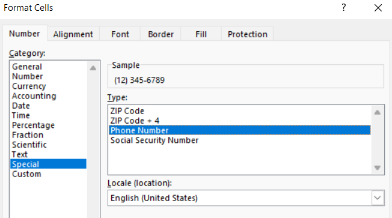

There is no PhpSpreadsheet "Wizard" for Special Masks.

## Custom Format Masks

The Custom "Wizard" really isn't a Wizard at all, just an editing field that allows you to pre-populate from a list of common format masks before editing.

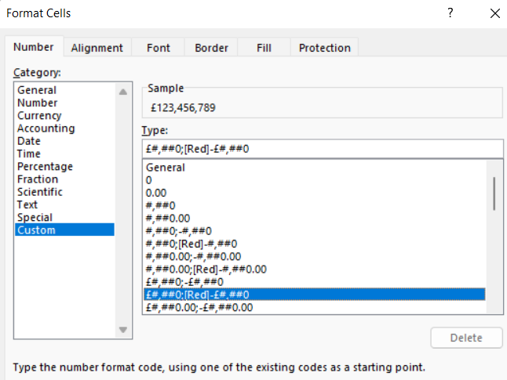

It does mean that you need to understand the rules for defining masks when you use this.

When you create custom number formats, you can specify up to four sections of format code.
These sections of code must be separated by semicolons (`;`).

### Sections for Composite Masks

Sections of the mask define the formats for positive numbers, negative numbers, zero values, and text, in that order.

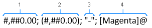
 1. Format for Positive values
 2. Format for Negative values
 3. Format for Zero values
 4. Format for Text

If you specify only one section of format code, the code in that section is used for all numbers.
If you specify two sections of format code, the first section of code is used for positive numbers and zeros, and the second section of code is used for negative numbers.
If you specify a third section, then the first applies to positive values, the second to negative values, and the third to zero values.
The fourth section only applies if the value is not numeric.

If you skip code sections in the format mask, then you must include a semicolon for each of the missing sections.

When you skip code sections in the format mask, then you must include a semicolon for each of the missing sections. Use `;` to indicate that a section exists, but with an empty mask; and that can be used to hide values that match the criteria for that section.

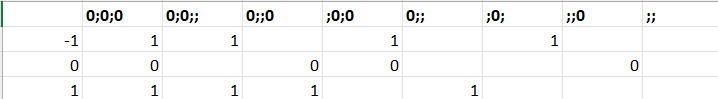

> **Note:** Negative values aren't shown with a sign when we use the negative value section. If we want the value to display with a sign, then we need to include an explicit '-' character in the Mask for that section (";-0;").

### Basic Masking Symbols

Three basic masking symbols are used to display numbers, and they differ in the way that they display leading or trailing zeroes.
The fourth basic masking symbol is the text placeholder, which can be used to wrap the cell value within additional formatting.

| Code | Description                                                                                                                                                                                 | Examples                                                                                                                                                     |  
|------|---------------------------------------------------------------------------------------------------------------------------------------------------------------------------------------------|--------------------------------------------------------------------------------------------------------------------------------------------------------------|
| 0    | Digit placeholder that displays insignificant zeros.                                                                                                                                        | #.00 - always displays 2 decimal places.<br /><br />If you type 5.5 in a cell, it will display as 5.50.                                                      |
| #    | Digit placeholder that represents optional digits and does not display extra zeros.<br /><br />That is, if a number doesn't need a certain digit, it won't be displayed.                    | #.## - displays up to 2 decimal places.<br /><br />If you type 5.5 in a cell, it will display as 5.5.<br /><br />If you type 5.555, it will display as 5.56. |
| ?    | Digit placeholder that leaves a space for insignificant zeros on either side of the decimal point but doesn't display them. It is often used to align numbers in a column by decimal point. | #.??? - displays a maximum of 3 decimal places and aligns numbers in a column by decimal point.                                                              |
| @    | Text placeholder                                                                                                                                                                            | 0.00; -0.00; 0; [Red]@ - applies the red font colour for text values.                                                                                         |

If a number entered in a cell has more digits to the right of the decimal point than there are placeholders in the format, the number is "rounded" to as many decimal places as there are placeholders.
For example, if you have a value of `2.25` in a cell with '#.#' format, then the number will be rounded to 1 decimal, and will display as `2.3`.

Digits to the left of the decimal point are always displayed regardless of the number of placeholders.
For example, if the value in a cell is `202.25` with '#.#' format, the number will display as `202.3`.

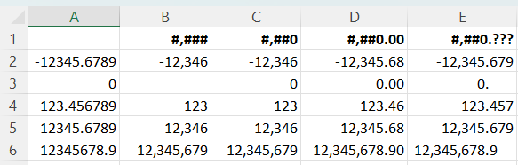

To display leading zeroes for a numeric value, you might create a mask like '0000', which will always display at least 4 digits, padding the value with leading zeroes if it is less than 1000.

### Other Special Codes
In addition to the masking symbols listed above, the following codes also enable special rendering of the value.

| Code           | Description                                                                                                                                                                   | Example                                          |
|----------------|-------------------------------------------------------------------------------------------------------------------------------------------------------------------------------|--------------------------------------------------|
| . (period)     | Decimal point.                                                                                                                                                                | ##0.00??                                         |
| , (comma)      | Thousands Separator.<br/> A comma that follows a digit placeholder scales the number by a thousand.                                                                           | #,##0<br/>0.000,<br/>Described below.            |
| \              | Text Escape Character that displays the character that follows it.                                                                                                            | ##0\°<br/>Described below.                       |
| " "            | Display any text that is enclosed in the double quotes.                                                                                                                       | ##0"°C"<br/>Described below.                     |
| %              | Multiplies the value stored in the cell by 100 and display it with the percentage sign.                                                                                       | Examples provided in the "Wizard" section above. |
| /              | Display the value as a fraction.                                                                                                                                              | Examples provided in the "Wizard" section above. |
| E              | Display the value in Scientific Format.                                                                                                                                       | Examples provided in the "Wizard" section above. |
| _ (underscore) | Space pad to the width of the next character in the mask.<br />It is commonly used in combination with parentheses to add left and right indents, `_(` and `_)` respectively. | Described below.                                 |                                
| * (asterisk)   | Repeats the character that follows it until the width of the cell is filled.<br />It is often used in combination with the space character to change alignment.               | Described below.                                 |

Simple examples of using these codes for Percentages, Fractions and Scientific Format can be found in the descriptions of those "Wizards".
The other codes are described in detail below.

### Thousands Separator and Scaling

To create an Excel custom number format with a thousands separator, include a comma (`,`) in the format code. For example:

 - #,### - display a thousands separator and no decimal places.
 - #,##0.00 - display a thousands separator and 2 decimal places.

Microsoft Excel separates thousands by commas: if a comma is enclosed by any digit placeholders - the pound sign (`#`), question mark (`?`) or zero (`0`).
But if no digit placeholder follows a comma, it scales the number by a thousand, two consecutive commas scale the number by a million, and so on.

For example, if a cell format is '#.00,' and the cell value is `5000`, then the number `5.00` is displayed.

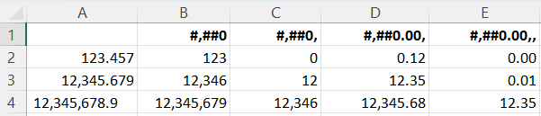

### Formatting with Text

If you want to include text in your format mask with numeric values, then there are two basic options.
To add a single character, then you can prefix that character with a backslash ('\'), e.g. '#.00,\K' or '#.00,,\M'.

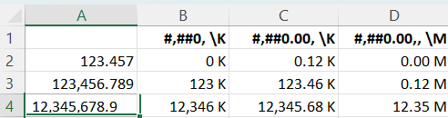

You don't need the backslash ('\') prefix for the following list of characters:

| Character | Description                      |  
|-----------|----------------------------------|
| + and -   | Plus and Minus Signs             |
| ( and )   | Left and Right Parenthesis       |
| :         | Colon                            |
| ^         | Caret                            |
| '         | Apostrophe                       |
| { and }   | Curly Braces                     |
| < and >   | Less Than and Greater than Signs |
| =         | Equals Sign                      |
| /         | Forward Slash                    |
| !         | Exclamation Mark                 |
| &         | Ampersand                        |
| ~         | Tilde                            |
|           | Space Character                  |

You can also use additional padding characters if you want to break a number into groups. For example, to display a number as a phone number, you might use a mask like '00-0000-0000' or '(++00) 00-0000-0000'.

It's a common practise in Accounting formats to wrap negative values in brackets; so you might use '([$€-nl-NL] #,##0.00)' for that section of the mask.

To add words or for phrases to the mask, you should wrap the text in quotes: e.g. '#.00" Surplus";-#.00" Deficit";"Out of Stock"'.

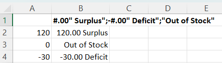

### Indents, Spacing and Alignment

If you're wrapping negative values in brackets, you might like like to align your positive values with your negative values on the decimal, then you need to apply indents to the positive values to match the width of the bracket characters.
The underscore code (`_`) tells Excel to pad the display to the width of the next character in the mask, so '_)' would tell Excel to pad to the width of ')' character like '[$€-nl-NL] _(#,##0.00_);[$€-nl-NL] (#,##0.00)'.


Accountants might also appreciate if the Currency symbols were also all aligned; so we can use the `*` code followed by a repeated character; and that will pad the width of the cell with the specified character. Typically, although not always, this will be a space character, '* '.

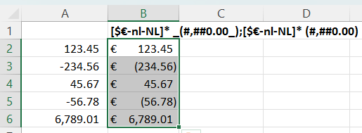

Which aligns all our currency symbols to the left of the cell, while displaying the value right-aligned in the cell, and all the decimal points neatly aligned.

The `*` code can also be used to change the alignment of a value in a cell. If we want text to be rendered right aligned, even though the cell is left aligned, we can use '* @' as the mask, and this will push the display to the right of the cell.

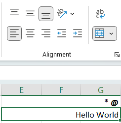

Note that padding is not supported by PhpSpreadsheet's internal renderer for the cell's `getFormattedValue()` method, because the renderer is unaware of font or cell width, so it will simply add a single space in the formatted result. Nor will it change alignment in any way.

### Colours

You can use format masks to change the font colour for a certain value with a custom number format.
e.g. '[Red]@'

Masking supports the following 8 main colours.

 - Black
 - Red
 - Green
 - Blue
 - Cyan
 - Yellow
 - Magenta
 - White

To specify the colour, just type one of those colour names in the appropriate section of your number format code, wrapped in square braces (e.g. '[red]').
This colour code must be at the very start of the section, before any other formatting characters or instructions.
The colour name is case-insensitive.

If we wanted to show positive values in green and negative values in red we could apply different colours to the different sections of the mask, e.g. "[Green]#,##0.00;[Red]#,##0.00;0.00".

> **Warning**: Colour masking doesn't apply when using Excel's `TEXT()` function; only when it is applied to a Cell's Format Mask.

### Conditional Formatting

Not to be confused with actual Conditional Formatting in MS Excel; but we can apply some limited condition checks in normal Cell Format Masks, and apply different masking based on those conditions.

While by default the different sections are interpreted by Excel as positive, negative, zero and text, we can override these definitions with conditions.
We do this by defining the condition for matching against the value inside square braces.

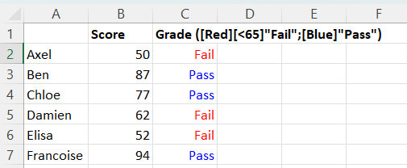

The mask that we're using here is `[Red][<65]"Fail";[Blue]"Pass"`.
This tells Excel to display the text "Fail" if the value in the Cell is less than 65, otherwise to display "Pass".

The symbols allowed for comparison in Conditions are the standard mathematical comparison operators:

| Symbol | Meaning               |  
|--------|-----------------------|
| \>     | Greater than          |
| \>=    | Greater than or Equal |
| <      | Less than             |
| <=     | Less than or Equal    |
| =      | Equal                 |
| <\>    | Not Equal             |

In this next example, we've created an additional condition, so we have three sections in the mask: the "Pass" grade is now any student that hasn't failed, but whose score is less than 85; the last section awards a grade of "Distinction" to any student whose score doesn't match the criteria for "Pass" or "Fail" (i.e. exceeds 85).
`[Red][<65]"Fail";[Blue][<85]"Pass";"Distinction"`

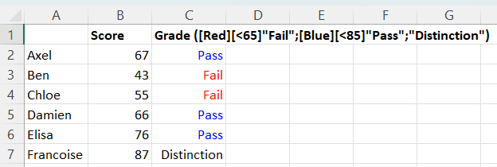

We do need to be careful about the order that we define the conditions, because Excel will apply the mask for the first condition that matches the Cell value.

> **Note**: Conditional Formatting using the Number Mask will also work with the TEXT() Function, although not with colour highlighting.

We can also use Conditional Formatting to display Lakh, the different grouping often found in India and the countries of that region.
While the thousands separator normally represents grouping to powers of 3 (10<sup>3</sup>, 10<sup>6</sup>, 10<sup>9</sup>, etc), the Lakh is 10<sup>3</sup>, 10<sup>5</sup>, 10<sup>7</sup>, etc. and is written as `1,00,000`.
After the first 1000, the comma separator is used to represent groups of 2 digits, not groups of 3 digits.
150,000 rupees is 1.5 lakh rupees, and is written as `₹1,50,000` or `INR 1,50,000`.

The mask used to represent lakh is:
[>=10000000][$₹]##\,##\,##\,##0;[>=100000][$₹]##\,##\,##0;[$₹]##,##0

Note that we're only using the `,` for thousands grouping in the final block, to represent values less than 100,000 where we would only display a single `,` as a thousands separator.
For the `,` in higher values, we are displaying a string literal `,` identified as such by the '\' immediately before it in the mask.

## Building Composite Masks using PhpSpreadsheet's Wizards

Even though PhpSpreadsheet's Wizards don't yet support building sections with different masks for positive, negative, zero, and text, you can still create these using the Wizards as building blocks.

```php
use PhpOffice\PhpSpreadsheet\Style\NumberFormat\Wizard\Currency;
use PhpOffice\PhpSpreadsheet\Style\NumberFormat\Wizard\Number;

// Set Cell value
$worksheet->getCell('C20')->setValue(-12345.67890);

// Set Cell Style using the Currency Wizard to build the Format Mask
$currencyMask = new Currency(
    '€',
    2,
    Number::WITH_THOUSANDS_SEPARATOR,
    Currency::TRAILING_SYMBOL,
    Currency::SYMBOL_WITH_SPACING
);

// Build the composite mask applying colours to the different sections
$compositeCurrencyMask = [
    '[Green]' . $currencyMask,
    '[Red]' . $currencyMask,
    $currencyMask,
];

$worksheet->getCell('C20')
    ->getStyle()->getNumberFormat()
    ->setFormatCode(implode(';', $compositeCurrencyMask));

var_dump($worksheet->getCell('C20')
    ->getStyle()->getNumberFormat()
    ->getFormatCode()); // [Green]#,##0.00 €;[Red]#,##0.00 €;#,##0.00 €
```
We repeat the mask that's generated by the "Wizard" for each section of the composite mask, adding the required colour to each section.

If we've used a locale to build a mask, then we may already have multiple sections:
```php
use PhpOffice\PhpSpreadsheet\Style\NumberFormat\Wizard\Currency;

// Set Cell value
$worksheet->getCell('C20')->setValue(-12345.67890);

// Set Cell Style using the Currency Wizard to build the Format Mask
$currencyMask = new Currency(
    '€',
    locale: 'nl_NL'
);

// Split the generated mask into sections
// This particular mask already has positive and negative value sections,
//      but does not have a zero value section
// Other locales may only have a positive section; or may already have a zero section
$currencyMaskSections = explode(';', $currencyMask);
// Recreate the modified mask applying colours to the different sections
$compositeCurrencyMask = [
    '[Green]' . $currencyMaskSections[0],
    '[Red]' . $currencyMaskSections[1] ?? $currencyMaskSections[0],
    $currencyMaskSections[2] ?? $currencyMaskSections[0],
];

$worksheet->getCell('C20')
    ->getStyle()->getNumberFormat()
    ->setFormatCode(implode(';', $compositeCurrencyMask));

var_dump($worksheet->getCell('C20')
    ->getStyle()->getNumberFormat()
    // [Green][$€-nl-NL] #,##0.00;[Red][$€-nl-NL] -#,##0.00;[$€-nl-NL] #,##0.00
    ->getFormatCode());
```
If the locale-generated mask already has a section defined, then we use that, otherwise we use the positive section (section 0) that will always exist as the base for each section.
> **Warning:** You might need to add an explicit `-` for the negative section if that needs to be created.

## Summary

Even though Excel displays the formatted value in the grid, the underlying value in the cell is unchanged.
The value being displayed as a date is still an Excel Serialized Timestamp, even though it is being displayed as '2023-02-28'; the student grade is still a number, even though it is being displayed as "Distinction"/"Pass"/"Fail"; and the cell that looks empty may not be as empty as you think.
The edit bar still shows us the value in the cell, not the formatted value; and we can still use that underlying value in formulae.

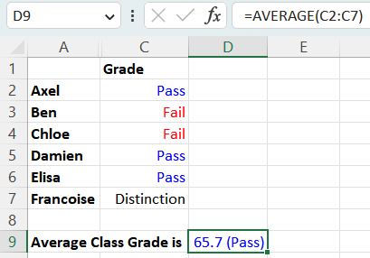

And we can even format the cell containing the result of that formula.

Number format masks allow us to present the spreadsheet data in a format that makes it easy for the user to interpret; so they add a lot of value to the spreadsheets that we create.
We just need to understand how to use them well to unlock that value.
