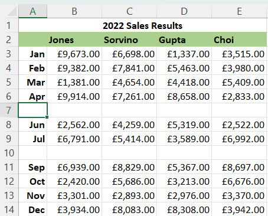
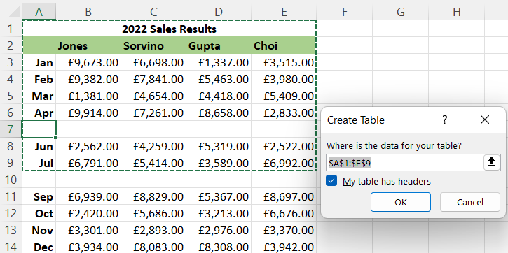
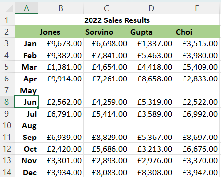

# Looping the Loop

PhpSpreadsheet uses a lot of memory to maintain the Spreadsheet model; but I regularly see developers loading a Spreadsheet file and then calling the `toArray()` methods so that they can loop through the rows and columns of a worksheet.
PHP arrays are also notoriously memory-intensive, so creating a large array duplicating the data that is already in the Spreadsheet model is a very inefficient use of memory.
Generally, unless we are always working with very small spreadsheets, we would want to avoid this.

So in this article, I'm going to look at a number of different ways of iterating through a worksheet to access the row and cell data; at their limitations; and at some of the options that each provides.

## Using `toArray()`

Using a sample data file from Microsoft and available at https://go.microsoft.com/fwlink/?LinkID=521962, I can load up the file, call `toArray()` to return the worksheet data in an array, and iterate over the rows and cells of that array with the following code.

```php
$inputFileType = 'Xlsx';
$inputFileName = __DIR__ . '/../Financial Sample.xlsx';

$reader = IOFactory::createReader($inputFileType);
$spreadsheet = $reader->load($inputFileName);
$worksheet = $spreadsheet->getActiveSheet();

$dataArray = $worksheet->toArray();

foreach ($dataArray as $row) {
    foreach ($row as $cellValue) {
        // Do something with the cell data here.
    }
}
```

The Financial Sample spreadsheet is fairly small, 701 rows (including a heading row) and 16 columns; and is predominantly numeric data.
To simulate a larger worksheet, I've duplicated that data to give 7001 rows; but this is still a small worksheet as MS Excel xlsx files can contain 1 million rows in each of several worksheets.

If we look at the timings and memory usage for this process with my extended MS Financial Sample spreadsheet:
```
Current memory usage: 47104 KB

Call time to build array was 0.6603 seconds

Call time to iterate array rows was 0.0130 seconds
Current memory usage: 57344 KB
   Peak memory usage: 57344 KB
```
We can see that using `toArray()` increases memory usage by 10240KB (10MB): that is the memory used by the array for a relatively small worksheet (less than 120,000 cells).
For larger worksheets, with more rows and columns, and with more text than numeric values, this memory overhead can grow significantly larger.

And while iteration over the array is very quick, it still takes 0.6603 seconds to build the array before we can start iterating over those rows and cells.

---

The `toArray()` method is easy to use: but not only is it increasing the memory overhead, especially with larger worksheets; but it also lacks flexibility.
It provides limited control over how the data from each cell is returned in the array.
It can return the raw cell value (which isn't particularly useful if the cell contains a formula, or if the value should be interpreted as a date); it can force PhpSpreadsheet to calculate formulae and return the calculated value; or it can return the formatted cell value (which includes calculating any formulae) so that date values are presented in a human-readable format, but which will also format numeric values with thousand separators where the cell style applies that.

| Argument Name      | DataType | Default | Purpose                                                                                                                                                                             |
|--------------------|----------|---------|-------------------------------------------------------------------------------------------------------------------------------------------------------------------------------------|
| $nullValue         | mixed    | null    | A value to be returned in the array if a cell doesn't exist.                                                                                                                        |
| $calculateFormulas | boolean  | false   | Flag to indicate if formula values should be calculated before returning.                                                                                                           |
| $formatData        | boolean  | false   | Flag to request that values should be formatting before returning.                                                                                                                  |
| $returnCellRef     | boolean  | false   | False - Return a simple enumerated array of rows and columns (indexed by number counting from zero)<br />True - Return rows and columns indexed by their actual row and column IDs. |
| $ignoreHidden      | boolean  | false   | True - Ignore hidden rows and columns. |
| $reduceArrays      | boolean  | false   | True - If calculated value is an array, reduce it to top leftmost value. |
| $lessFloatPrecision | boolean  | false   | True - PhpSpreadsheet 5.2+ - Floats, if formatted, will display as a more human-friendly but possibly less accurate value. |

### Dealing with empty rows

The example spreadsheet that I've used here is well behaved, with no empty rows. Empty rows can cause problems, even when working in Excel itself.

Let's take a look at a worksheet of Sales Data, where we're missing the returns for a couple of months:



If we're using MS Excel, and we hit `Ctrl-T` to create a table from this data, we might expect Excel to build that table from all rows up to `Dec`; but it won't, it will only build the table up to the next empty row.



And unless we're careful, we might not even notice that the last few months of the year are omitted.
So empty rows can create problems even in MS Excel itself; and we certainly need to have some way of identifying them when we're processing a worksheet using PhpSpreadsheet.

---

While we're iterating through a spreadsheet with PhpSpreadsheet, we might want to avoid trying to process blank data if we reach a row that is empty; or we might want to terminate iterating when we encounter an empty row.

If we've created an array from a worksheet, then an empty row will be a row where every cell/column entry has a null value (unless called specifying an alternative value using the `$nullValue` argument).

We can filter the row to eliminate null values, then count the length of that filtered array: if there are no remaining cells, then the row is empty. We can then skip that row in our code using `continue`.

```php
foreach ($dataArray as $row) {
    // Check for empty rows
    if (count(array_filter($row, function ($value) {
        return $value !== null;
    })) === 0) {
        continue;   // Ignore empty rows
    }

    foreach ($row as $cellValue) {
        // Do something with the cell data here.
    }
}
```

Or if we want to terminate iterating when we encounter an empty row, use `break` rather than `continue`.

```php
foreach ($dataArray as $row) {
    // Check for empty rows
    if (count(array_filter($row, function ($value) {
        return $value !== null;
    })) === 0) {
        break;    // Stop at the first empty row
    }

    foreach ($row as $cellValue) {
        // Do something with the cell data here.
    }
}
```

Using `toArray()` won't change anything in the worksheet model: it won't modify values or create new cells.
It will return a row/column entry for every cell that can exist, even if that cell doesn't exist in the worksheet, or is part of a merge range.
> **Note**: It is possible for several cells in a merge range to have a value. Although MS Excel doesn't allow you to set data like this, the option is available in other Spreadsheet software, and if the file is saved as an xlsx file, then the data for those cells is retained in the file, even though only the top left cell of a merge range shows a value in MS Excel. In PhpSpreadsheet, accessing those cells (including using `toArray()`) will return the "hidden" value.

One useful factor about returning an array of arrays is if we want to populate a data model from that row before persisting to a database, for example. We don't need to iterate the columns in that row, but can work directly with the column array for each row.

```php
class MonthlySales {
    private function __construct(
        public readonly string $month,
        public readonly array $sales,
    ) {}

    public static function fromExcel(array $values, array $headers): self {
        $month = array_shift($values);
        return new self($month, array_combine($headers, $values));
    }
}

$monthlySalesData = new MonthlySalesCollection();

// Read from the header row of the worksheet
$excelHeaderRow = ['Jones', 'Sorvino', 'Gupta', 'Choi'];

$dataArray = $worksheet->toArray(formatData: true);
foreach ($dataArray as $excelDataRow) {
    // Check for empty rows
    if (count(array_filter($excelDataRow, function ($value) {
        return $value !== null;
    })) === 0) {
        continue;   // Ignore empty rows
    }

    $monthlySalesData->add(MonthlySales::fromExcel(
        $excelDataRow,
        $excelHeaderRow
    ));
}
```
We can pass the row array directly to the static `MonthlySales::fromExcel()` constructor for our data object, handling any validation and manipulation of the structure there, to map the Excel data row to that object properties, handling filtering within the business logic of the Monthly Sales object's static constructor.

---

And remember that by default, `toArray()` returns a simple enumerated array of enumerated arrays, to reflect rows and columns. You can modify this using the `$returnCellRef` argument to the method: set `$returnCellRef` to true, and the array indexes will be the row number (with 1 as the first row) and the column address ('A', 'B', 'C', etc); which can be useful if you want to do some processing of the cells based on that column address.

```php
class MonthlySales {
    private function __construct(
        public readonly string $month,
        public readonly array $sales,
    ) {}

    public static function fromExcel(array $values, array $headers): self {
        $month = array_shift($values);
        $salesValues = [];
        foreach ($values as $column => $value) {
            // Ignore salespeople who have null sales values
            if ($value !== null) {
                $salesValues[$headers[$column]] = $value;
            }
        }
        return new self($month, $salesValues);
    }
}

$monthlySalesData = new MonthlySalesCollection();

// Read from the header row of the worksheet
$excelHeaderRow = [
    'B' => 'Jones',
    'C' => 'Sorvino',
    'D' => 'Gupta',
    'E' => 'Choi'
];

$dataArray = $worksheet->toArray(formatData: true, returnCellRef: true);
foreach ($dataArray as $excelDataRow) {
    // Check for empty rows
    if (count(array_filter($excelDataRow, function ($value) {
        return $value !== null;
    })) === 0) {
        continue;   // Ignore empty rows
    }

    $monthlySalesData->add(MonthlySales::fromExcel(
        $excelDataRow,
        $excelHeaderRow
    ));
}
```

## Using `rangeToArray()`

The `toArray()` method uses information from the loaded file to identify the range of rows and columns to populate the array.
`toArray()` uses two cached values to identify the range of cells to populate the array, values that are returned by the `getHighestRow()` and `getHighestColumn()` methods.

But many worksheets do have trailing empty rows (or columns); and it is quite common for an Excel spreadsheet to have only a few rows or columns of data, but for the spreadsheet itself to claim that the highest row is 1,048,576 or that the highest column is XFD.
Features such as Data Validation or Conditional Formatting that can also artificially inflate/increase the values returned by `getHighestRow()` and `getHighestColumn()` methods.

If we use `toArray()` to build an array from the worksheet in this case, then it will build a 1,048,576x16,384 array, filled with null values, that will almost certainly exceed PHP's memory limits, and take a long time to do so.
And if we do have enough memory to build the array, we will still be iterating over a lot more array entries than we want. Even if we're skipping empty rows, we're still testing every row to see if it's empty.
Where possible, it's better to specify the limit of rows and columns that we want to use to build an array, and PhpSpreadsheet provides the `rangeToArray()` for that purpose.

One option to reduce a large array using a lot of PHP memory would be to run a loop using `rangeToArray()` to build smaller arrays for blocks of perhaps 100 rows at a time.
This will still take a while to run if we have a lot of trailing empty rows, but it won't exceed PHP's memory limits.

```php
$startRow = 1;
$batchSize = 100;
while ($startRow <= $maxRow) {
    $endRow = min($startRow + $batchSize, $maxRow);
    $dataArray = $worksheet->rangeToArray("A{$startRow}:{$maxColumn}{$endRow}");
    $startRow += $batchSize;

    foreach ($dataArray as $row) {
        // Check for empty rows
        if (count(array_filter($row, function ($value) {
                return $value !== null;
            })) === 0) {
            continue;   // Ignore empty rows
        }

        foreach ($row as $cellValue) {
            // Do something with the cell data here.
        }
    }
}
```

Alternatively, we can identify the highest row and highest column that actually contain cell data using the `getHighestDataRow()` and `getHighestDataColumn()` methods. This allows us to specify a range to pass to the `rangeToArray()` method.

```php
$maxDataRow = $worksheet->getHighestDataRow();
$maxDataColumn = $worksheet->getHighestDataColumn();

$dataArray = $worksheet->rangeToArray("A1:{$maxDataColumn}{$maxDataRow}");

foreach ($dataArray as $row) {
    // Check for empty rows
    if (count(array_filter($row, function ($value) {
        return $value !== null;
    })) === 0) {
        continue;   // Ignore empty rows
    }

    foreach ($row as $cellValue) {
        // Do something with the cell data here.
    }
}
```

There might still be some empty rows in this array, so we still want to test for empty rows; but we won't have any trailing empty rows at the end of our data, so the iteration will terminate at the end of our specified row range, when we know we have no further data.

And if there is a row or two of column headers that we want to ignore, we can modify the specified range to exclude them by adjusting the starting row of the range (e.g. `"A3:{$maxDataColumn}{$maxDataRow}"`);

Because we're only building the array for a specified range of rows and columns, the array that the method builds will often be smaller than the array created by `toArray()`, using less memory; and it will often be faster iterating just the subset of rows that we've requested.


A combination of these approaches - batching and using the 'getHighestDataRow()' value, will be more memory-efficient, and possibly faster, than using 'toArray()'.
```php
$startRow = 1;
$batchSize = 100;
while ($startRow <= $maxDataRow) {
    $endRow = min($startRow + $batchSize, $maxDataRow);
    $dataArray = $worksheet->rangeToArray("A{$startRow}:{$maxDataColumn}{$endRow}");
    $startRow += $batchSize;

    foreach ($dataArray as $row) {
        // Check for empty rows
        if (count(array_filter($row, function ($value) {
                return $value !== null;
            })) === 0) {
            continue;   // Ignore empty rows
        }

        foreach ($row as $cellValue) {
            // Do something with the cell data here.
        }
    }
}
```
How does this approach compare with using 'toArray()' in terms of memory and speed? Here are the details for using `rangeToArray()` with a batched approach:
```
Current memory usage: 47104 KB

Call time to batch iterate array rows was 0.6844 seconds
 Current memory usage: 47104 KB
    Peak memory usage: 49152 KB
```
While the total time is 0.6844 seconds, that included building the smaller batched arrays, so its speed is comparable to the total time of 0.6733 seconds using `toArray()`.
But a peak memory usage of 49,152KB compared with the 57,344KB used by `toArray()` make this approach a lot more memory efficient.

Like `toArray()`, `rangeToArray()` is easy to use, but it has the same limitations for flexibility. It provides the same limited control over how the data from each cell is returned in the array as `toArray()`.
The same additional arguments that can be provided for the `toArray()` method can also be provided to `rangeToArray()`.


## Using `rangeToArrayYieldRows()`

Since v2.1.0 the worksheet method `rangeToArrayYieldRows()` is available.
It allows you to iterate over all sheet's rows with little memory consumption,
while obtaining each row as an array:

```php
$rowGenerator = $sheet->rangeToArrayYieldRows(
    'A1:' . $sheet->getHighestDataColumn() . $sheet->getHighestDataRow(),
    null,
    false,
    false
);
foreach ($rowGenerator as $row) {
    echo $row[0] . ' | ' . $row[1] . "\n";
}
```

See `samples/Reader2/23_iterateRowsYield.php`.


## Using Iterators

You don't need to build an array from the worksheet to loop through the rows and columns and do whatever processing you need; you can loop through the rows and columns in the Worksheet directly and more efficiently using PhpSpreadsheet's built-in iterators.

And this also gives a lot more flexibility in how you can present the cell values, because the iterator will return the Cell itself, not a representation of its value. You can read its value, check its style, identify if it is part of a merge range.

```php
$rowIterator = $worksheet->getRowIterator();
foreach ($rowIterator as $row) {
    $columnIterator = $row->getCellIterator();
    foreach ($columnIterator as $cell) {
        // Do something with the cell here.
    }
}
```

Let's look at the memory usage and timings for using PhpSpreadsheet's Iterators, as we did for building and iterating through the array.

```
Current memory usage: 47104 KB

Call time to iterate rows was 0.0930 seconds
 Current memory usage: 47104 KB
    Peak memory usage: 47104 KB
```

Using the PhpSpreadsheet Iterators isn't as fast as iterating over an array; but it doesn't have the time or memory overheads of actually building that array from the worksheet.
Using the same example spreadsheet, it only took 0.0130 seconds to iterate every cell of that array, but 0.6603 seconds to build the array, a total of 0.6733 seconds; but using the Iterator has performed the equivalent task in just 0.0930 seconds; about 7 times faster and without the increased memory overhead of the array.

### Dealing with empty rows

As, when we were iterating over the array, we might want to identify empty rows so that we can avoid trying to process them. The Row Iterator provides a method to identify empty rows.

```php
$rowIterator = $worksheet->getRowIterator();
foreach ($rowIterator as $row) {
    if ($row->isEmpty()) { // Ignore empty rows
        continue;
    }

    $columnIterator = $row->getCellIterator();
    foreach ($columnIterator as $cell) {
        // Do something with the cell here.
    }
}
```

One additional feature when using the Iterator to determine whether a row is empty or not is that we can set our own rules to define "empty".
The default rule is if there is no entry for the Cell in the Cell Collection.
If we also want to skip any Cell that contains a null value, then we can pass an argument using the pre-defined constant `CellIterator::TREAT_NULL_VALUE_AS_EMPTY_CELL`.
If we also want to skip any Cell that contains an empty string, then we can pass an argument using the pre-defined constant `CellIterator::TREAT_EMPTY_STRING_AS_EMPTY_CELL`.

And we can combine those rules:
```php
if ($row->isEmpty(
    CellIterator::TREAT_EMPTY_STRING_AS_EMPTY_CELL | 
    CellIterator::TREAT_NULL_VALUE_AS_EMPTY_CELL)
    ) { // Ignore empty rows
    continue;
}
```

Since PhpSpreadsheet 1.27.0, we can take this empty test one step further.
If we look at a slightly modified version of the Sales Data worksheet, rows 7 and 10 have no sales data, but they aren't empty because there is a month value in column A.



But we can tell the `isEmpty()` method to only check if a specified range of columns is empty in a row.

```php
if ($row->isEmpty(startColumn: 'B', endColumn: 'E') {
     // Ignore empty rows where columns B to E are empty values
     //     even though there is a value in Column A.
    continue;
}
```

---

Like `toArray()`, the Iterators use the `getHighestRow()` and `getHighestColumn()` methods to identify the maximum row and column values for iterating; so it can still iterate over a lot of trailing empty rows and columns.
But that is just a default behaviour.
Similarly to `rangeToArray()` we can specify a range of rows, and a range of columns to iterate.

```php
$maxDataRow = $worksheet->getHighestDataRow();
$maxDataColumn = $worksheet->getHighestDataColumn();

$rowIterator = $worksheet->getRowIterator(1, $maxDataRow);
foreach ($rowIterator as $row) {
    if ($row->isEmpty()) { // Ignore empty rows
        continue;
    }

    $columnIterator = $row->getCellIterator('A', $maxDataColumn);
    foreach ($columnIterator as $cell) {
        // Do something with the cell here.
    }
}
```

and if we have heading rows at the top of the worksheet that we want to ignore:
```php
$rowIterator = $worksheet->getRowIterator(3, $maxDataRow);
```

And if we want to return only cells that aren't empty in the row, then we can tell the Cell Iterator to skip empty cells.

```php
$rowIterator = $worksheet->getRowIterator(1, $maxDataRow);
foreach ($rowIterator as $row) {
    $columnIterator = $row->getCellIterator();
    $columnIterator->setIterateOnlyExistingCells(true);
    foreach ($columnIterator as $cell) {
        // Do something with the cell here.
    }
}
```

Alongside the speed and memory benefits, another big advantage of using the Iterators (Row and Cell, or Column and Cell) is that we get direct access to the cell itself. We can look at its value, its style; we can identify if it is a formula, or formatted as a date/time, whether it is part of a merge range: we can choose exactly what we want to do with it.

---

One drawback of the Cell Iterator is that it will create a new cell if none exists (by default) unless we're skipping empty cells.
Until PhpSpreadsheet 1.27.0, the Cell Iterator would always create a new Cell if one didn't exist in the Cell Collection when it was required to access it. And this can lead to increasing memory consumption.

PhpSpreadsheet 1.27.0 introduced the option to return a null value rather than to create and return a new Cell.

```php
$rowIterator = $worksheet->getRowIterator(1, $maxDataRow);
foreach ($rowIterator as $row) {
    $columnIterator = $row->getCellIterator();
    $columnIterator->setIfNotExists(CellIterator::IF_NOT_EXISTS_RETURN_NULL);
    foreach ($columnIterator as $cell) {
        if ($cell !== null) {
            // Do something with the cell here.
        }
    }
}
```

The default Iterator behaviour is still to create a new Cell, to retain backward compatibility; but the option to return a null value instead of a new empty cell now exists.
> **Note**: This default behaviour is likely to be reversed with the eventual release of PhpSpreadsheet 2.0, with a null value as the default return, but with the option to create a new empty cell.

## Summary of Performance and Benefits

So here is a quick summary of timing and memory usage for the three different approaches to iterating through the rows and cells of the 7000 row sample worksheet.

Memory usage is adjusted for the 47,104 KB baseline of the loaded file.

| Approach               | Total Time (s) | Memory (KB) |
|------------------------|----------------|-------------|
| toArray()              | 0.6733         | 10,240      |      
| rangeToArray (Batched) | 0.6844         | 2,048       |    
| Iterators              | 0.0930         | 0           |   

These figures are all based on a well-formed spreadsheet, with no trailing empty rows, or empty rows within the dataset.
Empty rows within a dataset can be identified by all three approaches, although only Iterators have a built-in method to identify an empty row.

Using `toArray()` is not good for controlling memory usage, especially if there are trailing empty rows, so it should generally be avoided; but both `rangeToArray()` and the Iterators can exclude trailing rows by setting their scope based on the `getHighestDataRow()` and `getHighestDataColumn()` values.

Batching rows with `rangeToArray()` is useful for keeping memory usage under control if you want to work with arrays.

But using the Iterators is significantly faster than either "array" approach, with no memory overhead (especially if using the option of a null return for Cells that don't exist that was made available in PhpSpreadsheet 1.27.0); and as the Iterators return the Cell object rather than simply a cell value, they provide a lot more flexibility in how to process that cell.
The flexibility to configure the definition of an empty row may also be useful to developers using this approach to iterating through a worksheet.

## Conclusions

While it might require a little more userland code by developers using PhpSpreadsheet; because they are faster, have no additional memory overhead, and provide more flexibility, Iterators are the recommended approach for looping through the rows (and cells) of a worksheet.

