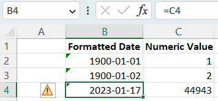
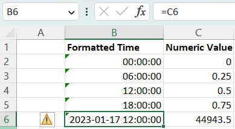
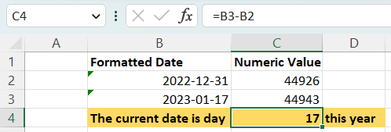
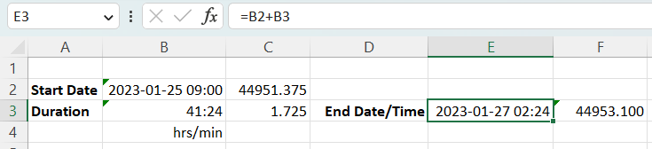
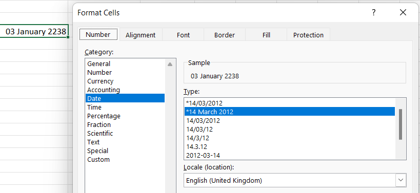
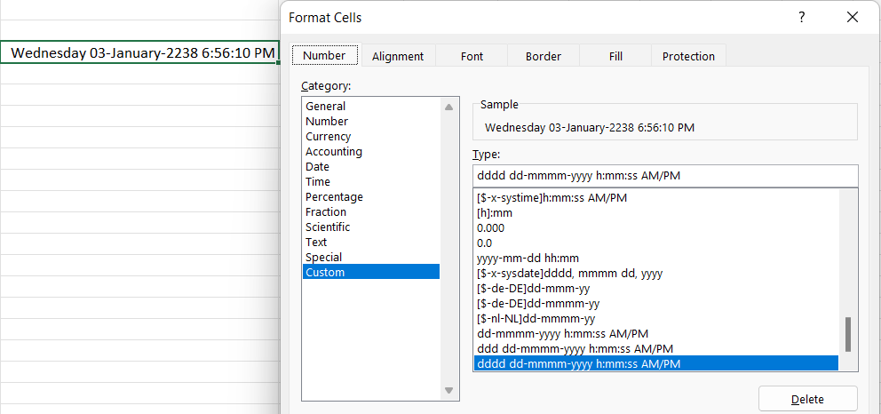
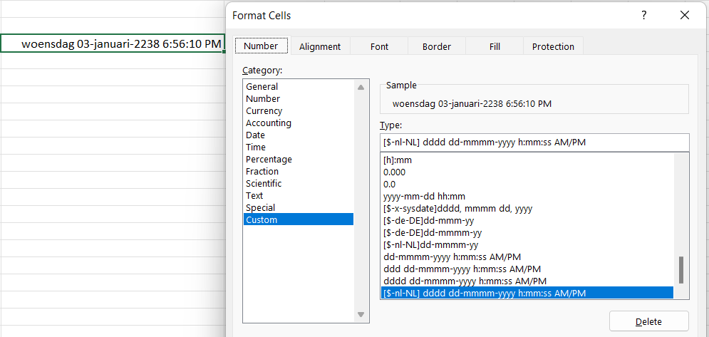
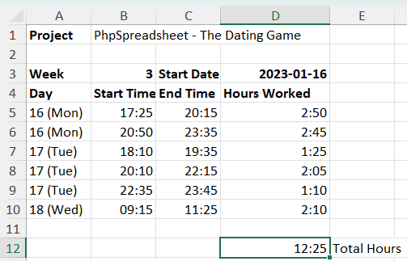

# The Dating Game

Date and Time values are stored in different ways in spreadsheet files, depending on the file format; but internally when working in Excel the cell always contains a numeric value, representing the number of days since a baseline date, and formatted to appear as a human-readable date using a "Number Format Mask". This number is sometimes referred to as a serialized Excel date or timestamp.

## Dates

That baseline date is normally 1st January 1900, although it can be 1st January 1904 (if the original spreadsheet file was created using the Mac version of MS Excel). Excel maintains a flag in the file indicating which baseline should be used; for file formats that don't provide this flag (such as .slk or .csv), the calendar defaults to the 1900 baseline.


Note that the baseline date itself is day 1; so strictly speaking, the base date 0 is '1899-12-31': Excel considers any value between 0 and 1 as purely a time value, trying to display 0 using a date format mask like 'yyyy-mm-dd' will show an invalid date like '1900-01-00' rather than '1899-12-31', but when using a time format mask like 'hh:mm:ss' it will appear as '00:00:00' (midnight). Values less than 0 are invalid as dates or as times, so a negative value in a cell with a date "Number Format Mask" will display as '############' in Excel.

Open/Libre Office and Gnumeric don't have this limitation, and negative date/timestamp values are recognised and formatted correctly; but it is recommended that you don't rely on this when working with PhpSpreadsheet.

To write a date in a cell using PhpSpreadsheet, we need to calculate the serialized Excel datestamp for that date. Methods to do this are available in the Shared\Date class, which provides a number of methods for conversion between different date options typically used in PHP applications (Unix timestamp, PHP DateTime objects and some recognisable formatted strings) and the Excel serialized value; and vice versa.

 - Shared\Date::convertIsoDate()
     - Converts a date/time in [ISO-8601 standard format](https://en.wikipedia.org/wiki/ISO_8601) to an Excel serialized timestamp
 - Shared\Date::PHPToExcel()
     - Converts a Unix timestamp, a PHP DateTime object, or a recognisable formatted string to an Excel serialized timestamp
 - Shared\Date::dateTimeToExcel()
     - Converts a Unix timestamp to an Excel serialized timestamp
 - Shared\Date::timestampToExcel()
     - Converts a PHP DateTime object to an Excel serialized timestamp
 - Shared\Date::formattedPHPToExcel()
     - Converts year, month, day, hour, minute, and second to an Excel serialized timestamp
 - Shared\Date::excelToDateTimeObject()
     - Converts an Excel serialized timestamp to a PHP DateTime object
 - Shared\Date::excelToTimestamp()
     - Converts an Excel serialized timestamp to a Unix timestamp.
     - The use of Unix timestamps, and therefore this function, is discouraged: they are not Y2038-safe on a 32-bit system, and have no timezone info.

We probably also want to set the number format mask for the cell so that it will be displayed as a human-readable date.
```php
use PhpOffice\PhpSpreadsheet\Spreadsheet;
use PhpOffice\PhpSpreadsheet\Shared\Date as SharedDate;

// Create new Spreadsheet object
$spreadsheet = new Spreadsheet();
$worksheet = $spreadsheet->getActiveSheet();

// Calculate today's date as an Excel serialized timestamp
$today = SharedDate::PHPToExcel(new DateTime('today'));

$data = [
    ['Formatted Date', 'Numeric Value'],
    ['=C2', 1],
    ['=C3', 2],
    ['=C4', $today],
];

// Write our data to the worksheet
$worksheet->fromArray($data, null, 'B1');

// Display values in column B as human-readable dates
$worksheet->getStyle('B2:B4')->getNumberFormat()->setFormatCode('yyyy-mm-dd');
// Set some additional styling
$worksheet->getStyle('B1:C1')->getFont()->setBold(true);
$worksheet->getColumnDimension('B')->setAutoSize(true);
```

## Times

Dates are always the integer part of the value (1, 2, 44943): the fractional part of the value is used to represent the time as a fraction of the day. So a value of 0.5 is 12:00 midday; 0.25 is 06:00 in the morning and 0.75 is 18:00 in the evening.


A float value greater than 1, like 44943.5 is considered as a datetime value: 12:00 (midday) on the 17th of January 2023.

As with dates, to write a time value to a cell in PhpSpreadsheet, we write the numeric value for that time (or date/time) to the cell, and then apply a number format mask to the cell so that it will be displayed in a human-readable format.
```php
use PhpOffice\PhpSpreadsheet\Spreadsheet;
use PhpOffice\PhpSpreadsheet\Shared\Date as SharedDate;

// Create new Spreadsheet object
$spreadsheet = new Spreadsheet();
$worksheet = $spreadsheet->getActiveSheet();

// Calculate today's date as an Excel serialized timestamp
$today = SharedDate::PHPToExcel(new DateTime('today'));

$data = [
    ['Formatted Time', 'Numeric Value'],
    ['=C2', 0],
    ['=C3', 0.25],
    ['=C4', 0.5],
    ['=C5', 0.75],
    ['=C6', $today + 0.5],
];

// Write our data to the worksheet
$worksheet->fromArray($data, null, 'B1', true);

// Display values in column B as human-readable dates
$worksheet->getStyle('B2:B5')->getNumberFormat()->setFormatCode('hh:mm:ss');
$worksheet->getStyle('B6')->getNumberFormat()->setFormatCode('yyyy-mm-dd hh:mm:ss');
// Set some additional styling
$worksheet->getStyle('B1:C1')->getFont()->setBold(true);
$worksheet->getColumnDimension('B')->setAutoSize(true);
```

The same `Shared\Date` functions that convert between Excel dates and Unix Timestamps or PHP DateTime objects can also be used to convert time values. 

## Dates/Times and Value Binders

It is a standing joke that MS Excel tries to identify date and time values as you are entering data in Excel, and often treats any value as a possible date, converting it to an Excel serialized timestamp and applying date/time formatting, even though that may not have been what was intended.


Any change to a cell value in PhpSpreadsheet that isn't made using the setCellValueExplicit() method is passed through a "Value Binder", which triggers additional settings for that cell.

> **Note**: dates and times maintained in true spreadsheet format files are always correctly identified in the file, and setCellValueExplicit() is used to store those values, with the formatting mask defined in that file. However, non-spreadsheet files such as .csv don't identify dates/times, so the Value Binder behaviour applies when loading those files.


The Default Value Binder attempts to identify the datatype of the value and sets the cell datatype accordingly: and if you pass a string value like '2023-01-18 12:15:00' then the Default Value Binder will simply treat it as a string, and set it accordingly.

However, if you choose to use the Advanced Value Binder, then that contains logic which looks more closely at those string values, and tries to determine if they are likely to be formatted dates or times, and in that regard it emulates Excel's behaviour. If the string value looks like a date or time, then it is converted to a serialized Excel date/timestamp, and an appropriate format mask is set for that cell.

While the logic of this isn't perfect, I'd like to believe that it is less error-prone than Excel's own logic; but it won't necessarily recognise ambiguous formats and values correctly like '1/7/2023' as dates. (Is that the 1st of July? Or the 7th of January?)

## Reading Dates and Times from cells

When we read the value of a cell that contains a Date/Time value, we are only reading a number (the Excel serialized timestamp); it is only the Number Format Mask that allows us to say whether that number is simply a number, or is meant to be a Date/Time value.

PhpSpreadsheet provides a number of methods to identify whether a Number Format Mask represents a Date/Time format mask, or whether a Cell is formatted as a Date/Time.

- Shared\Date::isDateTimeFormat()
  - Identifies if a NumberFormat Style object is an Excel Date/Time style format mask.
- Shared\Date::isDateTimeFormatCode()
  - Identifies if the string value of a Number Format mask is an Excel Date/Time style format mask.
- Shared\Date::isDateTime()
  - Identifies if a Cell is styled with a Number Format mask is an Excel Date/Time style format mask.****

These functions allow you to identify whether a cell value should be converted to a Unix Timestamp or PHP DateTime object (using one of the conversion functions provided in `Shared\Date`) for processing in your script, or for formatting as a Date/Time value.

## Date Arithmetic

Because dates and times are just numeric values in MS Excel, this makes date/time arithmetic very easy to calculate: to count the number of days (or a duration) between two dates, we can use a simple subtraction.


Similarly, we can add date/time values like adding a duration to a start date to calculate an end date.


## Excel Date Functions

MS Excel provides a number of functions that will return a date or a time value. It also recognises when one of these functions is the "outer" function in a formula, so the final result will always be a serialized date/time value, and sets an appropriate format mask for that value.

This behaviour is not replicated in PhpSpreadsheet. If you set a formula for a cell through your code that will return a date or time value, then you will also need to set the format mask for that cell manually.  

## Formatting Options

PhpSpreadsheet provides a number of built-in format code constants for dates and times in the NumberFormat class, matching those defined in the OfficeOpenXML specification, but you can always just set the format to any valid Excel formatting string, the equivalent of setting a custom date format in Excel.

### Dates

When setting up a custom date format in Excel, you can use the following codes.

| Code  | Description                         | Example (January 3, 2023)             |
|-------|-------------------------------------|---------------------------------------|
| m     | Month number without a leading zero | 1                                     |
| mm    | Month number with a leading zero    | 01                                    |
| mmm   | Month name, short form              | Jan                                   |
| mmmm  | Month name, full form               | January                               |
| mmmmm | Month as the first letter           | J (stands for January, June and July) |
| d     | Day number without a leading zero   | 3                                     |
| dd    | Day number with a leading zero      | 03                                    |
| ddd   | Day of the week, short form         | Tue                                   |
| dddd  | Day of the week, full form          | Tuesday                               |
| yy    | Year (last 2 digits)                | 23                                    |
| yyyy  | Year (4 digits)                     | 2023                                  |

### Times

When setting up a custom time format in Excel, you can use the following codes.

| Code   | Description                                                        | Displays as |
|--------|--------------------------------------------------------------------|-------------|
| h      | Hours without a leading zero                                       | 0-23        |
| hh     | Hours with a leading zero                                          | 00-23       |
| m      | Minutes without a leading zero                                     | 0-59        |
| mm     | Minutes with a leading zero                                        | 00-59       |
| s      | Seconds without a leading zero                                     | 0-59        |
| ss     | Seconds with a leading zero                                        | 00-59       |
| AM/PM  | Periods of the day <br/>(if omitted, 24-hour time format is used)  | AM or PM    |
> **Warning**
MS Excel allows any separator character between hours/minutes/seconds; PhpSpreadsheet currently requires a colon (`:`) to correctly distinguish minutes from months when rendering a time format within PHP code, although it will correctly write the format to file if any other separator character is used.

### Duration (Elapsed Time)

Excel also supports formatting a value as a duration; a total number of hours, minutes or seconds rather than a time of day. However, please note that negative durations are supported only if using base year 1904 (Mac default).

| Code    | Description                                                    | Displays as |
|---------|----------------------------------------------------------------|-------------|
| [h]:mm  | Elapsed time in hours                                          | e.g. 25:02  |
| [hh]:mm | Elapsed time in hours<br>with a leading zero if less than 10   | e.g. 05:02  |
| [mm]:ss | Elapsed time in minutes                                        | e.g. 63:46  |
| [m]:ss  | Elapsed time in minutes<br>with a leading zero if less than 10 | e.g. 03:46  |
| [s]     | Elapsed time in seconds                                        |             |
| [ss]    | Elapsed time in seconds<br>with a leading zero if less than 10 |             |

If you want to display an elapsed time in days, then you can use a normal date mask like `d h:mm` (without month or year), with the limitation that it will not exceed 31 days.

### Localisation

#### Built-in Formats

Some of the Excel built-in format masks are locale-aware. 


Those locale-aware formats are highlighted with a * in Excel's drop-down lists for Date and Time, and will adapt when viewed in MS Excel, based on the locale settings of that local PC.

PhpSpreadsheet is not locale-aware, so it will not render these formats as locale-formats, just as generic Date/Time formats; and localisation will be not be saved when writing to a spreadsheet file.

#### Custom Formats

When you're displaying a date/time using a format mask that isn't locale-aware in MS Excel, the locale settings for Excel are applied. So if you're displaying a month or day name, these will appear in the appropriate language for the locale of your PC.


You can force the display for a specific locale by prefixing the format mask with a locale setting, so that Excel will render it using the appropriate language. The locale code should be enclosed in [square brackets] and preceded with the dollar sign ($) and a dash (-).

In this example, I'm forcing Dutch Netherlands by prefixing the mask with `[$-nl-NL]`. As an alternative, I could also have used the Windows LCID for that locale (`[$-413]`).


Because PhpSpreadsheet is not locale-aware, displaying the formatted value for that cell in your PHP script won't show the locale date/time, only a generic date/time; but it will still be written correctly when the file is saved (as a spreadsheet format) for Excel to render correctly and in the appropriate language.

If you need this, then you can find a list of Windows LCID values [here](https://learn.microsoft.com/en-us/openspecs/windows_protocols/ms-adts/a29e5c28-9fb9-4c49-8e43-4b9b8e733a05)

## Summary Example

Let's summarise some of this information with a script that will build a project timesheet for a week of work on that project.

I'll keep the basic data in arrays for simplicity.
```php
// In a real application, we might read this data from a database to build a project timesheet
$projectHeading = [['Project', 'PhpSpreadsheet - The Dating Game']];
$weekHeading = [
    ['Week', '=ISOWEEKNUM(D3)', 'Start Date', '=DATE(2023,1,16)'],
    ['Day', 'Start Time', 'End Time', 'Hours Worked'],
];

$timesheetData = [
    ['2023-01-16', '17:25', '20:15'],
    ['2023-01-16', '20:50', '23:35'],
    ['2023-01-17', '18:10', '19:35'],
    ['2023-01-17', '20:10', '22:15'],
    ['2023-01-17', '22:35', '23:45'],
    ['2023-01-18', '09:15', '11:25'],
];
```
Because I've used string values for the dates and times, I'm going to use the Advanced Value Binder to populate the worksheet.
The Binder will also format the time values in columns B and C; but I want to override the Binder formatting for date values in column A; and I'm using an Excel formula for the "start date" value in cell D3, so I have to set the format manually for that.
```php
use PhpOffice\PhpSpreadsheet\Spreadsheet;
use PhpOffice\PhpSpreadsheet\Cell\Cell;
use PhpOffice\PhpSpreadsheet\Cell\AdvancedValueBinder;
use PhpOffice\PhpSpreadsheet\Style\Alignment;

// Create new Spreadsheet object
$spreadsheet = new Spreadsheet();
$worksheet = $spreadsheet->getActiveSheet();
// Use the Advanced Value Binder so that our string date/time values will be automatically converted
//     to Excel serialized date/timestamps
// Old method using static property
Cell::setValueBinder(new AdvancedValueBinder());
// Preferred method using dynamic property since 3.4.0
$spreadsheet->setValueBinder(new AdvancedValueBinder());

// Write our data to the worksheet
$worksheet->fromArray($projectHeading);
$worksheet->fromArray($weekHeading, null, 'A3');

// Let Excel calculate the duration for each timesheet entry
$row = 4;
foreach ($timesheetData as $timesheetEntry) {
    ++$row;
    $worksheet->fromArray($timesheetEntry, null, "A{$row}");
    $worksheet->setCellValue("D{$row}", "=C{$row} - B{$row}");
}
$totalRow = $row + 2;
$worksheet->setCellValue("D{$totalRow}", "=SUM(D4:D{$row})");
$worksheet->setCellValue("E{$totalRow}", 'Total Hours');
```
And then the final formatting:
```php
// Display values in column A as human-readable dates
$worksheet->getStyle("A5:A{$row}")->getNumberFormat()->setFormatCode('dd (ddd)');
// Display values in column D as human-readable durations
$worksheet->getStyle("D5:D{$totalRow}")->getNumberFormat()->setFormatCode('[h]:mm');

// Set some additional styling
$worksheet->getStyle('D3')->getNumberFormat()->setFormatCode('yyyy-mm-dd');
$worksheet->getStyle('A1')->getFont()->setBold(true);
$worksheet->getStyle('A3:D4')->getFont()->setBold(true);
$worksheet->getStyle("A5:A{$row}")->getAlignment()->setHorizontal(Alignment::HORIZONTAL_LEFT);
$worksheet->getColumnDimension('D')->setAutoSize(true);
$worksheet->getStyle("E{$totalRow}")->getFont()->setBold(true);
```

And the resulting spreadsheet will look something like:


## Final Notes

MS Excel is not Timezone aware, nor does it have any logic for handling Daylight Savings.

Excel functions like the NOW() function return the serialized timestamp of the current date and time. The date and time are provided by the operating system, and that determines, according to the time zone and date of the year if Daylight Saving Time is in effect. So functions like NOW() include any DST offset, because it is automatically included by the OS.
