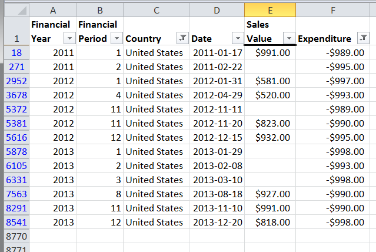
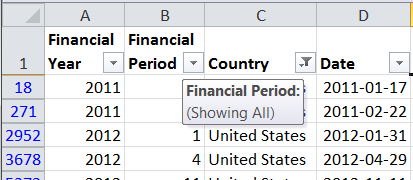
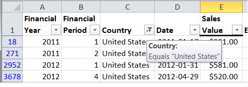
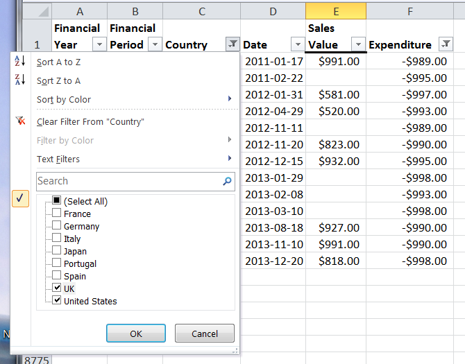
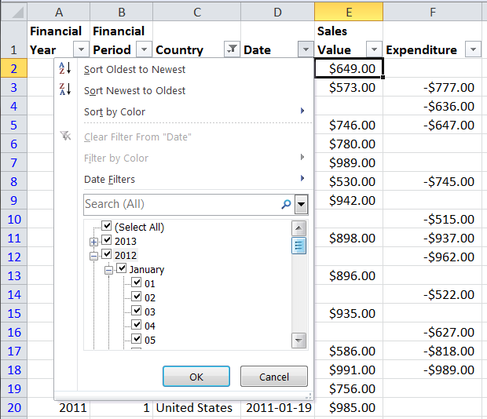
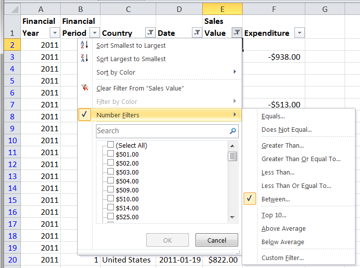
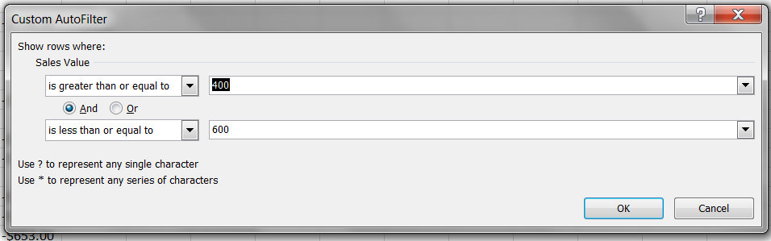
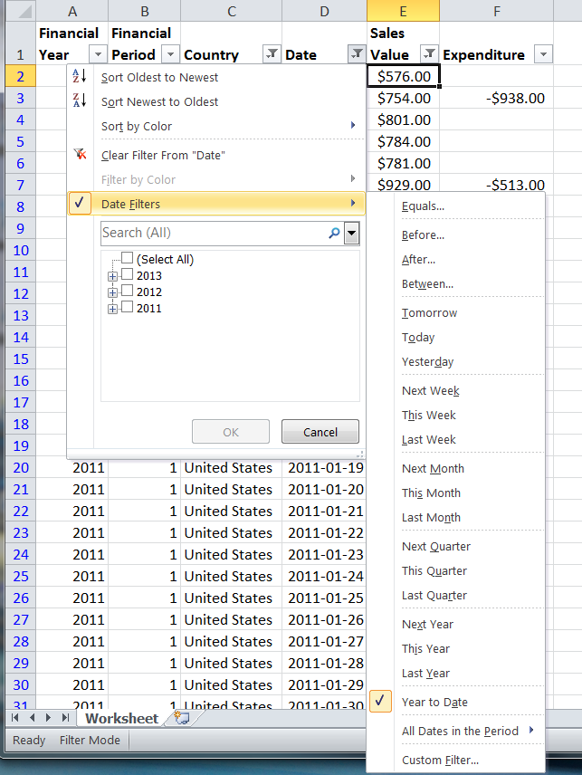
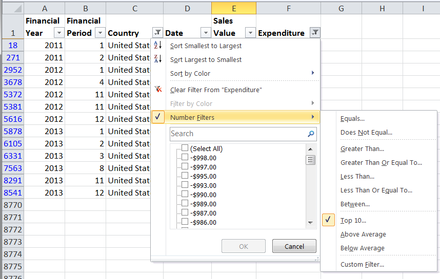
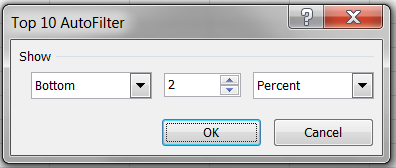

# AutoFilter Reference

## Introduction

Each worksheet in an Excel Workbook can contain a single autoFilter
range. Filtered data displays only the rows that meet criteria that you
specify and hides rows that you do not want displayed. You can filter by
more than one column: filters are additive, which means that each
additional filter is based on the current filter and further reduces the
subset of data.



When an AutoFilter is applied to a range of cells, the first row in an
autofilter range will be the heading row, which displays the autoFilter
dropdown icons. It is not part of the actual autoFiltered data. All
subsequent rows are the autoFiltered data. So an AutoFilter range should
always contain the heading row and one or more data rows (one data row
is pretty meaningless), but PhpSpreadsheet won't actually stop you
specifying a meaningless range: it's up to you as a developer to avoid
such errors.

To determine if a filter is applied, note the icon in the column
heading. A drop-down arrow
() means
that filtering is enabled but not applied. In MS Excel, when you hover
over the heading of a column with filtering enabled but not applied, a
screen tip displays the cell text for the first row in that column, and
the message "(Showing All)".



A Filter button
() means
that a filter is applied. When you hover over the heading of a filtered
column, a screen tip displays the filter that has been applied to that
column, such as "Equals a red cell color" or "Larger than 150".



## Setting an AutoFilter area on a worksheet

To set an autoFilter on a range of cells.

``` php
$spreadsheet->getActiveSheet()->setAutoFilter('A1:E20');
```

The first row in an autofilter range will be the heading row, which
displays the autoFilter dropdown icons. It is not part of the actual
autoFiltered data. All subsequent rows are the autoFiltered data. So an
AutoFilter range should always contain the heading row and one or more
data rows (one data row is pretty meaningless, but PhpSpreadsheet won't
actually stop you specifying a meaningless range: it's up to you as a
developer to avoid such errors.

If you want to set the whole worksheet as an autofilter region

``` php
$spreadsheet->getActiveSheet()->setAutoFilter(
    $spreadsheet->getActiveSheet()
        ->calculateWorksheetDimension()
);
```

This enables filtering, but does not actually apply any filters.

## Autofilter Expressions

PHPEXcel 1.7.8 introduced the ability to actually create, read and write
filter expressions; initially only for Xlsx files, but later releases
will extend this to other formats.

To apply a filter expression to an autoFilter range, you first need to
identify which column you're going to be applying this filter to.

``` php
$autoFilter = $spreadsheet->getActiveSheet()->getAutoFilter();
$columnFilter = $autoFilter->getColumn('C');
```

This returns an autoFilter column object, and you can then apply filter
expressions to that column.

There are a number of different types of autofilter expressions. The
most commonly used are:

-   Simple Filters
-   DateGroup Filters
-   Custom filters
-   Dynamic Filters
-   Top Ten Filters

These different types are mutually exclusive within any single column.
You should not mix the different types of filter in the same column.
PhpSpreadsheet will not actively prevent you from doing this, but the
results are unpredictable.

Other filter expression types (such as cell colour filters) are not yet
supported.

### Simple filters

In MS Excel, Simple Filters are a dropdown list of all values used in
that column, and the user can select which ones they want to display and
which ones they want to hide by ticking and unticking the checkboxes
alongside each option. When the filter is applied, rows containing the
checked entries will be displayed, rows that don't contain those values
will be hidden.



To create a filter expression, we need to start by identifying the
filter type. In this case, we're just going to specify that this filter
is a standard filter.

``` php
$columnFilter->setFilterType(
    \PhpOffice\PhpSpreadsheet\Worksheet\AutoFilter\Column::AUTOFILTER_FILTERTYPE_FILTER
);
```

Now we've identified the filter type, we can create a filter rule and
set the filter values:

When creating a simple filter in PhpSpreadsheet, you only need to
specify the values for "checked" columns: you do this by creating a
filter rule for each value.

``` php
$columnFilter->createRule()
    ->setRule(
        \PhpOffice\PhpSpreadsheet\Worksheet\AutoFilter\Column\Rule::AUTOFILTER_COLUMN_RULE_EQUAL,
        'France'
    );

$columnFilter->createRule()
    ->setRule(
        \PhpOffice\PhpSpreadsheet\Worksheet\AutoFilter\Column\Rule::AUTOFILTER_COLUMN_RULE_EQUAL,
        'Germany'
    );
```

This creates two filter rules: the column will be filtered by values
that match “France” OR “Germany”. For Simple Filters, you can create as
many rules as you want

Simple filters are always a comparison match of EQUALS, and multiple
standard filters are always treated as being joined by an OR condition.

#### Matching Blanks

If you want to create a filter to select blank cells, you would use:

``` php
$columnFilter->createRule()
    ->setRule(
        \PhpOffice\PhpSpreadsheet\Worksheet\AutoFilter\Column\Rule::AUTOFILTER_COLUMN_RULE_EQUAL,
        ''
    );
```

### DateGroup Filters

In MS Excel, DateGroup filters provide a series of dropdown filter
selectors for date values, so you can specify entire years, or months
within a year, or individual days within each month.



DateGroup filters are still applied as a Standard Filter type.

``` php
$columnFilter->setFilterType(
    \PhpOffice\PhpSpreadsheet\Worksheet\AutoFilter\Column::AUTOFILTER_FILTERTYPE_FILTER
);
```

Creating a dateGroup filter in PhpSpreadsheet, you specify the values
for "checked" columns as an associative array of year. month, day, hour
minute and second. To select a year and month, you need to create a
DateGroup rule identifying the selected year and month:

``` php
$columnFilter->createRule()
    ->setRule(
        \PhpOffice\PhpSpreadsheet\Worksheet\AutoFilter\Column\Rule::AUTOFILTER_COLUMN_RULE_EQUAL,
        array(
            'year' => 2012,
            'month' => 1
        )
    )
    ->setRuleType(
        \PhpOffice\PhpSpreadsheet\Worksheet\AutoFilter\Column\Rule::AUTOFILTER_RULETYPE_DATEGROUP
    );
```

The key values for the associative array are:

-   year
-   month
-   day
-   hour
-   minute
-   second

Like Standard filters, DateGroup filters are always a match of EQUALS,
and multiple standard filters are always treated as being joined by an
OR condition.

Note that we alse specify a ruleType: to differentiate this from a
standard filter, we explicitly set the Rule's Type to
AUTOFILTER\_RULETYPE\_DATEGROUP. As with standard filters, we can create
any number of DateGroup Filters.

### Custom filters

In MS Excel, Custom filters allow us to select more complex conditions
using an operator as well as a value. Typical examples might be values
that fall within a range (e.g. between -20 and +20), or text values with
wildcards (e.g. beginning with the letter U). To handle this, they





Custom filters are limited to 2 rules, and these can be joined using
either an AND or an OR.

We start by specifying a Filter type, this time a CUSTOMFILTER.

``` php
$columnFilter->setFilterType(
    \PhpOffice\PhpSpreadsheet\Worksheet\AutoFilter\Column::AUTOFILTER_FILTERTYPE_CUSTOMFILTER
);
```

And then define our rules.

The following shows a simple wildcard filter to show all column entries
beginning with the letter 'U'.

``` php
$columnFilter->createRule()
    ->setRule(
        \PhpOffice\PhpSpreadsheet\Worksheet\AutoFilter\Column\Rule::AUTOFILTER_COLUMN_RULE_EQUAL,
        'U*'
    )
    ->setRuleType(
        \PhpOffice\PhpSpreadsheet\Worksheet\AutoFilter\Column\Rule::AUTOFILTER_RULETYPE_CUSTOMFILTER
    );
```

MS Excel uses \* as a wildcard to match any number of characters, and ?
as a wildcard to match a single character. 'U\*' equates to "begins with
a 'U'"; '\*U' equates to "ends with a 'U'"; and '\*U\*' equates to
"contains a 'U'"

If you want to match explicitly against a \* or a ? character, you can
escape it with a tilde (\~), so ?\~\*\* would explicitly match for a \*
character as the second character in the cell value, followed by any
number of other characters. The only other character that needs escaping
is the \~ itself.

To create a "between" condition, we need to define two rules:

``` php
$columnFilter->createRule()
    ->setRule(
        \PhpOffice\PhpSpreadsheet\Worksheet\AutoFilter\Column\Rule::AUTOFILTER_COLUMN_RULE_GREATERTHANOREQUAL,
        -20
    )
    ->setRuleType(
        \PhpOffice\PhpSpreadsheet\Worksheet\AutoFilter\Column\Rule::AUTOFILTER_RULETYPE_CUSTOMFILTER
    );
$columnFilter->createRule()
    ->setRule(
        \PhpOffice\PhpSpreadsheet\Worksheet\AutoFilter\Column\Rule::AUTOFILTER_COLUMN_RULE_LESSTHANOREQUAL,
        20
    )
    ->setRuleType(
        \PhpOffice\PhpSpreadsheet\Worksheet\AutoFilter\Column\Rule::AUTOFILTER_RULETYPE_CUSTOMFILTER
    );
```

We also set the rule type to CUSTOMFILTER.

This defined two rules, filtering numbers that are &gt;= -20 OR &lt;=
20, so we also need to modify the join condition to reflect AND rather
than OR.

``` php
$columnFilter->setAndOr(
    \PhpOffice\PhpSpreadsheet\Worksheet\AutoFilter\Column::AUTOFILTER_COLUMN_ANDOR_AND
);
```

The valid set of operators for Custom Filters are defined in the
\PhpOffice\PhpSpreadsheet\Worksheet\AutoFilter\Column\Rule class, and
comprise:

Operator Constant                         | Value
------------------------------------------|----------------------
AUTOFILTER_COLUMN_RULE_EQUAL              | 'equal'
AUTOFILTER_COLUMN_RULE_NOTEQUAL           | 'notEqual'
AUTOFILTER_COLUMN_RULE_GREATERTHAN        | 'greaterThan'
AUTOFILTER_COLUMN_RULE_GREATERTHANOREQUAL | 'greaterThanOrEqual'
AUTOFILTER_COLUMN_RULE_LESSTHAN           | 'lessThan'
AUTOFILTER_COLUMN_RULE_LESSTHANOREQUAL    | 'lessThanOrEqual'

### Dynamic Filters

Dynamic Filters are based on a dynamic comparison condition, where the
value we're comparing against the cell values is variable, such as
'today'; or when we're testing against an aggregate of the cell data
(e.g. 'aboveAverage'). Only a single dynamic filter can be applied to a
column at a time.



Again, we start by specifying a Filter type, this time a DYNAMICFILTER.

``` php
$columnFilter->setFilterType(
    \PhpOffice\PhpSpreadsheet\Worksheet\AutoFilter\Column::AUTOFILTER_FILTERTYPE_DYNAMICFILTER
);
```

When defining the rule for a dynamic filter, we don't define a value (we
can simply set that to NULL) but we do specify the dynamic filter
category.

``` php
$columnFilter->createRule()
    ->setRule(
        \PhpOffice\PhpSpreadsheet\Worksheet\AutoFilter\Column\Rule::AUTOFILTER_COLUMN_RULE_EQUAL,
        NULL,
        \PhpOffice\PhpSpreadsheet\Worksheet\AutoFilter\Column\Rule::AUTOFILTER_RULETYPE_DYNAMIC_YEARTODATE
    )
    ->setRuleType(
        \PhpOffice\PhpSpreadsheet\Worksheet\AutoFilter\Column\Rule::AUTOFILTER_RULETYPE_DYNAMICFILTER
    );
```

We also set the rule type to DYNAMICFILTER.

The valid set of dynamic filter categories is defined in the
\PhpOffice\PhpSpreadsheet\Worksheet\AutoFilter\Column\Rule class, and
comprises:

Operator Constant                        | Value
-----------------------------------------|----------------
AUTOFILTER_RULETYPE_DYNAMIC_YESTERDAY    | 'yesterday'
AUTOFILTER_RULETYPE_DYNAMIC_TODAY        | 'today'
AUTOFILTER_RULETYPE_DYNAMIC_TOMORROW     | 'tomorrow'
AUTOFILTER_RULETYPE_DYNAMIC_YEARTODATE   | 'yearToDate'
AUTOFILTER_RULETYPE_DYNAMIC_THISYEAR     | 'thisYear'
AUTOFILTER_RULETYPE_DYNAMIC_THISQUARTER  | 'thisQuarter'
AUTOFILTER_RULETYPE_DYNAMIC_THISMONTH    | 'thisMonth'
AUTOFILTER_RULETYPE_DYNAMIC_THISWEEK     | 'thisWeek'
AUTOFILTER_RULETYPE_DYNAMIC_LASTYEAR     | 'lastYear'
AUTOFILTER_RULETYPE_DYNAMIC_LASTQUARTER  | 'lastQuarter'
AUTOFILTER_RULETYPE_DYNAMIC_LASTMONTH    | 'lastMonth'
AUTOFILTER_RULETYPE_DYNAMIC_LASTWEEK     | 'lastWeek'
AUTOFILTER_RULETYPE_DYNAMIC_NEXTYEAR     | 'nextYear'
AUTOFILTER_RULETYPE_DYNAMIC_NEXTQUARTER  | 'nextQuarter'
AUTOFILTER_RULETYPE_DYNAMIC_NEXTMONTH    | 'nextMonth'
AUTOFILTER_RULETYPE_DYNAMIC_NEXTWEEK     | 'nextWeek'
AUTOFILTER_RULETYPE_DYNAMIC_MONTH_1      | 'M1'
AUTOFILTER_RULETYPE_DYNAMIC_JANUARY      | 'M1'
AUTOFILTER_RULETYPE_DYNAMIC_MONTH_2      | 'M2'
AUTOFILTER_RULETYPE_DYNAMIC_FEBRUARY     | 'M2'
AUTOFILTER_RULETYPE_DYNAMIC_MONTH_3      | 'M3'
AUTOFILTER_RULETYPE_DYNAMIC_MARCH        | 'M3'
AUTOFILTER_RULETYPE_DYNAMIC_MONTH_4      | 'M4'
AUTOFILTER_RULETYPE_DYNAMIC_APRIL        | 'M4'
AUTOFILTER_RULETYPE_DYNAMIC_MONTH_5      | 'M5'
AUTOFILTER_RULETYPE_DYNAMIC_MAY          | 'M5'
AUTOFILTER_RULETYPE_DYNAMIC_MONTH_6      | 'M6'
AUTOFILTER_RULETYPE_DYNAMIC_JUNE         | 'M6'
AUTOFILTER_RULETYPE_DYNAMIC_MONTH_7      | 'M7'
AUTOFILTER_RULETYPE_DYNAMIC_JULY         | 'M7'
AUTOFILTER_RULETYPE_DYNAMIC_MONTH_8      | 'M8'
AUTOFILTER_RULETYPE_DYNAMIC_AUGUST       | 'M8'
AUTOFILTER_RULETYPE_DYNAMIC_MONTH_9      | 'M9'
AUTOFILTER_RULETYPE_DYNAMIC_SEPTEMBER    | 'M9'
AUTOFILTER_RULETYPE_DYNAMIC_MONTH_10     | 'M10'
AUTOFILTER_RULETYPE_DYNAMIC_OCTOBER      | 'M10'
AUTOFILTER_RULETYPE_DYNAMIC_MONTH_11     | 'M11'
AUTOFILTER_RULETYPE_DYNAMIC_NOVEMBER     | 'M11'
AUTOFILTER_RULETYPE_DYNAMIC_MONTH_12     | 'M12'
AUTOFILTER_RULETYPE_DYNAMIC_DECEMBER     | 'M12'
AUTOFILTER_RULETYPE_DYNAMIC_QUARTER_1    | 'Q1'
AUTOFILTER_RULETYPE_DYNAMIC_QUARTER_2    | 'Q2'
AUTOFILTER_RULETYPE_DYNAMIC_QUARTER_3    | 'Q3'
AUTOFILTER_RULETYPE_DYNAMIC_QUARTER_4    | 'Q4'
AUTOFILTER_RULETYPE_DYNAMIC_ABOVEAVERAGE | 'aboveAverage'
AUTOFILTER_RULETYPE_DYNAMIC_BELOWAVERAGE | 'belowAverage'

We can only apply a single Dynamic Filter rule to a column at a time.

### Top Ten Filters

Top Ten Filters are similar to Dynamic Filters in that they are based on
a summarisation of the actual data values in the cells. However, unlike
Dynamic Filters where you can only select a single option, Top Ten
Filters allow you to select based on a number of criteria:





You can identify whether you want the top (highest) or bottom (lowest)
values.You can identify how many values you wish to select in the
filterYou can identify whether this should be a percentage or a number
of items.

Like Dynamic Filters, only a single Top Ten filter can be applied to a
column at a time.

We start by specifying a Filter type, this time a DYNAMICFILTER.

``` php
$columnFilter->setFilterType(
    \PhpOffice\PhpSpreadsheet\Worksheet\AutoFilter\Column::AUTOFILTER_FILTERTYPE_TOPTENFILTER
);
```

Then we create the rule:

``` php
$columnFilter->createRule()
    ->setRule(
        \PhpOffice\PhpSpreadsheet\Worksheet\AutoFilter\Column\Rule::AUTOFILTER_COLUMN_RULE_TOPTEN_PERCENT,
        5,
        \PhpOffice\PhpSpreadsheet\Worksheet\AutoFilter\Column\Rule::AUTOFILTER_COLUMN_RULE_TOPTEN_TOP
    )
    ->setRuleType(
        \PhpOffice\PhpSpreadsheet\Worksheet\AutoFilter\Column\Rule::AUTOFILTER_RULETYPE_TOPTENFILTER
    );
```

This will filter the Top 5 percent of values in the column.

To specify the lowest (bottom 2 values), we would specify a rule of:

``` php
$columnFilter->createRule()
    ->setRule(
        \PhpOffice\PhpSpreadsheet\Worksheet\AutoFilter\Column\Rule::AUTOFILTER_COLUMN_RULE_TOPTEN_BY_VALUE,
        5,
        \PhpOffice\PhpSpreadsheet\Worksheet\AutoFilter\Column\Rule::AUTOFILTER_COLUMN_RULE_TOPTEN_BOTTOM
    )
    ->setRuleType(
        \PhpOffice\PhpSpreadsheet\Worksheet\AutoFilter\Column\Rule::AUTOFILTER_RULETYPE_TOPTENFILTER
    );
```

The option values for TopTen Filters top/bottom value/percent are all
defined in the
\PhpOffice\PhpSpreadsheet\Worksheet\AutoFilter\Column\Rule class, and
comprise:

Operator Constant                      | Value
---------------------------------------|-------------
AUTOFILTER_COLUMN_RULE_TOPTEN_BY_VALUE | 'byValue'
AUTOFILTER_COLUMN_RULE_TOPTEN_PERCENT  | 'byPercent'

and

Operator Constant                    | Value
-------------------------------------|----------
AUTOFILTER_COLUMN_RULE_TOPTEN_TOP    | 'top'
AUTOFILTER_COLUMN_RULE_TOPTEN_BOTTOM | 'bottom'

## Executing an AutoFilter

When an autofilter is applied in MS Excel, it sets the row
hidden/visible flags for each row of the autofilter area based on the
selected criteria, so that only those rows that match the filter
criteria are displayed.

PhpSpreadsheet will not execute the equivalent function automatically
when you set or change a filter expression, but only when the file is
saved.

### Applying the Filter

If you wish to execute your filter from within a script, you need to do
this manually. You can do this using the autofilters showHideRows()
method.

``` php
$autoFilter = $spreadsheet->getActiveSheet()->getAutoFilter();
$autoFilter->showHideRows();
```

This will set all rows that match the filter criteria to visible, while
hiding all other rows within the autofilter area.

### Displaying Filtered Rows

Simply looping through the rows in an autofilter area will still access
ever row, whether it matches the filter criteria or not. To selectively
access only the filtered rows, you need to test each row’s visibility
settings.

``` php
foreach ($spreadsheet->getActiveSheet()->getRowIterator() as $row) {
    if ($spreadsheet->getActiveSheet()
        ->getRowDimension($row->getRowIndex())->getVisible()) {
        echo '    Row number - ' , $row->getRowIndex() , ' ';
        echo $spreadsheet->getActiveSheet()
            ->getCell(
                'C'.$row->getRowIndex()
            )
            ->getValue(), ' ';
        echo $spreadsheet->getActiveSheet()
            ->getCell(
                'D'.$row->getRowIndex()
            )->getFormattedValue(), ' ';
        echo EOL;
    }
}
```

## AutoFilter Sorting

In MS Excel, Autofiltering also allows the rows to be sorted. This
feature is ***not*** supported by PhpSpreadsheet.
