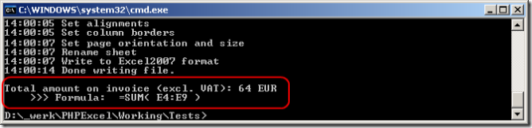
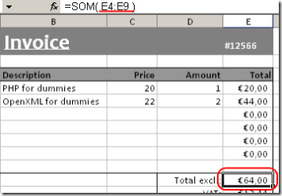
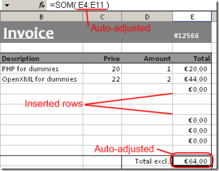

# Calculation Engine

## Using the PhpSpreadsheet calculation engine

### Performing formula calculations

As PhpSpreadsheet represents an in-memory spreadsheet, it also offers
formula calculation capabilities. A cell can be of a value type
(containing a number or text), or a formula type (containing a formula
which can be evaluated). For example, the formula `=SUM(A1:A10)`
evaluates to the sum of values in A1, A2, ..., A10.

To calculate a formula, you can call the cell containing the formula’s
method `getCalculatedValue()`, for example:

``` php
$spreadsheet->getActiveSheet()->getCell('E11')->getCalculatedValue();
```

If you write the following line of code in the invoice demo included
with PhpSpreadsheet, it evaluates to the value "64":



Another nice feature of PhpSpreadsheet's formula parser, is that it can
automatically adjust a formula when inserting/removing rows/columns.
Here's an example:



You see that the formula contained in cell E11 is "SUM(E4:E9)". Now,
when I write the following line of code, two new product lines are
added:

``` php
$spreadsheet->getActiveSheet()->insertNewRowBefore(7, 2);
```



Did you notice? The formula in the former cell E11 (now E13, as I
inserted 2 new rows), changed to "SUM(E4:E11)". Also, the inserted cells
duplicate style information of the previous cell, just like Excel's
behaviour. Note that you can both insert rows and columns.

## Known limitations

There are some known limitations to the PhpSpreadsheet calculation
engine. Most of them are due to the fact that an Excel formula is
converted into PHP code before being executed. This means that Excel
formula calculation is subject to PHP's language characteristics.

### Function that are not Supported in Xls

Not all functions are supported, for a comprehensive list, read the
[function list by name](../references/function-list-by-name.md).

#### Operator precedence

In Excel `+` wins over `&`, just like `*` wins over `+` in ordinary
algebra. The former rule is not what one finds using the calculation
engine shipped with PhpSpreadsheet.

- [Reference for Excel](https://support.office.com/en-us/article/Calculation-operators-and-precedence-in-Excel-48be406d-4975-4d31-b2b8-7af9e0e2878a)
- [Reference for PHP](http://php.net/manual/en/language.operators.php)

#### Formulas involving numbers and text

Formulas involving numbers and text may produce unexpected results or
even unreadable file contents. For example, the formula `=3+"Hello "` is
expected to produce an error in Excel (\#VALUE!). Due to the fact that
PHP converts `"Hello "` to a numeric value (zero), the result of this
formula is evaluated as 3 instead of evaluating as an error. This also
causes the Excel document being generated as containing unreadable
content.

- [Reference for this behaviour in PHP](http://php.net/manual/en/language.types.string.php#language.types.string.conversion)

#### Formulas don’t seem to be calculated in Excel2003 using compatibility pack?

This is normal behaviour of the compatibility pack, Xlsx displays this
correctly. Use `\PhpOffice\PhpSpreadsheet\Writer\Xls` if you really need
calculated values, or force recalculation in Excel2003.

## Handling Date and Time Values

### Excel functions that return a Date and Time value

Any of the Date and Time functions that return a date value in Excel can
return either an Excel timestamp or a PHP timestamp or `DateTime` object.

It is possible for scripts to change the data type used for returning
date values by calling the
`\PhpOffice\PhpSpreadsheet\Calculation\Functions::setReturnDateType()`
method:

``` php
\PhpOffice\PhpSpreadsheet\Calculation\Functions::setReturnDateType($returnDateType);
```

where the following constants can be used for `$returnDateType`:

- `\PhpOffice\PhpSpreadsheet\Calculation\Functions::RETURNDATE_PHP_NUMERIC`
- `\PhpOffice\PhpSpreadsheet\Calculation\Functions::RETURNDATE_PHP_OBJECT`
- `\PhpOffice\PhpSpreadsheet\Calculation\Functions::RETURNDATE_EXCEL`

The method will return a Boolean True on success, False on failure (e.g.
if an invalid value is passed in for the return date type).

The `\PhpOffice\PhpSpreadsheet\Calculation\Functions::getReturnDateType()`
method can be used to determine the current value of this setting:

``` php
$returnDateType = \PhpOffice\PhpSpreadsheet\Calculation\Functions::getReturnDateType();
```

The default is `RETURNDATE_PHP_NUMERIC`.

#### PHP Timestamps

If `RETURNDATE_PHP_NUMERIC` is set for the Return Date Type, then any
date value returned to the calling script by any access to the Date and
Time functions in Excel will be an integer value that represents the
number of seconds from the PHP/Unix base date. The PHP/Unix base date
(0) is 00:00 UST on 1st January 1970. This value can be positive or
negative: so a value of -3600 would be 23:00 hrs on 31st December 1969;
while a value of +3600 would be 01:00 hrs on 1st January 1970. This
gives PHP a date range of between 14th December 1901 and 19th January
2038.

#### PHP `DateTime` Objects

If the Return Date Type is set for `RETURNDATE_PHP_OBJECT`, then any
date value returned to the calling script by any access to the Date and
Time functions in Excel will be a PHP `DateTime` object.

#### Excel Timestamps

If `RETURNDATE_EXCEL` is set for the Return Date Type, then the returned
date value by any access to the Date and Time functions in Excel will be
a floating point value that represents a number of days from the Excel
base date. The Excel base date is determined by which calendar Excel
uses: the Windows 1900 or the Mac 1904 calendar. 1st January 1900 is the
base date for the Windows 1900 calendar while 1st January 1904 is the
base date for the Mac 1904 calendar.

It is possible for scripts to change the calendar used for calculating
Excel date values by calling the
`\PhpOffice\PhpSpreadsheet\Shared\Date::setExcelCalendar()` method:

``` php
\PhpOffice\PhpSpreadsheet\Shared\Date::setExcelCalendar($baseDate);
```

where the following constants can be used for `$baseDate`:

- `\PhpOffice\PhpSpreadsheet\Shared\Date::CALENDAR_WINDOWS_1900`
- `\PhpOffice\PhpSpreadsheet\Shared\Date::CALENDAR_MAC_1904`

The method will return a Boolean True on success, False on failure (e.g.
if an invalid value is passed in).

The `\PhpOffice\PhpSpreadsheet\Shared\Date::getExcelCalendar()` method can
be used to determine the current value of this setting:

``` php
$baseDate = \PhpOffice\PhpSpreadsheet\Shared\Date::getExcelCalendar();
```

The default is `CALENDAR_WINDOWS_1900`.

#### Functions that return a Date/Time Value

- DATE
- DATEVALUE
- EDATE
- EOMONTH
- NOW
- TIME
- TIMEVALUE
- TODAY

### Excel functions that accept Date and Time values as parameters

Date values passed in as parameters to a function can be an Excel
timestamp or a PHP timestamp; or `DateTime` object; or a string containing a
date value (e.g. '1-Jan-2009'). PhpSpreadsheet will attempt to identify
their type based on the PHP datatype:

An integer numeric value will be treated as a PHP/Unix timestamp. A real
(floating point) numeric value will be treated as an Excel
date/timestamp. Any PHP `DateTime` object will be treated as a `DateTime`
object. Any string value (even one containing straight numeric data)
will be converted to a `DateTime` object for validation as a date value
based on the server locale settings, so passing through an ambiguous
value of '07/08/2008' will be treated as 7th August 2008 if your server
settings are UK, but as 8th July 2008 if your server settings are US.
However, if you pass through a value such as '31/12/2008' that would be
considered an error by a US-based server, but which is not ambiguous,
then PhpSpreadsheet will attempt to correct this to 31st December 2008.
If the content of the string doesn’t match any of the formats recognised
by the php `DateTime` object implementation of `strtotime()` (which can
handle a wider range of formats than the normal `strtotime()` function),
then the function will return a `#VALUE` error. However, Excel
recommends that you should always use date/timestamps for your date
functions, and the recommendation for PhpSpreadsheet is the same: avoid
strings because the result is not predictable.

The same principle applies when data is being written to Excel. Cells
containing date actual values (rather than Excel functions that return a
date value) are always written as Excel dates, converting where
necessary. If a cell formatted as a date contains an integer or
`DateTime` object value, then it is converted to an Excel value for
writing: if a cell formatted as a date contains a real value, then no
conversion is required. Note that string values are written as strings
rather than converted to Excel date timestamp values.

#### Functions that expect a Date/Time Value

- DATEDIF
- DAY
- DAYS360
- EDATE
- EOMONTH
- HOUR
- MINUTE
- MONTH
- NETWORKDAYS
- SECOND
- WEEKDAY
- WEEKNUM
- WORKDAY
- YEAR
- YEARFRAC

### Helper Methods

In addition to the `setExcelCalendar()` and `getExcelCalendar()` methods, a
number of other methods are available in the
`\PhpOffice\PhpSpreadsheet\Shared\Date` class that can help when working
with dates:

#### \PhpOffice\PhpSpreadsheet\Shared\Date::excelToTimestamp($excelDate)

Converts a date/time from an Excel date timestamp to return a PHP
serialized date/timestamp.

Note that this method does not trap for Excel dates that fall outside of
the valid range for a PHP date timestamp.

#### \PhpOffice\PhpSpreadsheet\Shared\Date::excelToDateTimeObject($excelDate)

Converts a date from an Excel date/timestamp to return a PHP `DateTime`
object.

#### \PhpOffice\PhpSpreadsheet\Shared\Date::PHPToExcel($PHPDate)

Converts a PHP serialized date/timestamp or a PHP `DateTime` object to
return an Excel date timestamp.

#### \PhpOffice\PhpSpreadsheet\Shared\Date::formattedPHPToExcel($year, $month, $day, $hours=0, $minutes=0, $seconds=0)

Takes year, month and day values (and optional hour, minute and second
values) and returns an Excel date timestamp value.

### Timezone support for Excel date timestamp conversions

The default timezone for the date functions in PhpSpreadsheet is UST (Universal Standard Time).
If a different timezone needs to be used, these methods are available:

#### \PhpOffice\PhpSpreadsheet\Shared\Date::getDefaultTimezone()

Returns the current timezone value PhpSpeadsheet is using to handle dates and times.

#### \PhpOffice\PhpSpreadsheet\Shared\Date::setDefaultTimezone($timeZone)

Sets the timezone for Excel date timestamp conversions to $timeZone,
which must be a valid PHP DateTimeZone value.
The return value is a Boolean, where true is success,
and false is failure (e.g. an invalid DateTimeZone value was passed.)

#### \PhpOffice\PhpSpreadsheet\Shared\Date::excelToDateTimeObject($excelDate, $timeZone)
#### \PhpOffice\PhpSpreadsheet\Shared\Date::excelToTimeStamp($excelDate, $timeZone)

These functions support a timezone as an optional second parameter.
This applies a specific timezone to that function call without affecting the default PhpSpreadsheet Timezone.

## Function Reference

### Database Functions

#### DAVERAGE

The DAVERAGE function returns the average value of the cells in a column
of a list or database that match conditions you specify.

##### Syntax

    DAVERAGE (database, field, criteria)

##### Parameters

**database** The range of cells that makes up the list or database.

A database is a list of related data in which rows of related
information are records, and columns of data are fields. The first row
of the list contains labels for each column.

**field** Indicates which column of the database is used in the
function.

Enter the column label as a string (enclosed between double quotation
marks), such as "Age" or "Yield," or as a number (without quotation
marks) that represents the position of the column within the list: 1 for
the first column, 2 for the second column, and so on.

**criteria** The range of cells that contains the conditions you
specify.

You can use any range for the criteria argument, as long as it includes
at least one column label and at least one cell below the column label
in which you specify a condition for the column.

##### Return Value

**float** The average value of the matching cells.

This is the statistical mean.

##### Examples

``` php
$database = [
    [ 'Tree',  'Height', 'Age', 'Yield', 'Profit' ],
    [ 'Apple',  18,       20,    14,      105.00  ],
    [ 'Pear',   12,       12,    10,       96.00  ],
    [ 'Cherry', 13,       14,     9,      105.00  ],
    [ 'Apple',  14,       15,    10,       75.00  ],
    [ 'Pear',    9,        8,     8,       76.80  ],
    [ 'Apple',   8,        9,     6,       45.00  ],
];

$criteria = [
    [ 'Tree',      'Height', 'Age', 'Yield', 'Profit', 'Height' ],
    [ '="=Apple"', '>10',    NULL,  NULL,    NULL,     '<16'    ],
    [ '="=Pear"',  NULL,     NULL,  NULL,    NULL,     NULL     ],
];

$worksheet->fromArray( $criteria, NULL, 'A1' )
    ->fromArray( $database, NULL, 'A4' );

$worksheet->setCellValue('A12', '=DAVERAGE(A4:E10,"Yield",A1:B2)');

$retVal = $worksheet->getCell('A12')->getCalculatedValue();
// $retVal = 12
```

##### Notes

There are no additional notes on this function

#### DCOUNT

The DCOUNT function returns the count of cells that contain a number in
a column of a list or database matching conditions that you specify.

##### Syntax

    DCOUNT(database, [field], criteria)

##### Parameters

**database** The range of cells that makes up the list or database.

A database is a list of related data in which rows of related
information are records, and columns of data are fields. The first row
of the list contains labels for each column.

**field** Indicates which column of the database is used in the
function.

Enter the column label as a string (enclosed between double quotation
marks), such as "Age" or "Yield," or as a number (without quotation
marks) that represents the position of the column within the list: 1 for
the first column, 2 for the second column, and so on.

**criteria** The range of cells that contains the conditions you
specify.

You can use any range for the criteria argument, as long as it includes
at least one column label and at least one cell below the column label
in which you specify a condition for the column.

##### Return Value

**float** The count of the matching cells.

##### Examples

``` php
$database = [
    [ 'Tree',  'Height', 'Age', 'Yield', 'Profit' ],
    [ 'Apple',  18,       20,    14,      105.00  ],
    [ 'Pear',   12,       12,    10,       96.00  ],
    [ 'Cherry', 13,       14,     9,      105.00  ],
    [ 'Apple',  14,       15,    10,       75.00  ],
    [ 'Pear',    9,        8,     8,       76.80  ],
    [ 'Apple',   8,        9,     6,       45.00  ],
];

$criteria = [
    [ 'Tree',      'Height', 'Age', 'Yield', 'Profit', 'Height' ],
    [ '="=Apple"', '>10',    NULL,  NULL,    NULL,     '<16'    ],
    [ '="=Pear"',  NULL,     NULL,  NULL,    NULL,     NULL     ],
];

$worksheet->fromArray( $criteria, NULL, 'A1' )
    ->fromArray( $database, NULL, 'A4' );

$worksheet->setCellValue('A12', '=DCOUNT(A4:E10,"Height",A1:B3)');

$retVal = $worksheet->getCell('A12')->getCalculatedValue();

// $retVal = 3
```

##### Notes

In MS Excel, The field argument is optional. If field is omitted, DCOUNT
counts all records in the database that match the criteria. This logic
has not yet been implemented in PhpSpreadsheet.

#### DCOUNTA

The DCOUNT function returns the count of cells that aren’t blank in a
column of a list or database and that match conditions that you specify.

##### Syntax

    DCOUNTA(database, [field], criteria)

##### Parameters

**database** The range of cells that makes up the list or database.

A database is a list of related data in which rows of related
information are records, and columns of data are fields. The first row
of the list contains labels for each column.

**field** Indicates which column of the database is used in the
function.

Enter the column label as a string (enclosed between double quotation
marks), such as "Age" or "Yield," or as a number (without quotation
marks) that represents the position of the column within the list: 1 for
the first column, 2 for the second column, and so on.

**criteria** The range of cells that contains the conditions you
specify.

You can use any range for the criteria argument, as long as it includes
at least one column label and at least one cell below the column label
in which you specify a condition for the column.

##### Return Value

**float** The count of the matching cells.

##### Examples

``` php
$database = [
    [ 'Tree',  'Height', 'Age', 'Yield', 'Profit' ],
    [ 'Apple',  18,       20,    14,      105.00  ],
    [ 'Pear',   12,       12,    10,       96.00  ],
    [ 'Cherry', 13,       14,     9,      105.00  ],
    [ 'Apple',  14,       15,    10,       75.00  ],
    [ 'Pear',    9,        8,     8,       76.80  ],
    [ 'Apple',   8,        9,     6,       45.00  ],
];

$criteria = [
    [ 'Tree',      'Height', 'Age', 'Yield', 'Profit', 'Height' ],
    [ '="=Apple"', '>10',    NULL,  NULL,    NULL,     '<16'    ],
    [ '="=Pear"',  NULL,     NULL,  NULL,    NULL,     NULL     ],
];

$worksheet->fromArray( $criteria, NULL, 'A1' )
    ->fromArray( $database, NULL, 'A4' );

$worksheet->setCellValue('A12', '=DCOUNTA(A4:E10,"Yield",A1:A3)');

$retVal = $worksheet->getCell('A12')->getCalculatedValue();

// $retVal = 5
```

##### Notes

In MS Excel, The field argument is optional. If field is omitted,
DCOUNTA counts all records in the database that match the criteria. This
logic has not yet been implemented in PhpSpreadsheet.

#### DGET

The DGET function extracts a single value from a column of a list or
database that matches conditions that you specify.

##### Syntax

    DGET(database, field, criteria)

##### Parameters

**database** The range of cells that makes up the list or database.

A database is a list of related data in which rows of related
information are records, and columns of data are fields. The first row
of the list contains labels for each column.

**field** Indicates which column of the database is used in the
function.

Enter the column label as a string (enclosed between double quotation
marks), such as "Age" or "Yield," or as a number (without quotation
marks) that represents the position of the column within the list: 1 for
the first column, 2 for the second column, and so on.

**criteria** The range of cells that contains the conditions you
specify.

You can use any range for the criteria argument, as long as it includes
at least one column label and at least one cell below the column label
in which you specify a condition for the column.

##### Return Value

**mixed** The value from the selected column of the matching row.

#### Examples

``` php
$database = [
    [ 'Tree',  'Height', 'Age', 'Yield', 'Profit' ],
    [ 'Apple',  18,       20,    14,      105.00  ],
    [ 'Pear',   12,       12,    10,       96.00  ],
    [ 'Cherry', 13,       14,     9,      105.00  ],
    [ 'Apple',  14,       15,    10,       75.00  ],
    [ 'Pear',    9,        8,     8,       76.80  ],
    [ 'Apple',   8,        9,     6,       45.00  ],
];

$criteria = [
    [ 'Tree',      'Height', 'Age', 'Yield', 'Profit', 'Height' ],
    [ '="=Apple"', '>10',    NULL,  NULL,    NULL,     '<16'    ],
    [ '="=Pear"',  NULL,     NULL,  NULL,    NULL,     NULL     ],
];

$worksheet->fromArray( $criteria, NULL, 'A1' )
    ->fromArray( $database, NULL, 'A4' );

$worksheet->setCellValue('A12', '=GET(A4:E10,"Age",A1:F2)');

$retVal = $worksheet->getCell('A12')->getCalculatedValue();
// $retVal = 14
```

##### Notes

There are no additional notes on this function

#### DMAX

The DMAX function returns the largest number in a column of a list or
database that matches conditions you specify.

##### Syntax

    DMAX(database, field, criteria)

##### Parameters

**database** The range of cells that makes up the list or database.

A database is a list of related data in which rows of related
information are records, and columns of data are fields. The first row
of the list contains labels for each column.

**field** Indicates which column of the database is used in the
function.

Enter the column label as a string (enclosed between double quotation
marks), such as "Age" or "Yield," or as a number (without quotation
marks) that represents the position of the column within the list: 1 for
the first column, 2 for the second column, and so on.

**criteria** The range of cells that contains the conditions you
specify.

You can use any range for the criteria argument, as long as it includes
at least one column label and at least one cell below the column label
in which you specify a condition for the column.

##### Return Value

**float** The maximum value of the matching cells.

##### Examples

``` php
$database = [
    [ 'Tree',  'Height', 'Age', 'Yield', 'Profit' ],
    [ 'Apple',  18,       20,    14,      105.00  ],
    [ 'Pear',   12,       12,    10,       96.00  ],
    [ 'Cherry', 13,       14,     9,      105.00  ],
    [ 'Apple',  14,       15,    10,       75.00  ],
    [ 'Pear',    9,        8,     8,       76.80  ],
    [ 'Apple',   8,        9,     6,       45.00  ],
];

$criteria = [
    [ 'Tree',      'Height', 'Age', 'Yield', 'Profit', 'Height' ],
    [ '="=Apple"', '>10',    NULL,  NULL,    NULL,     '<16'    ],
    [ '="=Pear"',  NULL,     NULL,  NULL,    NULL,     NULL     ],
];

$worksheet->fromArray( $criteria, NULL, 'A1' )
    ->fromArray( $database, NULL, 'A4' );

$worksheet->setCellValue('A12', '=DMAX(A4:E10,"Profit",A1:B2)');

$retVal = $worksheet->getCell('A12')->getCalculatedValue();
// $retVal = 105
```

##### Notes

There are no additional notes on this function

#### DMIN

The DMIN function returns the smallest number in a column of a list or
database that matches conditions you specify.

##### Syntax

    DMIN(database, field, criteria)

##### Parameters

**database** The range of cells that makes up the list or database.

A database is a list of related data in which rows of related
information are records, and columns of data are fields. The first row
of the list contains labels for each column.

**field** Indicates which column of the database is used in the
function.

Enter the column label as a string (enclosed between double quotation
marks), such as "Age" or "Yield," or as a number (without quotation
marks) that represents the position of the column within the list: 1 for
the first column, 2 for the second column, and so on.

**criteria** The range of cells that contains the conditions you
specify.

You can use any range for the criteria argument, as long as it includes
at least one column label and at least one cell below the column label
in which you specify a condition for the column.

##### Return Value

**float** The minimum value of the matching cells.

##### Examples

``` php
$database = [
    [ 'Tree',  'Height', 'Age', 'Yield', 'Profit' ],
    [ 'Apple',  18,       20,    14,      105.00  ],
    [ 'Pear',   12,       12,    10,       96.00  ],
    [ 'Cherry', 13,       14,     9,      105.00  ],
    [ 'Apple',  14,       15,    10,       75.00  ],
    [ 'Pear',    9,        8,     8,       76.80  ],
    [ 'Apple',   8,        9,     6,       45.00  ],
];

$criteria = [
    [ 'Tree',      'Height', 'Age', 'Yield', 'Profit', 'Height' ],
    [ '="=Apple"', '>10',    NULL,  NULL,    NULL,     '<16'    ],
    [ '="=Pear"',  NULL,     NULL,  NULL,    NULL,     NULL     ],
];

$worksheet->fromArray( $criteria, NULL, 'A1' )
    ->fromArray( $database, NULL, 'A4' );

$worksheet->setCellValue('A12', '=DMIN(A4:E10,"Yield",A1:A3)');

$retVal = $worksheet->getCell('A12')->getCalculatedValue();
// $retVal = 6
```

##### Notes

There are no additional notes on this function

#### DPRODUCT

The DPRODUCT function multiplies the values in a column of a list or
database that match conditions that you specify.

##### Syntax

    DPRODUCT(database, field, criteria)

##### Parameters

**database** The range of cells that makes up the list or database.

A database is a list of related data in which rows of related
information are records, and columns of data are fields. The first row
of the list contains labels for each column.

**field** Indicates which column of the database is used in the
function.

Enter the column label as a string (enclosed between double quotation
marks), such as "Age" or "Yield," or as a number (without quotation
marks) that represents the position of the column within the list: 1 for
the first column, 2 for the second column, and so on.

**criteria** The range of cells that contains the conditions you
specify.

You can use any range for the criteria argument, as long as it includes
at least one column label and at least one cell below the column label
in which you specify a condition for the column.

##### Return Value

**float** The product of the matching cells.

##### Examples

``` php
$database = [
    [ 'Tree',  'Height', 'Age', 'Yield', 'Profit' ],
    [ 'Apple',  18,       20,    14,      105.00  ],
    [ 'Pear',   12,       12,    10,       96.00  ],
    [ 'Cherry', 13,       14,     9,      105.00  ],
    [ 'Apple',  14,       15,    10,       75.00  ],
    [ 'Pear',    9,        8,     8,       76.80  ],
    [ 'Apple',   8,        9,     6,       45.00  ],
];

$criteria = [
    [ 'Tree',      'Height', 'Age', 'Yield', 'Profit', 'Height' ],
    [ '="=Apple"', '>10',    NULL,  NULL,    NULL,     '<16'    ],
    [ '="=Pear"',  NULL,     NULL,  NULL,    NULL,     NULL     ],
];

$worksheet->fromArray( $criteria, NULL, 'A1' )
    ->fromArray( $database, NULL, 'A4' );

$worksheet->setCellValue('A12', '=DPRODUCT(A4:E10,"Yield",A1:B2)');

$retVal = $worksheet->getCell('A12')->getCalculatedValue();
// $retVal = 140
```

##### Notes

There are no additional notes on this function

#### DSTDEV

The DSTDEV function estimates the standard deviation of a population
based on a sample by using the numbers in a column of a list or database
that match conditions that you specify.

##### Syntax

    DSTDEV(database, field, criteria)

##### Parameters

**database** The range of cells that makes up the list or database.

A database is a list of related data in which rows of related
information are records, and columns of data are fields. The first row
of the list contains labels for each column.

**field** Indicates which column of the database is used in the
function.

Enter the column label as a string (enclosed between double quotation
marks), such as "Age" or "Yield," or as a number (without quotation
marks) that represents the position of the column within the list: 1 for
the first column, 2 for the second column, and so on.

**criteria** The range of cells that contains the conditions you
specify.

You can use any range for the criteria argument, as long as it includes
at least one column label and at least one cell below the column label
in which you specify a condition for the column.

##### Return Value

**float** The estimated standard deviation of the matching cells.

##### Examples

``` php
$database = [
    [ 'Tree',  'Height', 'Age', 'Yield', 'Profit' ],
    [ 'Apple',  18,       20,    14,      105.00  ],
    [ 'Pear',   12,       12,    10,       96.00  ],
    [ 'Cherry', 13,       14,     9,      105.00  ],
    [ 'Apple',  14,       15,    10,       75.00  ],
    [ 'Pear',    9,        8,     8,       76.80  ],
    [ 'Apple',   8,        9,     6,       45.00  ],
];

$criteria = [
    [ 'Tree',      'Height', 'Age', 'Yield', 'Profit', 'Height' ],
    [ '="=Apple"', '>10',    NULL,  NULL,    NULL,     '<16'    ],
    [ '="=Pear"',  NULL,     NULL,  NULL,    NULL,     NULL     ],
];

$worksheet->fromArray( $criteria, NULL, 'A1' )
    ->fromArray( $database, NULL, 'A4' );

$worksheet->setCellValue('A12', '=DSTDEV(A4:E10,"Yield",A1:A3)');

$retVal = $worksheet->getCell('A12')->getCalculatedValue();
// $retVal = 2.97
```

##### Notes

There are no additional notes on this function

#### DSTDEVP

The DSTDEVP function calculates the standard deviation of a population
based on the entire population by using the numbers in a column of a
list or database that match conditions that you specify.

##### Syntax

    DSTDEVP(database, field, criteria)

##### Parameters

**database** The range of cells that makes up the list or database.

A database is a list of related data in which rows of related
information are records, and columns of data are fields. The first row
of the list contains labels for each column.

**field** Indicates which column of the database is used in the
function.

Enter the column label as a string (enclosed between double quotation
marks), such as "Age" or "Yield," or as a number (without quotation
marks) that represents the position of the column within the list: 1 for
the first column, 2 for the second column, and so on.

**criteria** The range of cells that contains the conditions you
specify.

You can use any range for the criteria argument, as long as it includes
at least one column label and at least one cell below the column label
in which you specify a condition for the column.

##### Return Value

**float** The estimated standard deviation of the matching cells.

##### Examples

``` php
$database = [
    [ 'Tree',  'Height', 'Age', 'Yield', 'Profit' ],
    [ 'Apple',  18,       20,    14,      105.00  ],
    [ 'Pear',   12,       12,    10,       96.00  ],
    [ 'Cherry', 13,       14,     9,      105.00  ],
    [ 'Apple',  14,       15,    10,       75.00  ],
    [ 'Pear',    9,        8,     8,       76.80  ],
    [ 'Apple',   8,        9,     6,       45.00  ],
];

$criteria = [
    [ 'Tree',      'Height', 'Age', 'Yield', 'Profit', 'Height' ],
    [ '="=Apple"', '>10',    NULL,  NULL,    NULL,     '<16'    ],
    [ '="=Pear"',  NULL,     NULL,  NULL,    NULL,     NULL     ],
];

$worksheet->fromArray( $criteria, NULL, 'A1' )
    ->fromArray( $database, NULL, 'A4' );

$worksheet->setCellValue('A12', '=DSTDEVP(A4:E10,"Yield",A1:A3)');

$retVal = $worksheet->getCell('A12')->getCalculatedValue();
// $retVal = 2.65
```

##### Notes

There are no additional notes on this function

#### DSUM

The DSUM function adds the numbers in a column of a list or database
that matches conditions you specify.

##### Syntax

    DSUM(database, field, criteria)

##### Parameters

**database** The range of cells that makes up the list or database.

A database is a list of related data in which rows of related
information are records, and columns of data are fields. The first row
of the list contains labels for each column.

**field** Indicates which column of the database is used in the
function.

Enter the column label as a string (enclosed between double quotation
marks), such as "Age" or "Yield," or as a number (without quotation
marks) that represents the position of the column within the list: 1 for
the first column, 2 for the second column, and so on.

**criteria** The range of cells that contains the conditions you
specify.

You can use any range for the criteria argument, as long as it includes
at least one column label and at least one cell below the column label
in which you specify a condition for the column.

##### Return Value

**float** The total value of the matching cells.

##### Examples

``` php
$database = [
    [ 'Tree',  'Height', 'Age', 'Yield', 'Profit' ],
    [ 'Apple',  18,       20,    14,      105.00  ],
    [ 'Pear',   12,       12,    10,       96.00  ],
    [ 'Cherry', 13,       14,     9,      105.00  ],
    [ 'Apple',  14,       15,    10,       75.00  ],
    [ 'Pear',    9,        8,     8,       76.80  ],
    [ 'Apple',   8,        9,     6,       45.00  ],
];

$criteria = [
    [ 'Tree',      'Height', 'Age', 'Yield', 'Profit', 'Height' ],
    [ '="=Apple"', '>10',    NULL,  NULL,    NULL,     '<16'    ],
    [ '="=Pear"',  NULL,     NULL,  NULL,    NULL,     NULL     ],
];

$worksheet->fromArray( $criteria, NULL, 'A1' )
    ->fromArray( $database, NULL, 'A4' );

$worksheet->setCellValue('A12', '=DMIN(A4:E10,"Profit",A1:A2)');

$retVal = $worksheet->getCell('A12')->getCalculatedValue();
// $retVal = 225
```

##### Notes

There are no additional notes on this function

#### DVAR

Not yet documented.

#### DVARP

Not yet documented.

### Date and Time Functions

Excel provides a number of functions for the manipulation of dates and
times, and calculations based on date/time values. it is worth spending
some time reading the section titled "Date and Time Values" on passing
date parameters and returning date values to understand how
PhpSpreadsheet reconciles the differences between dates and times in
Excel and in PHP.

#### DATE

The DATE function returns an Excel timestamp or a PHP timestamp or `DateTime`
object representing the date that is referenced by the parameters.

##### Syntax

    DATE(year, month, day)

##### Parameters

**year** The year number.

If this value is between 0 (zero) and 1899 inclusive (for the Windows
1900 calendar), or between 4 and 1903 inclusive (for the Mac 1904), then
PhpSpreadsheet adds it to the Calendar base year, so a value of 108 will
interpret the year as 2008 when using the Windows 1900 calendar, or 2012
when using the Mac 1904 calendar.

**month** The month number.

If this value is greater than 12, the DATE function adds that number of
months to the first month in the year specified. For example,
DATE(2008,14,2) returns a value representing February 2, 2009.

If the value of **month** is less than 1, then that value will be
adjusted by -1, and that will then be subtracted from the first month of
the year specified. For example, DATE(2008,0,2) returns a value
representing December 2, 2007; while DATE(2008,-1,2) returns a value
representing November 2, 2007.

**day** The day number.

If this value is greater than the number of days in the month (and year)
specified, the DATE function adds that number of days to the first day
in the month. For example, DATE(2008,1,35) returns a value representing
February 4, 2008.

If the value of **day** is less than 1, then that value will be adjusted
by -1, and that will then be subtracted from the first month of the year
specified. For example, DATE(2008,3,0) returns a value representing
February 29, 2008; while DATE(2008,3,-2) returns a value representing
February 27, 2008.

##### Return Value

**mixed** A date/time stamp that corresponds to the given date.

This could be a PHP timestamp value (integer), a PHP `DateTime` object,
or an Excel timestamp value (real), depending on the value of
`\PhpOffice\PhpSpreadsheet\Calculation\Functions::getReturnDateType()`.

##### Examples

``` php
$worksheet->setCellValue('A1', 'Year')
    ->setCellValue('A2', 'Month')
    ->setCellValue('A3', 'Day');

$worksheet->setCellValue('B1', 2008)
    ->setCellValue('B2', 12)
    ->setCellValue('B3', 31);

$worksheet->setCellValue('D1', '=DATE(B1,B2,B3)');

$retVal = $worksheet->getCell('D1')->getCalculatedValue();
// $retVal = 1230681600
```

``` php
// We're going to be calling the same cell calculation multiple times,
//    and expecting different return values, so disable calculation cacheing
\PhpOffice\PhpSpreadsheet\Calculation\Calculation::getInstance()->setCalculationCacheEnabled(FALSE);

$saveFormat = \PhpOffice\PhpSpreadsheet\Calculation\Functions::getReturnDateType();

\PhpOffice\PhpSpreadsheet\Calculation\Functions::setReturnDateType(
    \PhpOffice\PhpSpreadsheet\Calculation\Functions::RETURNDATE_EXCEL
);

$retVal = call_user_func_array(
    ['\PhpOffice\PhpSpreadsheet\Calculation\Functions', 'DATE'],
    [2008, 12, 31]
);
// $retVal = 39813.0

\PhpOffice\PhpSpreadsheet\Calculation\Functions::setReturnDateType(
    \PhpOffice\PhpSpreadsheet\Calculation\Functions::RETURNDATE_PHP_NUMERIC
);

$retVal = call_user_func_array(
    ['\PhpOffice\PhpSpreadsheet\Calculation\Functions', 'DATE'],
    [2008, 12, 31]
);
// $retVal = 1230681600

\PhpOffice\PhpSpreadsheet\Calculation\Functions::setReturnDateType($saveFormat);
```

##### Notes

There are no additional notes on this function

#### DATEDIF

The DATEDIF function computes the difference between two dates in a
variety of different intervals, such number of years, months, or days.

##### Syntax

    DATEDIF(date1, date2 [, unit])

##### Parameters

**date1** First Date.

An Excel date value, PHP date timestamp, PHP `DateTime` object, or a date
represented as a string.

**date2** Second Date.

An Excel date value, PHP date timestamp, PHP `DateTime` object, or a date
represented as a string.

**unit** The interval type to use for the calculation

This is a string, comprising one of the values listed below:

Unit | Meaning                         | Description
-----|---------------------------------|--------------------------------
m    | Months                          | Complete calendar months between the dates.
d    | Days                            | Number of days between the dates.
y    | Years                           | Complete calendar years between the dates.
ym   | Months Excluding Years          | Complete calendar months between the dates as if they were of the same year.
yd   | Days Excluding Years            | Complete calendar days between the dates as if they were of the same year.
md   | Days Excluding Years And Months | Complete calendar days between the dates as if they were of the same month and same year.

The unit value is not case sensitive, and defaults to `d`.

##### Return Value

**integer** An integer value that reflects the difference between the
two dates.

This could be the number of full days, months or years between the two
dates, depending on the interval unit value passed into the function as
the third parameter.

##### Examples

``` php
$worksheet->setCellValue('A1', 'Year')
    ->setCellValue('A2', 'Month')
    ->setCellValue('A3', 'Day');

$worksheet->setCellValue('B1', 2001)
    ->setCellValue('C1', 2009)
    ->setCellValue('B2', 7)
    ->setCellValue('C2', 12)
    ->setCellValue('B3', 1)
    ->setCellValue('C3', 31);

$worksheet->setCellValue('D1', '=DATEDIF(DATE(B1,B2,B3),DATE(C1,C2,C3),"d")')
    ->setCellValue('D2', '=DATEDIF(DATE(B1,B2,B3),DATE(C1,C2,C3),"m")')
    ->setCellValue('D3', '=DATEDIF(DATE(B1,B2,B3),DATE(C1,C2,C3),"y")')
    ->setCellValue('D4', '=DATEDIF(DATE(B1,B2,B3),DATE(C1,C2,C3),"ym")')
    ->setCellValue('D5', '=DATEDIF(DATE(B1,B2,B3),DATE(C1,C2,C3),"yd")')
    ->setCellValue('D6', '=DATEDIF(DATE(B1,B2,B3),DATE(C1,C2,C3),"md")');

$retVal = $worksheet->getCell('D1')->getCalculatedValue();
// $retVal = 3105

$retVal = $worksheet->getCell('D2')->getCalculatedValue();
// $retVal = 101

$retVal = $worksheet->getCell('D3')->getCalculatedValue();
// $retVal = 8

$retVal = $worksheet->getCell('D4')->getCalculatedValue();
// $retVal = 5

$retVal = $worksheet->getCell('D5')->getCalculatedValue();
// $retVal = 183

$retVal = $worksheet->getCell('D6')->getCalculatedValue();
// $retVal = 30
```

``` php
$date1 = 1193317015; // PHP timestamp for 25-Oct-2007
$date2 = 1449579415; // PHP timestamp for 8-Dec-2015

$retVal = call_user_func_array(
    ['\PhpOffice\PhpSpreadsheet\Calculation\Functions', 'DATEDIF'],
    [$date1, $date2, 'd']
);
// $retVal = 2966

$retVal = call_user_func_array(
    ['\PhpOffice\PhpSpreadsheet\Calculation\Functions', 'DATEDIF'],
    [$date1, $date2, 'm']
);
// $retVal = 97

$retVal = call_user_func_array(
    ['\PhpOffice\PhpSpreadsheet\Calculation\Functions', 'DATEDIF'],
    [$date1, $date2, 'y']
);
// $retVal = 8

$retVal = call_user_func_array(
    ['\PhpOffice\PhpSpreadsheet\Calculation\Functions', 'DATEDIF'],
    [$date1, $date2, 'ym']
);
// $retVal = 1

$retVal = call_user_func_array(
    ['\PhpOffice\PhpSpreadsheet\Calculation\Functions', 'DATEDIF'],
    [$date1, $date2, 'yd']
);
// $retVal = 44

$retVal = call_user_func_array(
    ['\PhpOffice\PhpSpreadsheet\Calculation\Functions', 'DATEDIF'],
    [$date1, $date2, 'md']
);
// $retVal = 13
```

##### Notes

If Date1 is later than Date2, DATEDIF will return a \#NUM! error.

#### DATEVALUE

The DATEVALUE function returns the date represented by a date formatted
as a text string. Use DATEVALUE to convert a date represented by text to
a serial number.

##### Syntax

    DATEVALUE(dateString)

##### Parameters

**date** Date String.

A string, representing a date value.

##### Return Value

**mixed** A date/time stamp that corresponds to the given date.

This could be a PHP timestamp value (integer), a PHP `DateTime` object,
or an Excel timestamp value (real), depending on the value of
`\PhpOffice\PhpSpreadsheet\Calculation\Functions::getReturnDateType()`.

##### Examples

``` php
$worksheet->setCellValue('A1', 'Date String');
    ->setCellValue('A2', '31-Dec-2008')
    ->setCellValue('A3', '31/12/2008')
    ->setCellValue('A4', '12-31-2008');

$worksheet->setCellValue('B2', '=DATEVALUE(A2)')
    ->setCellValue('B3', '=DATEVALUE(A3)')
    ->setCellValue('B4', '=DATEVALUE(A4)');

\PhpOffice\PhpSpreadsheet\Calculation\Functions::setReturnDateType(
    \PhpOffice\PhpSpreadsheet\Calculation\Functions::RETURNDATE_EXCEL
);

$retVal = $worksheet->getCell('B2')->getCalculatedValue();

$retVal = $worksheet->getCell('B3')->getCalculatedValue();

$retVal = $worksheet->getCell('B4')->getCalculatedValue();
// $retVal = 39813.0 for all cases
```

``` php
// We're going to be calling the same cell calculation multiple times,
//    and expecting different return values, so disable calculation cacheing
\PhpOffice\PhpSpreadsheet\Calculation\Calculation::getInstance()->setCalculationCacheEnabled(FALSE);

$saveFormat = \PhpOffice\PhpSpreadsheet\Calculation\Functions::getReturnDateType();

\PhpOffice\PhpSpreadsheet\Calculation\Functions::setReturnDateType(
    \PhpOffice\PhpSpreadsheet\Calculation\Functions::RETURNDATE_EXCEL
);

$retVal = call_user_func_array(
    ['\PhpOffice\PhpSpreadsheet\Calculation\Functions', 'DATEVALUE'],
    ['31-Dec-2008']
);
// $retVal = 39813.0

\PhpOffice\PhpSpreadsheet\Calculation\Functions::setReturnDateType(
    \PhpOffice\PhpSpreadsheet\Calculation\Functions::RETURNDATE_PHP_NUMERIC
);

$retVal = call_user_func_array(
    ['\PhpOffice\PhpSpreadsheet\Calculation\Functions', 'DATEVALUE'],
    ['31-Dec-2008']
);
// $retVal = 1230681600

\PhpOffice\PhpSpreadsheet\Calculation\Functions::setReturnDateType($saveFormat);
```

##### Notes

DATEVALUE uses the php `DateTime` object implementation of `strtotime()`
(which can handle a wider range of formats than the normal `strtotime()`
function), and it is also called for any date parameter passed to other
date functions (such as DATEDIF) when the parameter value is a string.

**WARNING:-** PhpSpreadsheet accepts a wider range of date formats than
MS Excel, so it is entirely possible that Excel will return a \#VALUE!
error when passed a date string that it can’t interpret, while
PhpSpreadsheet is able to translate that same string into a correct date
value.

Care should be taken in workbooks that use string formatted dates in
calculations when writing to Xls or Xlsx.

#### DAY

The DAY function returns the day of a date. The day is given as an
integer ranging from 1 to 31.

##### Syntax

    DAY(datetime)

##### Parameters

**datetime** Date.

An Excel date value, PHP date timestamp, PHP `DateTime` object, or a date
represented as a string.

##### Return Value

**integer** An integer value that reflects the day of the month.

This is an integer ranging from 1 to 31.

##### Examples

``` php
$worksheet->setCellValue('A1', 'Date String')
    ->setCellValue('A2', '31-Dec-2008')
    ->setCellValue('A3', '14-Feb-2008');

$worksheet->setCellValue('B2', '=DAY(A2)')
    ->setCellValue('B3', '=DAY(A3)');

$retVal = $worksheet->getCell('B2')->getCalculatedValue();
// $retVal = 31

$retVal = $worksheet->getCell('B3')->getCalculatedValue();
// $retVal = 14
```

``` php
$retVal = call_user_func_array(
    ['\PhpOffice\PhpSpreadsheet\Calculation\Functions', 'DAYOFMONTH'],
    ['25-Dec-2008']
);
// $retVal = 25
```

##### Notes

Note that the PhpSpreadsheet function is
`\PhpOffice\PhpSpreadsheet\Calculation\Functions::DAYOFMONTH()` when the
method is called statically.

#### DAYS360

The DAYS360 function computes the difference between two dates based on
a 360 day year (12 equal periods of 30 days each) used by some
accounting systems.

##### Syntax

    DAYS360(date1, date2 [, method])

#### Parameters

**date1** First Date.

An Excel date value, PHP date timestamp, PHP `DateTime` object, or a date
represented as a string.

**date2** Second Date.

An Excel date value, PHP date timestamp, PHP `DateTime` object, or a date
represented as a string.

**method** A boolean flag (TRUE or FALSE)

This is a flag that determines which method to use in the calculation,
based on the values listed below:

method | Description
-------|------------
FALSE  | U.S. (NASD) method. If the starting date is the last day of a month, it becomes equal to the 30th of the same month. If the ending date is the last day of a month and the starting date is earlier than the 30th of a month, the ending date becomes equal to the 1st of the next month; otherwise the ending date becomes equal to the 30th of the same month.
TRUE   | European method. Starting dates and ending dates that occur on the 31st of a month become equal to the 30th of the same month.

The method value defaults to FALSE.

##### Return Value

**integer** An integer value that reflects the difference between the
two dates.

This is the number of full days between the two dates, based on a 360
day year.

##### Examples

``` php
$worksheet->setCellValue('B1', 'Start Date')
    ->setCellValue('C1', 'End Date')
    ->setCellValue('A2', 'Year')
    ->setCellValue('A3', 'Month')
    ->setCellValue('A4', 'Day');

$worksheet->setCellValue('B2', 2003)
    ->setCellValue('B3', 2)
    ->setCellValue('B4', 3);

$worksheet->setCellValue('C2', 2007)
    ->setCellValue('C3', 5)
    ->setCellValue('C4', 31);

$worksheet->setCellValue('E2', '=DAYS360(DATE(B2,B3,B4),DATE(C2,C3,C4))')
    ->setCellValue('E4', '=DAYS360(DATE(B2,B3,B4),DATE(C2,C3,C4),FALSE)');

$retVal = $worksheet->getCell('E2')->getCalculatedValue();
// $retVal = 1558

$retVal = $worksheet->getCell('E4')->getCalculatedValue();
// $retVal = 1557
```

``` php
$date1 = 37655.0; // Excel timestamp for 25-Oct-2007
$date2 = 39233.0; // Excel timestamp for 8-Dec-2015

$retVal = call_user_func_array(
    ['\PhpOffice\PhpSpreadsheet\Calculation\Functions', 'DAYS360'],
    [$date1, $date2]
);
// $retVal = 1558

$retVal = call_user_func_array(
    ['\PhpOffice\PhpSpreadsheet\Calculation\Functions', 'DAYS360'],
    [$date1, $date2, TRUE]
);
// $retVal = 1557
```

##### Notes

**WARNING:-** This function does not currently work with the Xls Writer
when a PHP Boolean is used for the third (optional) parameter (as shown
in the example above), and the writer will generate and error. It will
work if a numeric 0 or 1 is used for the method parameter; or if the
Excel `TRUE()` and `FALSE()` functions are used instead.

#### EDATE

The EDATE function returns an Excel timestamp or a PHP timestamp or `DateTime`
object representing the date that is the indicated number of months
before or after a specified date (the start\_date). Use EDATE to
calculate maturity dates or due dates that fall on the same day of the
month as the date of issue.

##### Syntax

    EDATE(baseDate, months)

##### Parameters

**baseDate** Start Date.

An Excel date value, PHP date timestamp, PHP `DateTime` object, or a date
represented as a string.

**months** Number of months to add.

An integer value indicating the number of months before or after
baseDate. A positive value for months yields a future date; a negative
value yields a past date.

##### Return Value

**mixed** A date/time stamp that corresponds to the basedate + months.

This could be a PHP timestamp value (integer), a PHP `DateTime` object,
or an Excel timestamp value (real), depending on the value of
`\PhpOffice\PhpSpreadsheet\Calculation\Functions::getReturnDateType()`.

##### Examples

``` php
$worksheet->setCellValue('A1', 'Date String')
    ->setCellValue('A2', '1-Jan-2008')
    ->setCellValue('A3', '29-Feb-2008');

$worksheet->setCellValue('B2', '=EDATE(A2,5)')
    ->setCellValue('B3', '=EDATE(A3,-12)');

\PhpOffice\PhpSpreadsheet\Calculation\Functions::setReturnDateType(
    \PhpOffice\PhpSpreadsheet\Calculation\Functions::RETURNDATE_EXCEL
);

$retVal = $worksheet->getCell('B2')->getCalculatedValue();
// $retVal = 39600.0 (1-Jun-2008)

$retVal = $worksheet->getCell('B3')->getCalculatedValue();
// $retVal = 39141.0 (28-Feb-2007)
```

``` php
\PhpOffice\PhpSpreadsheet\Calculation\Functions::setReturnDateType(
    \PhpOffice\PhpSpreadsheet\Calculation\Functions::RETURNDATE_EXCEL
);

$retVal = call_user_func_array(
    ['\PhpOffice\PhpSpreadsheet\Calculation\Functions', 'EDATE'],
    ['31-Oct-2008', 25]
);
// $retVal = 40512.0 (30-Nov-2010)
```

###### Notes

**WARNING:-** This function is currently not supported by the Xls Writer
because it is not a standard function within Excel 5, but an add-in from
the Analysis ToolPak.

#### EOMONTH

The EOMONTH function returns an Excel timestamp or a PHP timestamp or
`DateTime` object representing the date of the last day of the month that is
the indicated number of months before or after a specified date (the
start\_date). Use EOMONTH to calculate maturity dates or due dates that
fall on the last day of the month.

##### Syntax

    EOMONTH(baseDate, months)

##### Parameters

**baseDate** Start Date.

An Excel date value, PHP date timestamp, PHP `DateTime` object, or a date
represented as a string.

**months** Number of months to add.

An integer value indicating the number of months before or after
baseDate. A positive value for months yields a future date; a negative
value yields a past date.

##### Return Value

**mixed** A date/time stamp that corresponds to the last day of basedate
+ months.

This could be a PHP timestamp value (integer), a PHP `DateTime` object,
or an Excel timestamp value (real), depending on the value of
`\PhpOffice\PhpSpreadsheet\Calculation\Functions::getReturnDateType()`.

##### Examples

``` php
$worksheet->setCellValue('A1', 'Date String')
    ->setCellValue('A2', '1-Jan-2000')
    ->setCellValue('A3', '14-Feb-2009');

$worksheet->setCellValue('B2', '=EOMONTH(A2,5)')
    ->setCellValue('B3', '=EOMONTH(A3,-12)');

\PhpOffice\PhpSpreadsheet\Calculation\Functions::setReturnDateType(\PhpOffice\PhpSpreadsheet\Calculation\Functions::RETURNDATE_EXCEL);

$retVal = $worksheet->getCell('B2')->getCalculatedValue();
// $retVal = 39629.0 (30-Jun-2008)

$retVal = $worksheet->getCell('B3')->getCalculatedValue();
// $retVal = 39507.0 (29-Feb-2008)
```

``` php
\PhpOffice\PhpSpreadsheet\Calculation\Functions::setReturnDateType(
    \PhpOffice\PhpSpreadsheet\Calculation\Functions::RETURNDATE_EXCEL
);

$retVal = call_user_func_array(
    ['\PhpOffice\PhpSpreadsheet\Calculation\Functions', 'EOMONTH'],
    ['31-Oct-2008', 13]
);
// $retVal = 40147.0 (30-Nov-2010)
```

##### Notes

**WARNING:-** This function is currently not supported by the Xls Writer
because it is not a standard function within Excel 5, but an add-in from
the Analysis ToolPak.

#### HOUR

The HOUR function returns the hour of a time value. The hour is given as
an integer, ranging from 0 (12:00 A.M.) to 23 (11:00 P.M.).

##### Syntax

    HOUR(datetime)

##### Parameters

**datetime** Time.

An Excel date/time value, PHP date timestamp, PHP `DateTime` object, or a
date/time represented as a string.

##### Return Value

**integer** An integer value that reflects the hour of the day.

This is an integer ranging from 0 to 23.

##### Examples

``` php
$worksheet->setCellValue('A1', 'Time String')
    ->setCellValue('A2', '31-Dec-2008 17:30')
    ->setCellValue('A3', '14-Feb-2008 4:20 AM')
    ->setCellValue('A4', '14-Feb-2008 4:20 PM');

$worksheet->setCellValue('B2', '=HOUR(A2)')
    ->setCellValue('B3', '=HOUR(A3)')
    ->setCellValue('B4', '=HOUR(A4)');

$retVal = $worksheet->getCell('B2')->getCalculatedValue();
// $retVal = 17

$retVal = $worksheet->getCell('B3')->getCalculatedValue();
// $retVal = 4

$retVal = $worksheet->getCell('B4')->getCalculatedValue();
// $retVal = 16
```

``` php
$retVal = call_user_func_array(
    ['\PhpOffice\PhpSpreadsheet\Calculation\Functions', 'HOUROFDAY'],
    ['09:30']
);
// $retVal = 9
```

##### Notes

Note that the PhpSpreadsheet function is
`\PhpOffice\PhpSpreadsheet\Calculation\Functions::HOUROFDAY()` when the
method is called statically.

#### MINUTE

The MINUTE function returns the minutes of a time value. The minute is
given as an integer, ranging from 0 to 59.

##### Syntax

    MINUTE(datetime)

##### Parameters

**datetime** Time.

An Excel date/time value, PHP date timestamp, PHP `DateTime` object, or a
date/time represented as a string.

##### Return Value

**integer** An integer value that reflects the minutes within the hour.

This is an integer ranging from 0 to 59.

##### Examples

``` php
$worksheet->setCellValue('A1', 'Time String')
    ->setCellValue('A2', '31-Dec-2008 17:30')
    ->setCellValue('A3', '14-Feb-2008 4:20 AM')
    ->setCellValue('A4', '14-Feb-2008 4:45 PM');

$worksheet->setCellValue('B2', '=MINUTE(A2)')
    ->setCellValue('B3', '=MINUTE(A3)')
    ->setCellValue('B4', '=MINUTE(A4)');

$retVal = $worksheet->getCell('B2')->getCalculatedValue();
// $retVal = 30

$retVal = $worksheet->getCell('B3')->getCalculatedValue();
// $retVal = 20

$retVal = $worksheet->getCell('B4')->getCalculatedValue();
// $retVal = 45
```

``` php
$retVal = call_user_func_array(
    ['\PhpOffice\PhpSpreadsheet\Calculation\Functions', 'MINUTE'],
    ['09:30']
);
// $retVal = 30
```

##### Notes

Note that the PhpSpreadsheet function is
`\PhpOffice\PhpSpreadsheet\Calculation\Functions::MINUTE()` when the
method is called statically.

#### MONTH

The MONTH function returns the month of a date. The month is given as an
integer ranging from 1 to 12.

##### Syntax

    MONTH(datetime)

##### Parameters

**datetime** Date.

An Excel date value, PHP date timestamp, PHP `DateTime` object, or a date
represented as a string.

##### Return Value

**integer** An integer value that reflects the month of the year.

This is an integer ranging from 1 to 12.

##### Examples

``` php
$worksheet->setCellValue('A1', 'Date String');
$worksheet->setCellValue('A2', '31-Dec-2008');
$worksheet->setCellValue('A3', '14-Feb-2008');

$worksheet->setCellValue('B2', '=MONTH(A2)');
$worksheet->setCellValue('B3', '=MONTH(A3)');

$retVal = $worksheet->getCell('B2')->getCalculatedValue();
// $retVal = 12

$retVal = $worksheet->getCell('B3')->getCalculatedValue();
// $retVal = 2
```

``` php
$retVal = call_user_func_array(
    ['\PhpOffice\PhpSpreadsheet\Calculation\Functions', 'MONTHOFYEAR'],
    ['14-July-2008']
);
// $retVal = 7
```

#### Notes

Note that the PhpSpreadsheet function is
`\PhpOffice\PhpSpreadsheet\Calculation\Functions::MONTHOFYEAR()` when the
method is called statically.

#### NETWORKDAYS

The NETWORKDAYS function returns the number of whole working days
between a *start date* and an *end date*. Working days exclude weekends
and any dates identified in *holidays*. Use NETWORKDAYS to calculate
employee benefits that accrue based on the number of days worked during
a specific term.

##### Syntax

    NETWORKDAYS(startDate, endDate [, holidays])

##### Parameters

**startDate** Start Date of the period.

An Excel date value, PHP date timestamp, PHP `DateTime` object, or a date
represented as a string.

**endDate** End Date of the period.

An Excel date value, PHP date timestamp, PHP `DateTime` object, or a date
represented as a string.

**holidays** Optional array of Holiday dates.

An optional range of one or more dates to exclude from the working
calendar, such as state and federal holidays and floating holidays.

The list can be either a range of cells that contains the dates or an
array constant of Excel date values, PHP date timestamps, PHP date
objects, or dates represented as strings.

##### Return Value

**integer** Number of working days.

The number of working days between startDate and endDate.

##### Examples

``` php
```

``` php
```

##### Notes

There are no additional notes on this function

#### NOW

The NOW function returns the current date and time.

##### Syntax

    NOW()

##### Parameters

There are no parameters for the `NOW()` function.

##### Return Value

**mixed** A date/time stamp that corresponds to the current date and
time.

This could be a PHP timestamp value (integer), a PHP `DateTime` object,
or an Excel timestamp value (real), depending on the value of
`\PhpOffice\PhpSpreadsheet\Calculation\Functions::getReturnDateType()`.

##### Examples

``` php
```

``` php
```

##### Notes

Note that the PhpSpreadsheet function is
`\PhpOffice\PhpSpreadsheet\Calculation\Functions::DATETIMENOW()` when the
method is called statically.

#### SECOND

The SECOND function returns the seconds of a time value. The second is
given as an integer, ranging from 0 to 59.

##### Syntax

    SECOND(datetime)

##### Parameters

**datetime** Time.

An Excel date/time value, PHP date timestamp, PHP `DateTime` object, or a
date/time represented as a string.

##### Return Value

**integer** An integer value that reflects the seconds within the
minute.

This is an integer ranging from 0 to 59.

##### Examples

``` php
$worksheet->setCellValue('A1', 'Time String')
    ->setCellValue('A2', '31-Dec-2008 17:30:20')
    ->setCellValue('A3', '14-Feb-2008 4:20 AM')
    ->setCellValue('A4', '14-Feb-2008 4:45:59 PM');

$worksheet->setCellValue('B2', '=SECOND(A2)')
    ->setCellValue('B3', '=SECOND(A3)');
    ->setCellValue('B4', '=SECOND(A4)');

$retVal = $worksheet->getCell('B2')->getCalculatedValue();
// $retVal = 20

$retVal = $worksheet->getCell('B3')->getCalculatedValue();
// $retVal = 0

$retVal = $worksheet->getCell('B4')->getCalculatedValue();
// $retVal = 59
```

``` php
$retVal = call_user_func_array(
    ['\PhpOffice\PhpSpreadsheet\Calculation\Functions', 'SECOND'],
    ['09:30:17']
);
// $retVal = 17
```

##### Notes

Note that the PhpSpreadsheet function is
`\PhpOffice\PhpSpreadsheet\Calculation\Functions::SECOND()` when the
method is called statically.

#### TIME

Not yet documented.

#### TIMEVALUE

Not yet documented.

#### TODAY

Not yet documented.

#### WEEKDAY

The WEEKDAY function returns the day of the week for a given date. The
day is given as an integer ranging from 1 to 7, although this can be
modified to return a value between 0 and 6.

##### Syntax

    WEEKDAY(datetime [, method])

##### Parameters

**datetime** Date.

An Excel date value, PHP date timestamp, PHP `DateTime` object, or a date
represented as a string.

**method** An integer flag (values 0, 1 or 2)

This is a flag that determines which method to use in the calculation,
based on the values listed below:

    method | Description
    :-----:|------------------------------------------
    0      | Returns 1 (Sunday) through 7 (Saturday).
    1      | Returns 1 (Monday) through 7 (Sunday).
    2      | Returns 0 (Monday) through 6 (Sunday).

The method value defaults to 1.

##### Return Value

**integer** An integer value that reflects the day of the week.

This is an integer ranging from 1 to 7, or 0 to 6, depending on the
value of method.

##### Examples

``` php
$worksheet->setCellValue('A1', 'Date String')
    ->setCellValue('A2', '31-Dec-2008')
    ->setCellValue('A3', '14-Feb-2008');

$worksheet->setCellValue('B2', '=WEEKDAY(A2)')
    ->setCellValue('B3', '=WEEKDAY(A3,0)')
    ->setCellValue('B4', '=WEEKDAY(A3,2)');

$retVal = $worksheet->getCell('B2')->getCalculatedValue();
// $retVal = 12

$retVal = $worksheet->getCell('B3')->getCalculatedValue();
// $retVal = 2

$retVal = $worksheet->getCell('B4')->getCalculatedValue();
// $retVal = 2
```

``` php
$retVal = call_user_func_array(
    ['\PhpOffice\PhpSpreadsheet\Calculation\Functions', 'WEEKDAY'],
    ['14-July-2008']
);
// $retVal = 7
```

##### Notes

Note that the PhpSpreadsheet function is
`\PhpOffice\PhpSpreadsheet\Calculation\Functions::WEEKDAY()` when the
method is called statically.

#### WEEKNUM

Not yet documented.

#### WORKDAY

Not yet documented.

#### YEAR

The YEAR function returns the year of a date.

##### Syntax

    YEAR(datetime)

##### Parameters

**datetime** Date.

An Excel date value, PHP date timestamp, PHP `DateTime` object, or a date
represented as a string.

##### Return Value

**integer** An integer value that reflects the month of the year.

This is an integer year value.

##### Examples

``` php
$worksheet->setCellValue('A1', 'Date String')
    ->setCellValue('A2', '17-Jul-1982')
    ->setCellValue('A3', '16-Apr-2009');

$worksheet->setCellValue('B2', '=YEAR(A2)')
    ->setCellValue('B3', '=YEAR(A3)');

$retVal = $worksheet->getCell('B2')->getCalculatedValue();
// $retVal = 1982

$retVal = $worksheet->getCell('B3')->getCalculatedValue();
// $retVal = 2009
```

``` php
$retVal = call_user_func_array(
    ['\PhpOffice\PhpSpreadsheet\Calculation\Functions', 'YEAR'],
    ['14-July-2001']
);
// $retVal = 2001
```

##### Notes

There are no additional notes on this function

### YEARFRAC

Not yet documented.
