# Conditional Formatting

## Introduction

In addition to standard cell formatting options, most spreadsheet software provides an option known as Conditional Formatting, which allows formatting options to be set based on the value of a cell.

The cell's standard formatting defines most style elements that will always be applied, such as the font face and size; but Conditional Formatting allows you to override some elements of that cell style such as number format mask; font colour, bold, italic and underlining; borders; and fill colour and pattern.

Conditional Formatting can be applied to individual cells, or to a range of cells.

### Example

As a simple example in MS Excel itself, if we wanted to highlight all cells in the range A1:A10 that contain values greater than 80, start by selecting the range of cells.

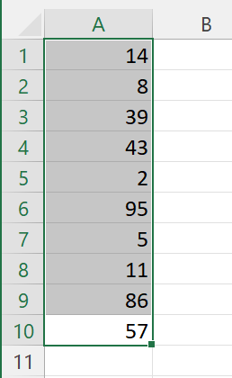

On the Home tab, in the "Styles" group, click "Conditional Formatting". This allows us to select an Excel Wizard to guide us through the process of creating a Conditional Rule and defining a Style for that rule.

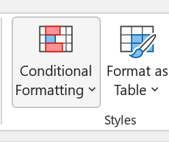

Click "Highlight Cells Rules", then "Greater Than".

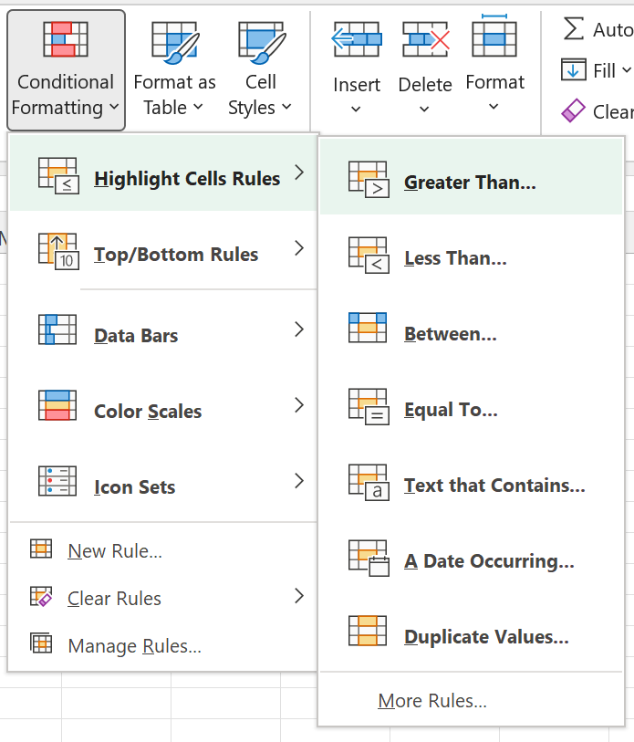

Enter the value "80" in the prompt box; and either select one of the pre-defined formatting style (or create a custom style from there).

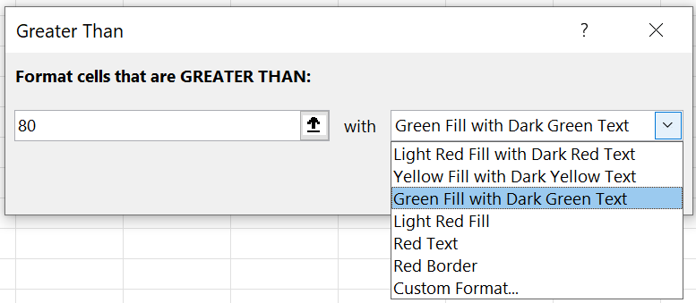

Then click "OK". The rule is immediately applied to the selected range of cells, highlighting all those with a value greater than 80 in the chosen style.

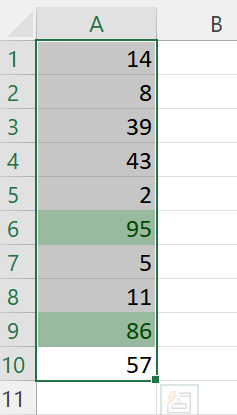

Any change to the value of a cell within that range will immediately check the rule, and automatically apply the new styling if it applies.

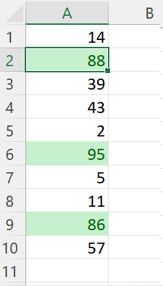

If we wanted to set up the same Conditional Formatting rule in PHPSpreadsheet, we would do so using the following code:

```php
$conditional = new \PhpOffice\PhpSpreadsheet\Style\Conditional();
$conditional->setConditionType(\PhpOffice\PhpSpreadsheet\Style\Conditional::CONDITION_CELLIS);
$conditional->setOperatorType(\PhpOffice\PhpSpreadsheet\Style\Conditional::OPERATOR_GREATERTHAN);
$conditional->addCondition(80);
$conditional->getStyle()->getFont()->getColor()->setARGB(\PhpOffice\PhpSpreadsheet\Style\Color::COLOR_DARKGREEN);
$conditional->getStyle()->getFill()->setFillType(\PhpOffice\PhpSpreadsheet\Style\Fill::FILL_SOLID);
$conditional->getStyle()->getFill()->getStartColor()->setARGB(\PhpOffice\PhpSpreadsheet\Style\Color::COLOR_GREEN);

$conditionalStyles = $spreadsheet->getActiveSheet()->getStyle('A1:A10')->getConditionalStyles();
$conditionalStyles[] = $conditional;

$spreadsheet->getActiveSheet()->getStyle('A1:A10')->setConditionalStyles($conditionalStyles);
```

Depending on the Rules that we might want to apply for a Condition, sometimes an "operator Type" is required, sometimes not (and not all Operator Types are appropriate for all Condition Types); sometimes a "Condition" is required (or even several conditions), sometimes not, and sometimes it must be a specific Excel formula expression.
Creating conditions manually requires a good knowledge of when these different properties need to be set, and with what type of values.
This isn't something that an end-user developer should be expected to know. 

So - to eliminate this need for complex and arcane knowledge - since PHPSpreadsheet verson 1.22.0 there is also a series of Wizards that can assist with creating Conditional Formatting rules, and which are capable of setting the appropriate operators and conditions (including the sometimes complex Excel formula expressions) for a Conditional Rule:

```php
$wizardFactory = new \PhpOffice\PhpSpreadsheet\Style\ConditionalFormatting\Wizard('A1:A10');
$wizard = $wizardFactory->newRule(\PhpOffice\PhpSpreadsheet\Style\ConditionalFormatting\Wizard::CELL_VALUE);
$wizard->greaterThan(80);
$wizard->getStyle()->getFont()->getColor()->setARGB(\PhpOffice\PhpSpreadsheet\Style\Color::COLOR_DARKGREEN);
$wizard->getStyle()->getFill()->setFillType(\PhpOffice\PhpSpreadsheet\Style\Fill::FILL_SOLID);
$wizard->getStyle()->getFill()->getStartColor()->setARGB(\PhpOffice\PhpSpreadsheet\Style\Color::COLOR_GREEN);

$conditional = $wizard->getConditional();
```
The Wizards know which operator types match up with condition types, and provide more meaningful method names for operators, and they build expressions and formulae when required; and also work well with an IDE such as PHPStorm.

---

Note that `$conditionalStyles` is an array: it is possible to apply several conditions to the same range of cells. If we also wanted to highlight values that were less than 10 in the the A1:A10 range, we can add a second style rule.

In Excel, we would do this by selecting the range again, and going through the same process, this time selecting the "Highlight Cells Rules", then "Less Than" from the "Conditional Styles" menu, entering the value "10" in the prompt box, and selecting the appropriate style.

In PHPSpreadsheet, we would do:

```php
$conditional2 = new \PhpOffice\PhpSpreadsheet\Style\Conditional();
$conditional2->setConditionType(\PhpOffice\PhpSpreadsheet\Style\Conditional::CONDITION_CELLIS);
$conditional2->setOperatorType(\PhpOffice\PhpSpreadsheet\Style\Conditional::OPERATOR_LESSTHAN);
$conditional2->addCondition(10);
$conditional2->getStyle()->getFont()->getColor()->setARGB(\PhpOffice\PhpSpreadsheet\Style\Color::COLOR_DARKRED);
$conditional2->getStyle()->getFill()->setFillType(\PhpOffice\PhpSpreadsheet\Style\Fill::FILL_SOLID);
$conditional2->getStyle()->getFill()->getStartColor()->setARGB(\PhpOffice\PhpSpreadsheet\Style\Color::COLOR_RED);

$conditionalStyles = $spreadsheet->getActiveSheet()->getStyle('A1:A10')->getConditionalStyles();
$conditionalStyles[] = $conditional2;

$spreadsheet->getActiveSheet()->getStyle('A1:A10')->setConditionalStyles($conditionalStyles);
```
or again, using the Wizard:
```php
$wizardFactory = new \PhpOffice\PhpSpreadsheet\Style\ConditionalFormatting\Wizard('A1:A10');
$wizard = $wizardFactory->newRule(\PhpOffice\PhpSpreadsheet\Style\ConditionalFormatting\Wizard::CELL_VALUE);
$wizard->lessThan(10);
$wizard->getStyle()->getFont()->getColor()->setARGB(\PhpOffice\PhpSpreadsheet\Style\Color::COLOR_DARKGREEN);
$wizard->getStyle()->getFill()->setFillType(\PhpOffice\PhpSpreadsheet\Style\Fill::FILL_SOLID);
$wizard->getStyle()->getFill()->getStartColor()->setARGB(\PhpOffice\PhpSpreadsheet\Style\Color::COLOR_GREEN);

$conditional = $wizard->getConditional();
```


### Order of Evaluating Multiple Rules/Conditions

`$conditionalStyles` is an array, which not only represents multiple conditions that can be applied to a cell (or range of cells), but also the order in which they are checked. MS Excel will check each of those conditions in turn in the order they are defined; and will stop checking once it finds a first matching rule. This means that the order of checking conditions can be important.

Consider the following. We have one condition that checks if a cell value is between -10 and 10, styling the cell in yellow if that condition matches; and a second condition that checks if the cell value is equal to 0, styling the cell in red if that matches.
 - Yellow if value is between -2 and 2
 - Red if value equals 0 

If they are evaluated in the order I've described above, and the cell has a value of 0, then the first rule will match (because 0 is between -2 and 2), and the cell will be styled in yellow, and no further conditions will be checked. So the rule that styles the cell in red if the value is 0 will never be assessed, even though that would also match (and is probably what we actually wanted, otherwise why have an explicit rule defined for that condition).

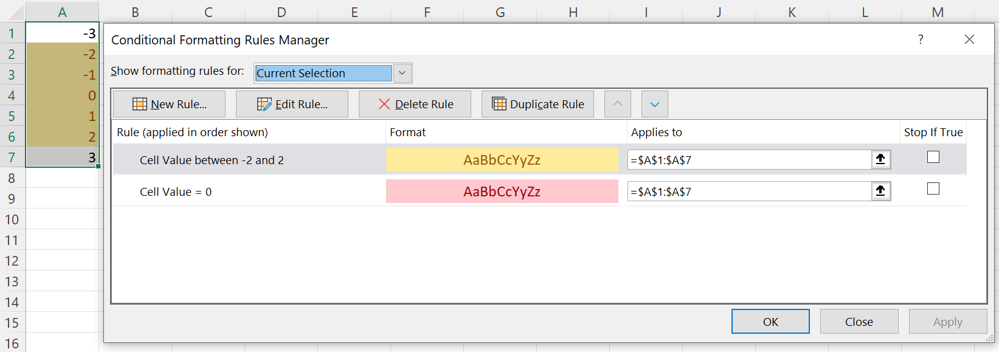

If the rule order is reversed
 - Red if value equals 0
 - Yellow if value is between -2 and 2

then the cell containing the value 0 will be rendered in red, because that is the first matching condition; and the between rule will not be assessed for that cell.

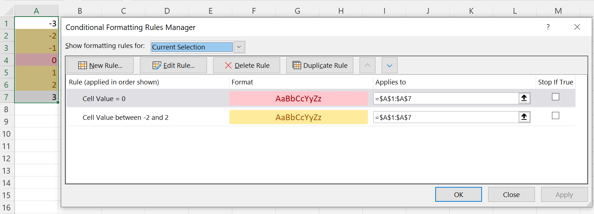

So when you have multiple conditions where the rules might "overlap", the order of these is important.


### Reader/Writer Support

Currently, the following Conditional Types are supported for the following Readers and Writers:

MS Excel | Conditional Type | Readers | Writers
---|---|---|---
| Cell Value | Conditional::CONDITION_CELLIS | Xlsx | Xlsx, Xls
Specific Text | Conditional::CONDITION_CONTAINSTEXT | Xlsx | Xlsx
 | Conditional::CONDITION_NOTCONTAINSTEXT | Xlsx | Xlsx
 | Conditional::CONDITION_BEGINSWITH | Xlsx | Xlsx
 | Conditional::CONDITION_ENDSWITH | Xlsx | Xlsx
Dates Occurring | Conditional::CONDITION_TIMEPERIOD | Xlsx | Xlsx
Blanks | Conditional::CONDITION_CONTAINSBLANKS | Xlsx | Xlsx
No Blanks | Conditional::CONDITION_NOTCONTAINSBLANKS | Xlsx | Xlsx
Errors | Conditional::CONDITION_CONTAINSERRORS | Xlsx | Xlsx
No Errors | Conditional::CONDITION_NOTCONTAINSERRORS | Xlsx | Xlsx
Duplicates/Unique | Conditional::CONDITION_DUPLICATES | Xlsx | Xlsx
 | Conditional::CONDITION_UNIQUE | Xlsx | Xlsx
Use a formula | Conditional::CONDITION_EXPRESSION | Xlsx | Xlsx, Xls
Data Bars | Conditional::CONDITION_DATABAR | Xlsx | Xlsx

The following Conditional Types are currently not supported by any Readers or Writers:

MS Excel | Conditional Type
---|---
Above/Below Average | ?
Top/Bottom Items | ?
Top/Bottom %age | ?
Colour Scales |?
Icon Sets | ?

Unsupported types will by ignored by the Readers, and cannot be created through PHPSpreadsheet.


## Wizards

While the Wizards don't simplify defining the Conditional Style itself; they do make it easier to define the conditions (the rules) where that style will be applied. 
MS Excel itself has wizards to guide the creation of Conditional Formatting rules and styles.

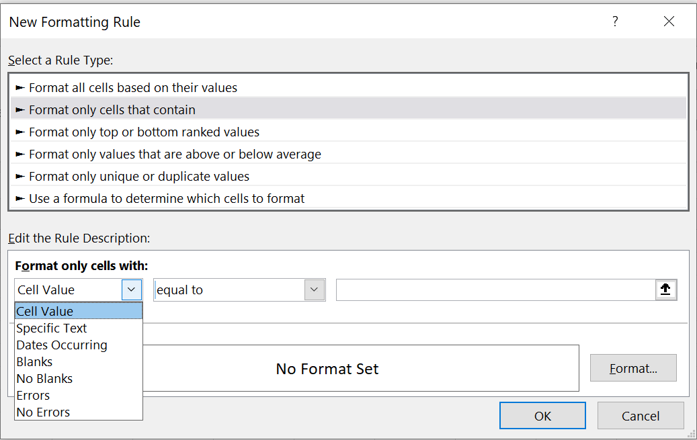

The Wizard Factory allows us to retrieve the appropriate Wizard for the CF Rule that we want to apply.
Most of those that have already been defined fall under the "Format only cells that contain" category.
MS Excel provides a whole series of different types of rule, each of which has it's own formatting and logic.
The Wizards try to replicate this logic and behaviour, similar to Excel's own "Formatting Rule" helper wizard.

MS Excel | Wizard Factory newRule() Type Constant | Wizard Class Name
---|---|---
Cell Value | Wizard::CELL_VALUE | CellValue
Specific Text | Wizard::TEXT_VALUE | TextValue
Dates Occurring | Wizard::DATES_OCCURRING | DateValue
Blanks | Wizard::BLANKS | Blanks
No Blanks | Wizard::NOT_BLANKS | Blanks
Errors | Wizard::ERRORS | Errors
No Errors | Wizard::NOT_ERRORS | Errors

Additionally, Wizards also exists for "Format only unique or duplicate values", and for "Use a formula to determine which cells to format":

MS Excel | Wizard Factory newRule() Type Constant | Wizard Class Name
---|---|---
Duplicates/Unique | Wizard::DUPLICATES or Wizard::UNIQUE | Duplicates
Use a formula | Wizard::EXPRESSION or Wizard::FORMULA | Expression

There is currently no Wizard for Data Bars, even though this Conditional Type is supported by the Xlsx Reader and Writer. 

---

We instantiate the Wizard Factory, passing in the cell range where we want to apply Conditional Formatting rules; and can then call the `newRule()` method, passing in the type of Conditional Rule that we want to create in order to return the appropriate Wizard:

```php
$wizardFactory = new \PhpOffice\PhpSpreadsheet\Style\ConditionalFormatting\Wizard('C3:E5');
$wizard = $wizardFactory->newRule(\PhpOffice\PhpSpreadsheet\Style\ConditionalFormatting\Wizard::CELL_VALUE);
```
You can, of course, instantiate the Wizard that you want directly, rather than using the factory; but still remember to pass in the cell range.
```php
$wizard = new \PhpOffice\PhpSpreadsheet\Style\ConditionalFormatting\Wizard\CellValue('C3:E5');
```

That Wizard then provides methods allowing us to define the rule, setting the operator and the values that we want to compare for that rule.
Note that not all rules require values, or even operators, but the individual Wizards provide whatever is necessary; and this document lists all options available for every Wizard.

Once we have used the Wizard to define the conditions and values that we want; and have defined a style using the `setStyle()` method, then we call the Wizard's `getConditional()` method to return a Conditional object that can be added to the array of Conditional Styles that we pass to `setConditionalStyles()`.


### CellValue Wizard

For the `CellValue` Wizard, we always need to provide an operator and a value; and for the "between" and "notBetween" operators, we need to provide two values to specify a range.

Condition Type | Wizard Factory newRule() Type Constant | Conditional Operator Type | Wizard Methods | Notes
---|---|---|---|---
Conditional::CONDITION_CELLIS | Wizard::CELL_VALUE | Conditional::OPERATOR_EQUAL | equals()
| | Conditional::OPERATOR_NOTEQUAL | notEquals()
| | Conditional::OPERATOR_GREATERTHAN | greaterThan()
| | Conditional::OPERATOR_GREATERTHANOREQUAL | greaterThanOrEqual()
| | Conditional::OPERATOR_LESSTHAN | lessThan()
| | Conditional::OPERATOR_LESSTHANOREQUAL | lessThanOrEqual()
| | Conditional::OPERATOR_BETWEEN | between()
| | Conditional::OPERATOR_NOTBETWEEN | notBetween()
| | | and() | Used to provide the second operand for `between()` and `notBetween() 

A single operator call is required for every rule (except `between()` and `notBetween`, where the Wizard also provides `and()`); and providing a value is mandatory for all operators.
The values that we need to provide for each operator can be numeric, boolean or string literals (even NULL); cell references; or formulae.

So to set the rule using an operator, we would make a call like:
```php
$wizard->lessThan(10);
```
or when setting a `between()` or `notBetween()` rule, we can make use of the fluent interface with the `and()` method to set the range of values:
```php
$wizard->between(-10)->and(10);
```
Providing a second value using `and()` is mandatory for a `between()` or `notBetween()` range.

To retrieve the Conditional, to add it to our `$conditionalStyles` array, we call the Wizard's `getConditional()` method.
```php
$conditional = $wizard->getConditional();
$conditionalStyles = [$conditional];
```
or simply
```php
$conditionalStyles[] = $wizard->getConditional();
```

Putting it all together, we can use a block of code like (using pre-defined Style objects):
```php
$cellRange = 'A2:E5';
$conditionalStyles = [];
$wizardFactory = new Wizard($cellRange);
/** @var Wizard\CellValue $cellWizard */
$cellWizard = $wizardFactory->newRule(Wizard::CELL_VALUE);

$cellWizard->equals(0)
    ->setStyle($yellowStyle);
$conditionalStyles[] = $cellWizard->getConditional();

$cellWizard->greaterThan(0)
    ->setStyle($greenStyle);
$conditionalStyles[] = $cellWizard->getConditional();

$cellWizard->lessThan(0)
    ->setStyle($redStyle);
$conditionalStyles[] = $cellWizard->getConditional();

$spreadsheet->getActiveSheet()
    ->getStyle($cellWizard->getCellRange())
    ->setConditionalStyles($conditionalStyles);
```
You can find an example that demonstrates this in the [code samples](https://github.com/PHPOffice/PhpSpreadsheet/blob/master/samples/ConditionalFormatting/01_Basic_Comparisons.php#L81 "Conditional Formatting - Simple Example") for the repo.

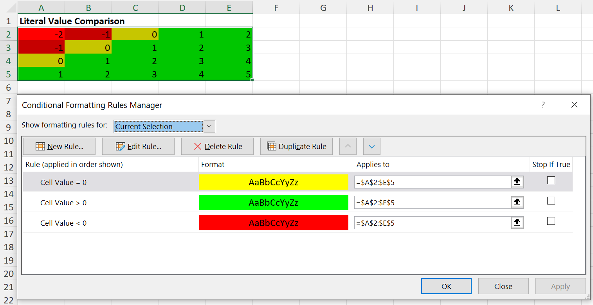


#### Value Types

When we need to provide a value for an operator, that value can be numeric, boolean or string literals (even NULL); cell references; or even an Excel formulae.

##### Literals

If the value is a literal (even a string literal), we simply need to pass the value; the Wizard will ensure that strings are correctly quoted when we get the Conditional from the Wizard.

```php
$wizard->equals('Hello World');
```
If you weren't using the Wizard, but were creating the Conditional directly, you would need to remember to wrap this value in quotes yourself (`'"Hello World"'`)  

However, a cell reference or a formula are also string data, so we need to tell the Wizard if the value that we are passing in isn't just a string literal value, but should be treated as a cell reference or as a formula.

##### Cell References

If we want to use the value from cell `H9` in our rule; then we need to pass a value type of `VALUE_TYPE_CELL` to the operator, in addition to the cell reference itself.

```php
$wizard->equals('$H$9', Wizard::VALUE_TYPE_CELL);
```

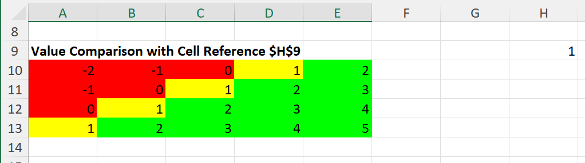

You can find an example that demonstrates this in the [code samples](https://github.com/PHPOffice/PhpSpreadsheet/blob/master/samples/ConditionalFormatting/01_Basic_Comparisons.php#L103 "Conditional Formatting - Basic Comparisons") for the repo.

Note that we are passing the cell as an absolute cell reference, "pinned" (with the `$` symbol) for both the row and the column.

In this next example, we need to use relative cell references, so that the comparison will match the value in column `A` against the values in columns `B` and `C` for each row in our range (`A18:A20`); ie, test if the value in `A18` is between the values in `B18` and `C18`, test if the value in `A19` is between the values in `B19` and `C19`, etc.  


```php
$wizard->between('$B1', Wizard::VALUE_TYPE_CELL)
    ->and('$C1', Wizard::VALUE_TYPE_CELL)
    ->setStyle($greenStyle);
```

This example can also be found in the [code samples](https://github.com/PHPOffice/PhpSpreadsheet/blob/master/samples/ConditionalFormatting/01_Basic_Comparisons.php#L126 "Conditional Formatting - Basic Comparisons") for the repo.

In this case, we "pin" the column for the address; but leave the row "unpinned".
Notice also that we treat the first cell in our range as cell `A1`: the relative row number will be adjusted automatically to match our defined range; that is, the range that we specified when we instantiated the Wizard (passed in through the Wizard Factory) when we make the call to `getConditional()`.

##### Formulae

It is also possible to set the value/operand as an Excel formula expression, not simply a literal value or a cell reference.
Again, we do need to specify that the value is a Formula.

```php
$cellRange = 'C26:C28';
$conditionalStyles = [];
$wizardFactory = new Wizard($cellRange);
/** @var Wizard\CellValue $cellWizard */
$cellWizard = $wizardFactory->newRule(Wizard::CELL_VALUE);

$cellWizard->equals('CONCATENATE($A1," ",$B1)', Wizard::VALUE_TYPE_FORMULA)
    ->setStyle($yellowStyle);
$conditionalStyles[] = $cellWizard->getConditional();

$spreadsheet->getActiveSheet()
    ->getStyle($cellWizard->getCellRange())
    ->setConditionalStyles($conditionalStyles);
```

You can find an example that demonstrates this in the [code samples](https://github.com/PHPOffice/PhpSpreadsheet/blob/master/samples/ConditionalFormatting/02_Text_Comparisons.php#L209 "Conditional Formatting - Text Comparisons") for the repo.

When the formula contains cell references, we again need to be careful with pinning to absolute columns/rows; and when unpinned, we reference based on the top-left cell of the range being cell `A1` when we define the formula.
Here we're defining the formula as `CONCATENATE($A1," ",$B1)`, so we're "pinning" the column references for columns `A` and `B`; but leaving the row unpinned (explicitly set to start from row 1), which is then adjusted to the conditional range when we get the Conditional from the Wizard, and adjusted to the individual rows within that range when MS Excel displays the results.


### TextValue Wizard

While we can use the `CellValue` Wizard to do basic string comparison rules, the `TextValue` Wizard provides rules for comparing parts of a string value.

For the `TextValue` Wizard, we always need to provide an operator and a value. As with the `CellValue` Wizard, values can be literals (but should always be string literals), cell references, or formula.

Condition Type | Wizard Factory newRule() Type Constant | Conditional Operator Type | Wizard Methods | Notes
---|---|---|---|---
Conditional::CONDITION_CONTAINSTEXT | Wizard::TEXT_VALUE | Conditional::OPERATOR_CONTAINSTEXT | contains()
Conditional::CONDITION_NOTCONTAINSTEXT | Wizard::TEXT_VALUE | Conditional::OPERATOR_NOTCONTAINS | doesNotContain()
| | | doesntContain() | synonym for `doesNotContain()`
Conditional::CONDITION_BEGINSWITH | Wizard::TEXT_VALUE | Conditional::OPERATOR_BEGINSWITH | beginsWith()
| | | startsWith() | synonym for `beginsWith()`
Conditional::CONDITION_ENDSWITH | Wizard::TEXT_VALUE | Conditional::OPERATOR_ENDSWITH | endsWith()

The Conditional actually uses a separate "Condition Type" for each option, each with its own "Operator Type", and the condition should be an Excel formula (not simply the string value to check), and with a custom `text` attribute. The Wizard should make it a lot easier to create these conditional rules.

To create a Conditional rule manually, you would need to do something like:
```php
$cellRange = 'A14:B16';
$conditionalStyles = [];
$conditional = new Conditional();
// Remember to use the correct Condition Type
$conditional->setConditionType(Conditional::CONDITION_CONTAINSTEXT);
// Remember to use the correct Operator Type
$conditional->setOperatorType(Conditional::OPERATOR_CONTAINSTEXT);
// Remember to set the text attribute
// Remember to wrap the string literal
$conditional->setText('"LL"');
// Remember that the condition should be the first element in an array
// Remember that we need a specific formula for this Conditional 
// Remember to wrap the string literal
// Remember to use the top-left cell of the range that we want to apply this rule to
$conditional->setConditions(['NOT(ISERROR(SEARCH("LL",A14)))']);
$conditional->setStyle($greenStyle);

$conditionalStyles[]

$spreadsheet->getActiveSheet()
    ->getStyle($cellRange)
    ->setConditionalStyles($conditionalStyles);
```
But using the Wizard, the same Conditional rule can be created by:
```php
$cellRange = 'A14:B16';
$conditionalStyles = [];
$wizardFactory = new Wizard($cellRange);
/** @var Wizard\TextValue $textWizard */
$textWizard = $wizardFactory->newRule(Wizard::TEXT_VALUE);

$textWizard->contains('LL')
    ->setStyle($greenStyle);
$conditionalStyles[] = $textWizard->getConditional();

$spreadsheet->getActiveSheet()
    ->getStyle($textWizard->getCellRange())
    ->setConditionalStyles($conditionalStyles);
```
You can find an example that demonstrates this in the [code samples](https://github.com/PHPOffice/PhpSpreadsheet/blob/master/samples/ConditionalFormatting/02_Text_Comparisons.php#L149 "Conditional Formatting - Text Comparisons") for the repo.

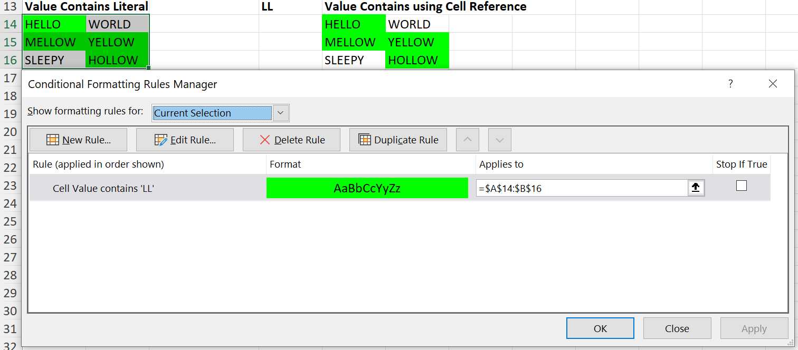

There are also examples in that file for `notContains()`, `beginsWith()` and `endsWith()` comparisons; using literal text, and with cell references.

The actual Excel Expressions used (and that you would need to set manually if you were defining the Conditional yourself rather than using the Wizard) are listed below:

Conditional Type | Condition Expression
---|---
Conditional::CONDITION_CONTAINSTEXT | NOT(ISERROR(SEARCH(`<value>`,`<cell address>`)))
Conditional::CONDITION_NOTCONTAINSTEXT | ISERROR(SEARCH(`<value>`,`<cell address>`))</
Conditional::CONDITION_BEGINSWITH | LEFT(`<cell address>`,LEN(`<value>`))=`<value>`
Conditional::CONDITION_ENDSWITH | RIGHT(`<cell address>`,LEN(`<value>`))=`<value>`

The `<cell address>` always references the top-left cell in the range of cells for this Conditional Formatting Rule.
The `<value>` should be wrapped in double quotes (`"`) for string literals; but unquoted if it is a value stored in a cell reference, or a formula. 
The `TextValue` Wizard handles defining these expressions for you.

As with the operand for the `CellValue` Wizard, you can specify the value passed to `contains()`, `doesNotContain()`, `beginsWith()` and `endsWith()` as a cell reference, or as a formula; and if you do so, then you need to pass a second argument to those methods specifying `Wizard::VALUE_TYPE_CELL` or `Wizard::VALUE_TYPE_FORMULA`.
The same rules also apply to "pinning" cell references as described above for the `CellValue` Wizard.

```php
$textWizard->beginsWith('$D$1', Wizard::VALUE_TYPE_CELL)
    ->setStyle($yellowStyle);
```

### DateValue Wizard

For the `DateValue` Wizard, we always need to provide an operator; but no value is required.

Condition Type | Wizard Factory newRule() Type Constant | Conditional Operator Type | Wizard Methods | Notes
---|---|---|---|---
Conditional::CONDITION_TIMEPERIOD | Wizard::DATES_OCCURRING | Conditional::TIMEPERIOD_TODAY | today()
| | Conditional::TIMEPERIOD_YESTERDAY | yesterday()
| | Conditional::TIMEPERIOD_TOMORROW | tomorrow()
| | Conditional::TIMEPERIOD_LAST_7_DAYS | last7Days()
| |  | lastSevenDays() | synonym for `last7Days()`
| | Conditional::TIMEPERIOD_LAST_WEEK | lastWeek()
| | Conditional::TIMEPERIOD_THIS_WEEK | thisWeek()
| | Conditional::TIMEPERIOD_NEXT_WEEK | nextWeek()
| | Conditional::TIMEPERIOD_LAST_MONTH | lastMonth()
| | Conditional::TIMEPERIOD_THIS_MONTH | thisMonth()
| | Conditional::TIMEPERIOD_NEXT_MONTH | nextMonth()

The Conditional has no actual "Operator Type", and the condition/value should be an Excel formula, and with a custom `timePeriod` attribute. The Wizard should make it a lot easier to create these condition rules.

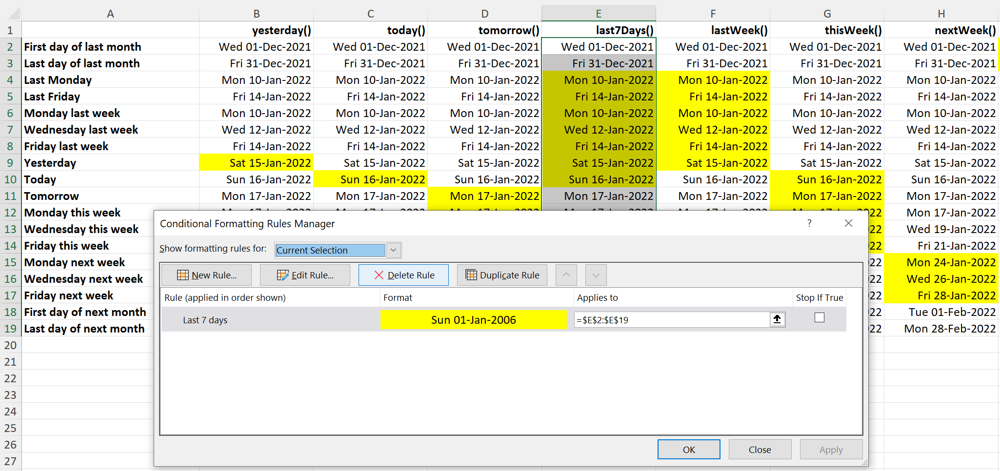

The above image shows a grid that demonstrate each of the possible Date Occurring rules, and was generated using [the code samples](https://github.com/PHPOffice/PhpSpreadsheet/blob/master/samples/ConditionalFormatting/05_Date_Comparisons.php#L118 "Conditional Formatting - Dates Occurring Comparisons")

Typical sample code wod look something like:
```php
$wizardFactory = new Wizard("E2:E19");
/** @var Wizard\DateValue $dateWizard */
$dateWizard = $wizardFactory->newRule(Wizard::DATES_OCCURRING);
$conditionalStyles = [];

$dateWizard->last7Days()
    ->setStyle($yellowStyle);

$conditionalStyles[] = $dateWizard->getConditional();

$spreadsheet->getActiveSheet()
    ->getStyle($dateWizard->getCellRange())
    ->setConditionalStyles($conditionalStyles);
```

The actual Excel Expressions used (and that you would need to set manually if you were defining the Conditional yourself rather than using the Wizard) are listed below:

timePeriod Attribute | Condition Expression
---|---
today | FLOOR(`<cell address>`,1)=TODAY()-1
yesterday | FLOOR(`<cell address>`,1)=TODAY()
tomorrow | FLOOR(`<cell address>`,1)=TODAY()+1
last7Days | AND(TODAY()-FLOOR(`<cell address>`,1)<=6,FLOOR(`<cell address>`,1)<=TODAY())
lastWeek | AND(TODAY()-ROUNDDOWN(`<cell address>`,0)>=(WEEKDAY(TODAY())),TODAY()-ROUNDDOWN(`<cell address>`,0)<(WEEKDAY(TODAY())+7))
thisWeek | AND(TODAY()-ROUNDDOWN(`<cell address>`,0)<=WEEKDAY(TODAY())-1,ROUNDDOWN(`<cell address>`,0)-TODAY()<=7-WEEKDAY(TODAY())) 
nextWeek | AND(ROUNDDOWN(`<cell address>`,0)-TODAY()>(7-WEEKDAY(TODAY())),ROUNDDOWN(`<cell address>`,0)-TODAY()<(15-WEEKDAY(TODAY())))
lastMonth | AND(MONTH(`<cell address>`)=MONTH(EDATE(TODAY(),0-1)),YEAR(`<cell address>`)=YEAR(EDATE(TODAY(),0-1)))
thisMonth | AND(MONTH(`<cell address>`)=MONTH(TODAY()),YEAR(`<cell address>`)=YEAR(TODAY()))
nextMonth | AND(MONTH(`<cell address>`)=MONTH(EDATE(TODAY(),0+1)),YEAR(`<cell address>`)=YEAR(EDATE(TODAY(),0+1)))

The `<cell address>` always references the top-left cell in the range of cells for this Conditional Formatting Rule.


### Blanks Wizard

This Wizard is used to define a simple boolean state rule, to determine whether a cell is blank or not blank.
Whether created using the Wizard Factory with a rule type of `Wizard::BLANKS` or `Wizard::NOT_BLANKS`, the same `Blanks` Wizard is returned.
The only difference is that in the one case the rule state is pre-set for `CONDITION_CONTAINSBLANKS`, in the other it is pre-set for `CONDITION_NOTCONTAINSBLANKS`.
However, you can switch between the two rules using the `isBlank()` and `notBlank()` methods; and it is only at the point when you call `getConditional()` that a Conditional will be returned based on the current state of the Wizard. 

Condition Type | Wizard Factory newRule() Type Constant | Conditional Operator Type | Wizard Methods | Notes
---|---|---|---|---
Conditional::CONDITION_CONTAINSBLANKS | Wizard::BLANKS | - | isBlank() | Default state
| | | notBlank()
| | | isEmpty() | Synonym for `isBlank()`
| | | notEmpty() | Synonym for `notBlank()`
Conditional::CONDITION_NOTCONTAINSBLANKS | Wizard::NOT_BLANKS | - | notBlank()| Default state
| | | isBlank()
| | | isEmpty() | Synonym for `isBlank()`
| | | notEmpty() | Synonym for `notBlank()`

The following code shows the same Blanks Wizard being used to create both Blank and Non-Blank Conditionals, using a pre-defined `$redStyle` Style object for Blanks, and a pre-defined `$greenStyle` Style object for Non-Blanks.  
```php
$cellRange = 'A2:B3';
$conditionalStyles = [];
$wizardFactory = new Wizard($cellRange);
/** @var Wizard\Blanks $blanksWizard */
$blanksWizard = $wizardFactory->newRule(Wizard::BLANKS);

$blanksWizard->setStyle($redStyle);
$conditionalStyles[] = $blanksWizard->getConditional();

$blanksWizard->notBlank()
    ->setStyle($greenStyle);
$conditionalStyles[] = $blanksWizard->getConditional();

$spreadsheet->getActiveSheet()
    ->getStyle($blanksWizard->getCellRange())
    ->setConditionalStyles($conditionalStyles);
```
This example can also be found in the [code samples](https://github.com/PHPOffice/PhpSpreadsheet/blob/master/samples/ConditionalFormatting/03_Blank_Comparisons.php#L58 "Conditional Formatting - Blank Comparisons") for the repo.

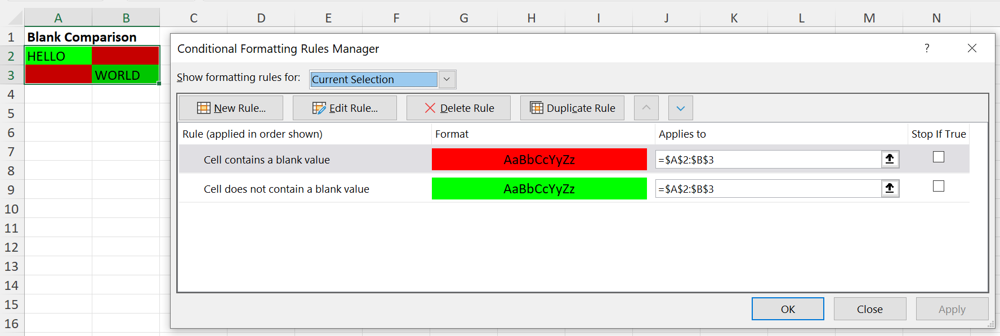

No operand/value is required for the Blanks Wizard methods; but the Conditional that is returned contains a defined expression with an Excel formula: 

Blanks Type | Condition Expression
---|---
isBlank() | LEN(TRIM(`<cell address>`))=0
notBlank() | LEN(TRIM(`<cell address>`))>0

The `<cell address>` always references the top-left cell in the range of cells for this Conditional Formatting Rule.


### Errors Wizard

Like the `Blanks` Wizard, this Wizard is used to define a simple boolean state rule, to determine whether a cell with a formula value results in an error or not.
Whether created using the Wizard Factory with a rule type of `Wizard::ERRORS` or `Wizard::NOT_ERRORS`, the same `Errors` Wizard is returned.
The only difference is that in the one case the rule state is pre-set for `CONDITION_CONTAINSERRORS`, in the other it is pre-set for `CONDITION_NOTCONTAINSERRORS`.
However, you can switch between the two rules using the `isError()` and `notError()` methods; and it is only at the point when you call `getConditional()` that a Conditional will be returned based on the current state of the Wizard.

Condition Type | Wizard Factory newRule() Type Constant | Conditional Operator Type | Wizard Methods | Notes
---|---|---|---|---
Conditional::CONDITION_CONTAINSERRORS | Wizard::ERRORS | - | isError() | Default state
| | | notError()
Conditional::CONDITION_NOTCONTAINSERRORS | Wizard::NOT_ERRORS | - | notError()| Default state
| | | isError()

The following code shows the same Errors Wizard being used to create both Error and Non-Error Conditionals, using a pre-defined `$redStyle` Style object for Errors, and a pre-defined `$greenStyle` Style object for Non-Errors.
```php
$cellRange = 'C2:C6';
$conditionalStyles = [];
$wizardFactory = new Wizard($cellRange);
/** @var Wizard\Errors $errorsWizard */
$errorsWizard = $wizardFactory->newRule(Wizard::ERRORS);

$errorsWizard->setStyle($redStyle);
$conditionalStyles[] = $errorsWizard->getConditional();

$errorsWizard->notError()
    ->setStyle($greenStyle);
$conditionalStyles[] = $errorsWizard->getConditional();

$spreadsheet->getActiveSheet()
    ->getStyle($errorsWizard->getCellRange())
    ->setConditionalStyles($conditionalStyles);
```

This example can also be found in the [code samples](https://github.com/PHPOffice/PhpSpreadsheet/blob/master/samples/ConditionalFormatting/04_Error_Comparisons.php#L62 "Conditional Formatting - Error Comparisons") for the repo.

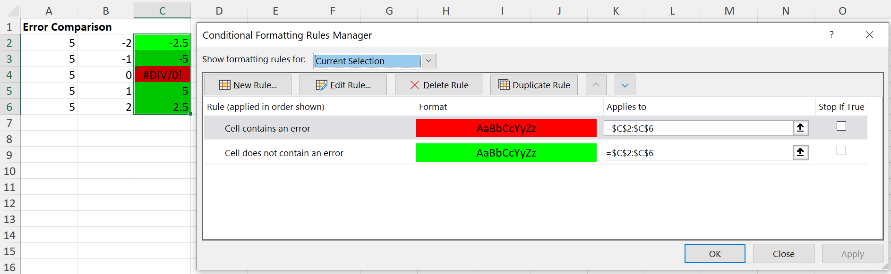

No operand/value is required for the Errors Wizard methods; but the Conditional that is returned contains a defined expression with an Excel formula:

Blanks Type | Condition Expression
---|---
isError() | ISERROR(`<cell address>`)
notError() | NOT(ISERROR(`<cell address>`))

The `<cell address>` always references the top-left cell in the range of cells for this Conditional Formatting Rule.


### Duplicates/Unique Wizard

This Wizard is used to define a simple boolean state rule, to determine whether a cell value matches any other cells with the same value within the conditional cell range, or if the value is unique in that range of cells.
It only has any meaning if it is applied to a range of cells, not to an individual cell.
Whether created using the Wizard Factory with a rule type of `Wizard::DUPLICATES` or `Wizard::UNIQUE`, the same `Duplicates` Wizard is returned.
The only difference is that in the one case the rule state is pre-set for `CONDITION_DUPLICATES`, in the other it is pre-set for `CONDITION_UNIQUE`.
However, you can switch between the two rules using the `duplicates()` and `unique()` methods; and it is only at the point when you call `getConditional()` that a Conditional will be returned based on the current state of the Wizard.

Condition Type | Wizard Factory newRule() Type Constant | Conditional Operator Type | Wizard Methods | Notes
---|---|---|---|---
Conditional::CONDITION_DUPLICATES | Wizard::DUPLICATES | - | duplicates() | Default state
| | | unique()
Conditional::CONDITION_UNIQUE | Wizard::UNIQUE | - | unique()| Default state
| | | duplicates()

The following code shows the same Duplicates Wizard being used to create both Blank and Non-Blank Conditionals, using a pre-defined `$redStyle` Style object for Blanks, and a pre-defined `$greenStyle` Style object for Non-Blanks.
```php
$cellRange = 'A2:E6';
$conditionalStyles = [];
$wizardFactory = new Wizard($cellRange);
/** @var Wizard\Duplicats $duplicatesWizard */
$duplicatesWizard = $wizardFactory->newRule(Wizard::DUPLICATES);

$duplicatesWizard->setStyle($redStyle);
$conditionalStyles[] = $duplicatesWizard->getConditional();

$duplicatesWizard->unique()
    ->setStyle($greenStyle);
$conditionalStyles[] = $duplicatesWizard->getConditional();

$spreadsheet->getActiveSheet()
    ->getStyle($duplicatesWizard->getCellRange())
    ->setConditionalStyles($conditionalStyles);
```
This example can also be found in the [code samples](https://github.com/PHPOffice/PhpSpreadsheet/blob/master/samples/ConditionalFormatting/06_Duplicate_Comparisons.php#L66 "Conditional Formatting - Duplicate/Unique Comparisons") for the repo.

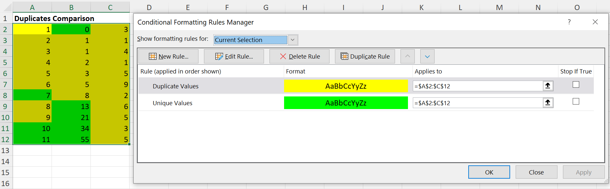

Duplicates/Uniques Conditions are only identified by a Condition Type in Excel, with no operator and no expression.


### Expression Wizard

The `Expression` Wizard expects to be provided with an Expression, an MS Excel formula that evaluates to either false or true.

Condition Type | Wizard Factory newRule() Type Constant | Conditional Operator Type | Wizard Methods | Notes
---|---|---|---|---
Conditional::CONDITION_EXPRESSION | Wizard::EXPRESSION or Wizard::FORMULA | - | expression() | The argument is an Excel formula that evaluates to true or false
 | | | | formula() | Synonym for `expression()`

Just as a simple example, here's a code snippet demonstrating expressions to determine if a cell contains an odd or an even number value:
```php
$cellRange = 'A2:C11';
$conditionalStyles = [];
$wizardFactory = new Wizard($cellRange);
/** @var Wizard\Expression $expressionWizard */
$expressionWizard = $wizardFactory->newRule(Wizard::EXPRESSION);

$expressionWizard->expression('ISODD(A1)')
    ->setStyle($greenStyle);
$conditionalStyles[] = $expressionWizard->getConditional();

$expressionWizard->expression('ISEVEN(A1)')
    ->setStyle($yellowStyle);
$conditionalStyles[] = $expressionWizard->getConditional();

$spreadsheet->getActiveSheet()
    ->getStyle($expressionWizard->getCellRange())
    ->setConditionalStyles($conditionalStyles);
```
This example can also be found in the [code samples](https://github.com/PHPOffice/PhpSpreadsheet/blob/master/samples/ConditionalFormatting/07_Expression_Comparisons.php#L87 "Conditional Formatting - Odd/Even Expression Comparisons") for the repo.

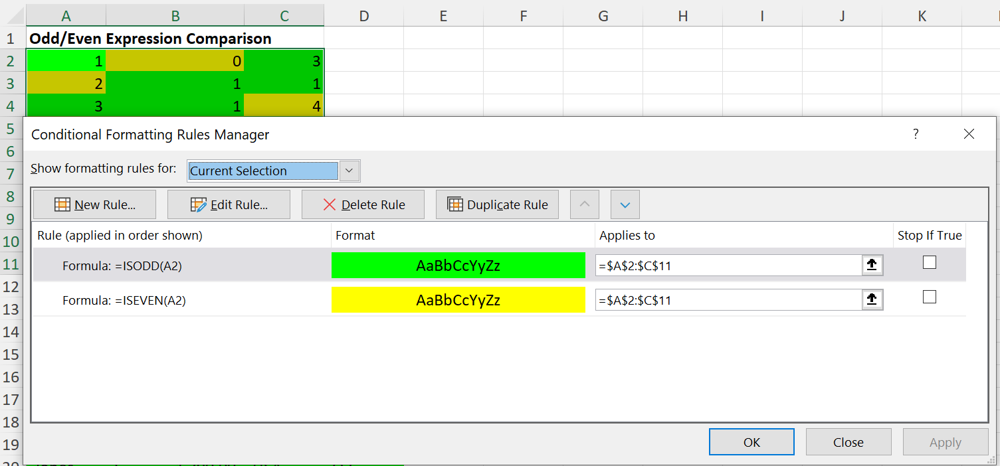

As a more complicated example, let's look at a Sales Grid, and use conditional formatting to highlight sales in the "USA" region:

```php
$greenStyleMoney = clone $greenStyle;
$greenStyleMoney->getNumberFormat()->setFormatCode(NumberFormat::FORMAT_ACCOUNTING_USD);

$cellRange = 'A17:D22';
$conditionalStyles = [];
$wizardFactory = new Wizard($cellRange);
/** @var Wizard\Expression $expressionWizard */
$expressionWizard = $wizardFactory->newRule(Wizard::EXPRESSION);

$expressionWizard->expression('$C1="USA"')
    ->setStyle($greenStyleMoney);
$conditionalStyles[] = $expressionWizard->getConditional();

$spreadsheet->getActiveSheet()
    ->getStyle($expressionWizard->getCellRange())
    ->setConditionalStyles($conditionalStyles);
```
This example can also be found in the [code samples](https://github.com/PHPOffice/PhpSpreadsheet/blob/master/samples/ConditionalFormatting/07_Expression_Comparisons.php#L107 "Conditional Formatting - Sales Grid Expression Comparisons") for the repo.

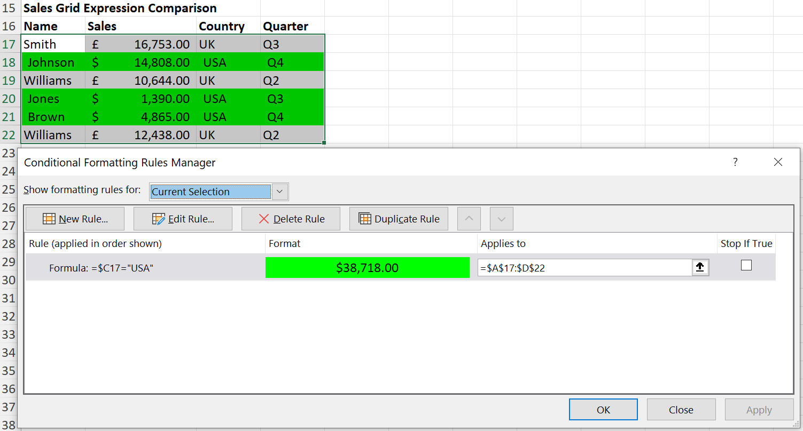

Or we could apply multiple comparisons in the same expression, so to check for all sales for the "USA" region in "Q4", combining them using an Excel `AND()`:
```php
$expressionWizard->expression('AND($C1="USA",$D1="Q4")')
    ->setStyle($greenStyleMoney);
```
This example can also be found in the [code samples](https://github.com/PHPOffice/PhpSpreadsheet/blob/master/samples/ConditionalFormatting/07_Expression_Comparisons.php#L121 "Conditional Formatting - Sales Grid Expression Comparisons") for the repo.

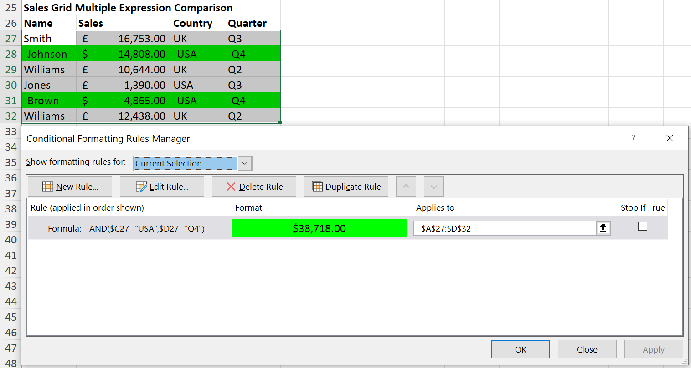

## General Notes

### Stop If True


### Changing the Cell Range

If you want to apply the same Conditional Rule/Style to several different areas on your spreadsheet, then you can do this using the `setCellRange()` method between calls to `getConditional()`.

```php
$wizardFactory = new Wizard();
/** @var Wizard\CellValue $wizard */
$wizard = $wizardFactory->newRule(Wizard::CELL_VALUE);

// Apply the wizard conditional to cell range A2:A10
$cellRange = 'A2:A10';
$conditionalStyles = [];
$wizard->between('$B1', Wizard::VALUE_TYPE_CELL)
    ->and('$C1', Wizard::VALUE_TYPE_CELL)
    ->setStyle($greenStyle);

$spreadsheet->getActiveSheet()
    ->getStyle($wizard->getCellRange())
    ->setConditionalStyles($conditionalStyles);

// Apply the same wizard conditional to cell range E2:E10
$cellRange = 'E2:E10';
$wizard->setCellRange($cellRange);
$conditionalStyles = [];
$wizard->between('$B1', Wizard::VALUE_TYPE_CELL)
    ->and('$C1', Wizard::VALUE_TYPE_CELL)
    ->setStyle($greenStyle);

$spreadsheet->getActiveSheet()
    ->getStyle($wizard->getCellRange())
    ->setConditionalStyles($conditionalStyles);
```

Because we use cell `A1` as the baseline cell for relative references, the Wizard is able to handle the necessary adjustments for cell references and formulae to match the range of cells that it is being applied to when `getConditional()` is called, so it returns the correct expression.

### Converting a Conditional to a Wizard

If you already have a `Conditional` object; you can create a Wizard from that Conditional to manipulate it using all the benefits of the Wizard before using that to create a new version of the Conditional:

```php
$wizard = Wizard\CellValue::fromConditional($conditional, '$A$3:$E$8');
$wizard->greaterThan(12.5);

$newConditional = $wizard->getConditional();
```
This is ok if you know what type of Conditional you want to convert; but it will throw an Exception if the Conditional is not of an appropriate type (ie. not a `cellIs`).

If you don't know what type of Conditional it is, then it's better to use the Wizard Factory `fromConditional()` method instead; and then test what type of Wizard object is returned: 
```php
$wizard = Wizard::fromConditional($conditional, '$A$3:$E$8');
if ($wizard instanceof Wizard\CellValue) {
    $wizard->greaterThan(12.5);

    $newConditional = $wizard->getConditional();
}
```
