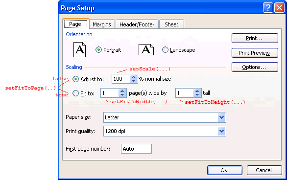
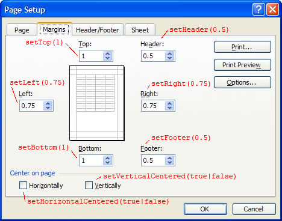
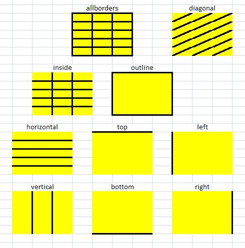
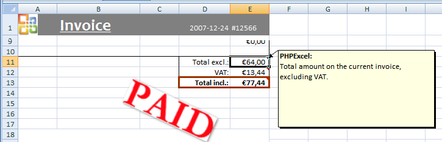
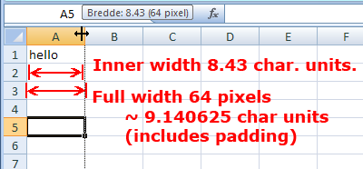

# Recipes

The following pages offer you some widely-used PhpSpreadsheet recipes.
Please note that these do NOT offer complete documentation on specific
PhpSpreadsheet API functions, but just a bump to get you started. If you
need specific API functions, please refer to the [API documentation](https://phpoffice.github.io/PhpSpreadsheet/master).

For example, [setting a worksheet's page orientation and size
](#setting-a-worksheets-page-orientation-and-size) covers setting a page
orientation to A4. Other paper formats, like US Letter, are not covered
in this document, but in the PhpSpreadsheet [API documentation](https://phpoffice.github.io/PhpSpreadsheet/master).

## Setting a spreadsheet's metadata

PhpSpreadsheet allows an easy way to set a spreadsheet's metadata, using
document property accessors. Spreadsheet metadata can be useful for
finding a specific document in a file repository or a document
management system. For example Microsoft Sharepoint uses document
metadata to search for a specific document in its document lists.

Setting spreadsheet metadata is done as follows:

``` php
$spreadsheet->getProperties()
    ->setCreator("Maarten Balliauw")
    ->setLastModifiedBy("Maarten Balliauw")
    ->setTitle("Office 2007 XLSX Test Document")
    ->setSubject("Office 2007 XLSX Test Document")
    ->setDescription(
        "Test document for Office 2007 XLSX, generated using PHP classes."
    )
    ->setKeywords("office 2007 openxml php")
    ->setCategory("Test result file");
```

## Setting a spreadsheet's active sheet

The following line of code sets the active sheet index to the first
sheet:

``` php
$spreadsheet->setActiveSheetIndex(0);
```

You can also set the active sheet by its name/title

``` php
$spreadsheet->setActiveSheetIndexByName('DataSheet')
```

will change the currently active sheet to the worksheet called
"DataSheet".

## Write a date or time into a cell

In Excel, dates and Times are stored as numeric values counting the
number of days elapsed since 1900-01-01. For example, the date
'2008-12-31' is represented as 39813. You can verify this in Microsoft
Office Excel by entering that date in a cell and afterwards changing the
number format to 'General' so the true numeric value is revealed.
Likewise, '3:15 AM' is represented as 0.135417.

PhpSpreadsheet works with UST (Universal Standard Time) date and Time
values, but does no internal conversions; so it is up to the developer
to ensure that values passed to the date/time conversion functions are
UST.

Writing a date value in a cell consists of 2 lines of code. Select the
method that suits you the best. Here are some examples:

``` php

// MySQL-like timestamp '2008-12-31' or date string
\PhpOffice\PhpSpreadsheet\Cell\Cell::setValueBinder( new \PhpOffice\PhpSpreadsheet\Cell\AdvancedValueBinder() );

$spreadsheet->getActiveSheet()
    ->setCellValue('D1', '2008-12-31');

$spreadsheet->getActiveSheet()->getStyle('D1')
    ->getNumberFormat()
    ->setFormatCode(\PhpOffice\PhpSpreadsheet\Style\NumberFormat::FORMAT_DATE_YYYYMMDDSLASH);

// PHP-time (Unix time)
$time = gmmktime(0,0,0,12,31,2008); // int(1230681600)
$spreadsheet->getActiveSheet()
    ->setCellValue('D1', \PhpOffice\PhpSpreadsheet\Shared\Date::PHPToExcel($time));
$spreadsheet->getActiveSheet()->getStyle('D1')
    ->getNumberFormat()
    ->setFormatCode(\PhpOffice\PhpSpreadsheet\Style\NumberFormat::FORMAT_DATE_YYYYMMDDSLASH);

// Excel-date/time
$spreadsheet->getActiveSheet()->setCellValue('D1', 39813)
$spreadsheet->getActiveSheet()->getStyle('D1')
    ->getNumberFormat()
    ->setFormatCode(\PhpOffice\PhpSpreadsheet\Style\NumberFormat::FORMAT_DATE_YYYYMMDDSLASH);
```

The above methods for entering a date all yield the same result.
`\PhpOffice\PhpSpreadsheet\Style\NumberFormat` provides a lot of
pre-defined date formats.

The `\PhpOffice\PhpSpreadsheet\Shared\Date::PHPToExcel()` method will also
work with a PHP DateTime object.

Similarly, times (or date and time values) can be entered in the same
fashion: just remember to use an appropriate format code.

**Note:**

See section "Using value binders to facilitate data entry" to learn more
about the AdvancedValueBinder used in the first example. Excel can also
operate in a 1904-based calendar (default for workbooks saved on Mac).
Normally, you do not have to worry about this when using PhpSpreadsheet.

## Write a formula into a cell

Inside the Excel file, formulas are always stored as they would appear
in an English version of Microsoft Office Excel, and PhpSpreadsheet
handles all formulae internally in this format. This means that the
following rules hold:

-   Decimal separator is `.` (period)
-   Function argument separator is `,` (comma)
-   Matrix row separator is `;` (semicolon)
-   English function names must be used

This is regardless of which language version of Microsoft Office Excel
may have been used to create the Excel file.

When the final workbook is opened by the user, Microsoft Office Excel
will take care of displaying the formula according the applications
language. Translation is taken care of by the application!

The following line of code writes the formula
`=IF(C4>500,"profit","loss")` into the cell B8. Note that the
formula must start with `=` to make PhpSpreadsheet recognise this as a
formula.

``` php
$spreadsheet->getActiveSheet()->setCellValue('B8','=IF(C4>500,"profit","loss")');
```

If you want to write a string beginning with an `=` character to a
cell, then you should use the `setCellValueExplicit()` method.

``` php
$spreadsheet->getActiveSheet()
    ->setCellValueExplicit(
        'B8',
        '=IF(C4>500,"profit","loss")',
        \PhpOffice\PhpSpreadsheet\Cell\DataType::TYPE_STRING
    );
```

A cell's formula can be read again using the following line of code:

``` php
$formula = $spreadsheet->getActiveSheet()->getCell('B8')->getValue();
```

If you need the calculated value of a cell, use the following code. This
is further explained in [the calculation engine](./calculation-engine.md).

``` php
$value = $spreadsheet->getActiveSheet()->getCell('B8')->getCalculatedValue();
```

## Locale Settings for Formulae

Some localisation elements have been included in PhpSpreadsheet. You can
set a locale by changing the settings. To set the locale to Russian you
would use:

``` php
$locale = 'ru';
$validLocale = \PhpOffice\PhpSpreadsheet\Settings::setLocale($locale);
if (!$validLocale) {
    echo 'Unable to set locale to '.$locale." - reverting to en_us<br />\n";
}
```

If Russian language files aren't available, the `setLocale()` method
will return an error, and English settings will be used throughout.

Once you have set a locale, you can translate a formula from its
internal English coding.

``` php
$formula = $spreadsheet->getActiveSheet()->getCell('B8')->getValue();
$translatedFormula = \PhpOffice\PhpSpreadsheet\Calculation\Calculation::getInstance()->_translateFormulaToLocale($formula);
```

You can also create a formula using the function names and argument
separators appropriate to the defined locale; then translate it to
English before setting the cell value:

``` php
$formula = '=ДНЕЙ360(ДАТА(2010;2;5);ДАТА(2010;12;31);ИСТИНА)';
$internalFormula = \PhpOffice\PhpSpreadsheet\Calculation\Calculation::getInstance()->translateFormulaToEnglish($formula);
$spreadsheet->getActiveSheet()->setCellValue('B8',$internalFormula);
```

Currently, formula translation only translates the function names, the
constants TRUE and FALSE, and the function argument separators.

At present, the following locale settings are supported:

Language             |                      | Locale Code
---------------------|----------------------|-------------
Czech                | Ceština              | cs
Danish               | Dansk                | da
German               | Deutsch              | de
Spanish              | Español              | es
Finnish              | Suomi                | fi
French               | Français             | fr
Hungarian            | Magyar               | hu
Italian              | Italiano             | it
Dutch                | Nederlands           | nl
Norwegian            | Norsk                | no
Polish               | Jezyk polski         | pl
Portuguese           | Português            | pt
Brazilian Portuguese | Português Brasileiro | pt_br
Russian              | русский язык         | ru
Swedish              | Svenska              | sv
Turkish              | Türkçe               | tr

## Write a newline character "\n" in a cell (ALT+"Enter")

In Microsoft Office Excel you get a line break in a cell by hitting
ALT+"Enter". When you do that, it automatically turns on "wrap text" for
the cell.

Here is how to achieve this in PhpSpreadsheet:

``` php
$spreadsheet->getActiveSheet()->getCell('A1')->setValue("hello\nworld");
$spreadsheet->getActiveSheet()->getStyle('A1')->getAlignment()->setWrapText(true);
```

**Tip**

Read more about formatting cells using `getStyle()` elsewhere.

**Tip**

AdvancedValuebinder.php automatically turns on "wrap text" for the cell
when it sees a newline character in a string that you are inserting in a
cell. Just like Microsoft Office Excel. Try this:

``` php
\PhpOffice\PhpSpreadsheet\Cell\Cell::setValueBinder( new \PhpOffice\PhpSpreadsheet\Cell\AdvancedValueBinder() );

$spreadsheet->getActiveSheet()->getCell('A1')->setValue("hello\nworld");
```

Read more about AdvancedValueBinder.php elsewhere.

## Explicitly set a cell's datatype

You can set a cell's datatype explicitly by using the cell's
setValueExplicit method, or the setCellValueExplicit method of a
worksheet. Here's an example:

``` php
$spreadsheet->getActiveSheet()->getCell('A1')
    ->setValueExplicit(
        '25',
        \PhpOffice\PhpSpreadsheet\Cell\DataType::TYPE_NUMERIC
    );
```

## Change a cell into a clickable URL

You can make a cell a clickable URL by setting its hyperlink property:

``` php
$spreadsheet->getActiveSheet()->setCellValue('E26', 'www.phpexcel.net');
$spreadsheet->getActiveSheet()->getCell('E26')->getHyperlink()->setUrl('https://www.example.com');
```

If you want to make a hyperlink to another worksheet/cell, use the
following code:

``` php
$spreadsheet->getActiveSheet()->setCellValue('E26', 'www.phpexcel.net');
$spreadsheet->getActiveSheet()->getCell('E26')->getHyperlink()->setUrl("sheet://'Sheetname'!A1");
```

## Setting Printer Options for Excel files

### Setting a worksheet's page orientation and size

Setting a worksheet's page orientation and size can be done using the
following lines of code:

``` php
$spreadsheet->getActiveSheet()->getPageSetup()
    ->setOrientation(\PhpOffice\PhpSpreadsheet\Worksheet\PageSetup::ORIENTATION_LANDSCAPE);
$spreadsheet->getActiveSheet()->getPageSetup()
    ->setPaperSize(\PhpOffice\PhpSpreadsheet\Worksheet\PageSetup::PAPERSIZE_A4);
```

Note that there are additional page settings available. Please refer to
the [API documentation](https://phpoffice.github.io/PhpSpreadsheet/master) for all possible options.

### Page Setup: Scaling options

The page setup scaling options in PhpSpreadsheet relate directly to the
scaling options in the "Page Setup" dialog as shown in the illustration.

Default values in PhpSpreadsheet correspond to default values in MS
Office Excel as shown in illustration



method              | initial value | calling method will trigger | Note
--------------------|:-------------:|-----------------------------|------
setFitToPage(...)   | FALSE         | -                           |
setScale(...)       | 100           | setFitToPage(FALSE)         |
setFitToWidth(...)  | 1             | setFitToPage(TRUE)          | value 0 means do-not-fit-to-width
setFitToHeight(...) | 1             | setFitToPage(TRUE)          | value 0 means do-not-fit-to-height

#### Example

Here is how to fit to 1 page wide by infinite pages tall:

``` php
$spreadsheet->getActiveSheet()->getPageSetup()->setFitToWidth(1);
$spreadsheet->getActiveSheet()->getPageSetup()->setFitToHeight(0);
```

As you can see, it is not necessary to call setFitToPage(TRUE) since
setFitToWidth(...) and setFitToHeight(...) triggers this.

If you use `setFitToWidth()` you should in general also specify
`setFitToHeight()` explicitly like in the example. Be careful relying on
the initial values.

### Page margins

To set page margins for a worksheet, use this code:

``` php
$spreadsheet->getActiveSheet()->getPageMargins()->setTop(1);
$spreadsheet->getActiveSheet()->getPageMargins()->setRight(0.75);
$spreadsheet->getActiveSheet()->getPageMargins()->setLeft(0.75);
$spreadsheet->getActiveSheet()->getPageMargins()->setBottom(1);
```

Note that the margin values are specified in inches.



### Center a page horizontally/vertically

To center a page horizontally/vertically, you can use the following
code:

``` php
$spreadsheet->getActiveSheet()->getPageSetup()->setHorizontalCentered(true);
$spreadsheet->getActiveSheet()->getPageSetup()->setVerticalCentered(false);
```

### Setting the print header and footer of a worksheet

Setting a worksheet's print header and footer can be done using the
following lines of code:

``` php
$spreadsheet->getActiveSheet()->getHeaderFooter()
    ->setOddHeader('&C&HPlease treat this document as confidential!');
$spreadsheet->getActiveSheet()->getHeaderFooter()
    ->setOddFooter('&L&B' . $spreadsheet->getProperties()->getTitle() . '&RPage &P of &N');
```

Substitution and formatting codes (starting with &) can be used inside
headers and footers. There is no required order in which these codes
must appear.

The first occurrence of the following codes turns the formatting ON, the
second occurrence turns it OFF again:

-   Strikethrough
-   Superscript
-   Subscript

Superscript and subscript cannot both be ON at same time. Whichever
comes first wins and the other is ignored, while the first is ON.

The following codes are supported by Xlsx:

Code                     | Meaning
-------------------------|-----------
`&L`                     | Code for "left section" (there are three header / footer locations, "left", "center", and "right"). When two or more occurrences of this section marker exist, the contents from all markers are concatenated, in the order of appearance, and placed into the left section.
`&P`                     | Code for "current page #"
`&N`                     | Code for "total pages"
`&font size`             | Code for "text font size", where font size is a font size in points.
`&K`                     | Code for "text font color" - RGB Color is specified as RRGGBB Theme Color is specifed as TTSNN where TT is the theme color Id, S is either "+" or "-" of the tint/shade value, NN is the tint/shade value.
`&S`                     | Code for "text strikethrough" on / off
`&X`                     | Code for "text super script" on / off
`&Y`                     | Code for "text subscript" on / off
`&C`                     | Code for "center section". When two or more occurrences of this section marker exist, the contents from all markers are concatenated, in the order of appearance, and placed into the center section.
`&D`                     | Code for "date"
`&T`                     | Code for "time"
`&G`                     | Code for "picture as background" - Please make sure to add the image to the header/footer (see Tip for picture)
`&U`                     | Code for "text single underline"
`&E`                     | Code for "double underline"
`&R`                     | Code for "right section". When two or more occurrences of this section marker exist, the contents from all markers are concatenated, in the order of appearance, and placed into the right section.
`&Z`                     | Code for "this workbook's file path"
`&F`                     | Code for "this workbook's file name"
`&A`                     | Code for "sheet tab name"
`&+`                     | Code for add to page #
`&-`                     | Code for subtract from page #
`&"font name,font type"` | Code for "text font name" and "text font type", where font name and font type are strings specifying the name and type of the font, separated by a comma. When a hyphen appears in font name, it means "none specified". Both of font name and font type can be localized values.
`&"-,Bold"`              | Code for "bold font style"
`&B`                     | Code for "bold font style"
`&"-,Regular"`           | Code for "regular font style"
`&"-,Italic"`            | Code for "italic font style"
`&I`                     | Code for "italic font style"
`&"-,Bold Italic"`       | Code for "bold italic font style"
`&O`                     | Code for "outline style"
`&H`                     | Code for "shadow style"

**Tip**

The above table of codes may seem overwhelming first time you are trying to
figure out how to write some header or footer. Luckily, there is an easier way.
Let Microsoft Office Excel do the work for you.For example, create in Microsoft
 Office Excel an xlsx file where you insert the header and footer as desired
using the programs own interface. Save file as test.xlsx. Now, take that file
and read off the values using PhpSpreadsheet as follows:

```php
$spreadsheet = \PhpOffice\PhpSpreadsheet\IOFactory::load('test.xlsx');
$worksheet = $spreadsheet->getActiveSheet();

var_dump($worksheet->getHeaderFooter()->getOddFooter());
var_dump($worksheet->getHeaderFooter()->getEvenFooter());
var_dump($worksheet->getHeaderFooter()->getOddHeader());
var_dump($worksheet->getHeaderFooter()->getEvenHeader());
```

That reveals the codes for the even/odd header and footer. Experienced
users may find it easier to rename test.xlsx to test.zip, unzip it, and
inspect directly the contents of the relevant xl/worksheets/sheetX.xml
to find the codes for header/footer.

**Tip for picture**

```php
$drawing = new \PhpOffice\PhpSpreadsheet\Worksheet\HeaderFooterDrawing();
$drawing->setName('PhpSpreadsheet logo');
$drawing->setPath('./images/PhpSpreadsheet_logo.png');
$drawing->setHeight(36);
$spreadsheet->getActiveSheet()->getHeaderFooter()->addImage($drawing, \PhpOffice\PhpSpreadsheet\Worksheet\HeaderFooter::IMAGE_HEADER_LEFT);
```

### Setting printing breaks on a row or column

To set a print break, use the following code, which sets a row break on
row 10.

``` php
$spreadsheet->getActiveSheet()->setBreak('A10', \PhpOffice\PhpSpreadsheet\Worksheet\Worksheet::BREAK_ROW);
```

The following line of code sets a print break on column D:

``` php
$spreadsheet->getActiveSheet()->setBreak('D10', \PhpOffice\PhpSpreadsheet\Worksheet\Worksheet::BREAK_COLUMN);
```

### Show/hide gridlines when printing

To show/hide gridlines when printing, use the following code:

```php
$spreadsheet->getActiveSheet()->setShowGridlines(true);
```

### Setting rows/columns to repeat at top/left

PhpSpreadsheet can repeat specific rows/cells at top/left of a page. The
following code is an example of how to repeat row 1 to 5 on each printed
page of a specific worksheet:

``` php
$spreadsheet->getActiveSheet()->getPageSetup()->setRowsToRepeatAtTopByStartAndEnd(1, 5);
```

### Specify printing area

To specify a worksheet's printing area, use the following code:

``` php
$spreadsheet->getActiveSheet()->getPageSetup()->setPrintArea('A1:E5');
```

There can also be multiple printing areas in a single worksheet:

``` php
$spreadsheet->getActiveSheet()->getPageSetup()->setPrintArea('A1:E5,G4:M20');
```

## Styles

### Formatting cells

A cell can be formatted with font, border, fill, ... style information.
For example, one can set the foreground colour of a cell to red, aligned
to the right, and the border to black and thick border style. Let's do
that on cell B2:

``` php
$spreadsheet->getActiveSheet()->getStyle('B2')
    ->getFont()->getColor()->setARGB(\PhpOffice\PhpSpreadsheet\Style\Color::COLOR_RED);
$spreadsheet->getActiveSheet()->getStyle('B2')
    ->getAlignment()->setHorizontal(\PhpOffice\PhpSpreadsheet\Style\Alignment::HORIZONTAL_RIGHT);
$spreadsheet->getActiveSheet()->getStyle('B2')
    ->getBorders()->getTop()->setBorderStyle(\PhpOffice\PhpSpreadsheet\Style\Border::BORDER_THICK);
$spreadsheet->getActiveSheet()->getStyle('B2')
    ->getBorders()->getBottom()->setBorderStyle(\PhpOffice\PhpSpreadsheet\Style\Border::BORDER_THICK);
$spreadsheet->getActiveSheet()->getStyle('B2')
    ->getBorders()->getLeft()->setBorderStyle(\PhpOffice\PhpSpreadsheet\Style\Border::BORDER_THICK);
$spreadsheet->getActiveSheet()->getStyle('B2')
    ->getBorders()->getRight()->setBorderStyle(\PhpOffice\PhpSpreadsheet\Style\Border::BORDER_THICK);
$spreadsheet->getActiveSheet()->getStyle('B2')
    ->getFill()->setFillType(\PhpOffice\PhpSpreadsheet\Style\Fill::FILL_SOLID);
$spreadsheet->getActiveSheet()->getStyle('B2')
    ->getFill()->getStartColor()->setARGB('FFFF0000');
```

`getStyle()` also accepts a cell range as a parameter. For example, you
can set a red background color on a range of cells:

``` php
$spreadsheet->getActiveSheet()->getStyle('B3:B7')->getFill()
    ->setFillType(\PhpOffice\PhpSpreadsheet\Style\Fill::FILL_SOLID)
    ->getStartColor()->setARGB('FFFF0000');
```

**Tip** It is recommended to style many cells at once, using e.g.
getStyle('A1:M500'), rather than styling the cells individually in a
loop. This is much faster compared to looping through cells and styling
them individually.

There is also an alternative manner to set styles. The following code
sets a cell's style to font bold, alignment right, top border thin and a
gradient fill:

``` php
$styleArray = [
    'font' => [
        'bold' => true,
    ],
    'alignment' => [
        'horizontal' => \PhpOffice\PhpSpreadsheet\Style\Alignment::HORIZONTAL_RIGHT,
    ],
    'borders' => [
        'top' => [
            'borderStyle' => \PhpOffice\PhpSpreadsheet\Style\Border::BORDER_THIN,
        ],
    ],
    'fill' => [
        'fillType' => \PhpOffice\PhpSpreadsheet\Style\Fill::FILL_GRADIENT_LINEAR,
        'rotation' => 90,
        'startColor' => [
            'argb' => 'FFA0A0A0',
        ],
        'endColor' => [
            'argb' => 'FFFFFFFF',
        ],
    ],
];

$spreadsheet->getActiveSheet()->getStyle('A3')->applyFromArray($styleArray);
```

Or with a range of cells:

``` php
$spreadsheet->getActiveSheet()->getStyle('B3:B7')->applyFromArray($styleArray);
```

This alternative method using arrays should be faster in terms of
execution whenever you are setting more than one style property. But the
difference may barely be measurable unless you have many different
styles in your workbook.

### Number formats

You often want to format numbers in Excel. For example you may want a
thousands separator plus a fixed number of decimals after the decimal
separator. Or perhaps you want some numbers to be zero-padded.

In Microsoft Office Excel you may be familiar with selecting a number
format from the "Format Cells" dialog. Here there are some predefined
number formats available including some for dates. The dialog is
designed in a way so you don't have to interact with the underlying raw
number format code unless you need a custom number format.

In PhpSpreadsheet, you can also apply various predefined number formats.
Example:

``` php
$spreadsheet->getActiveSheet()->getStyle('A1')->getNumberFormat()
    ->setFormatCode(\PhpOffice\PhpSpreadsheet\Style\NumberFormat::FORMAT_NUMBER_COMMA_SEPARATED1);
```

This will format a number e.g. 1587.2 so it shows up as 1,587.20 when
you open the workbook in MS Office Excel. (Depending on settings for
decimal and thousands separators in Microsoft Office Excel it may show
up as 1.587,20)

You can achieve exactly the same as the above by using this:

``` php
$spreadsheet->getActiveSheet()->getStyle('A1')->getNumberFormat()
    ->setFormatCode('#,##0.00');
```

In Microsoft Office Excel, as well as in PhpSpreadsheet, you will have
to interact with raw number format codes whenever you need some special
custom number format. Example:

``` php
$spreadsheet->getActiveSheet()->getStyle('A1')->getNumberFormat()
    ->setFormatCode('[Blue][>=3000]$#,##0;[Red][<0]$#,##0;$#,##0');
```

Another example is when you want numbers zero-padded with leading zeros
to a fixed length:

``` php
$spreadsheet->getActiveSheet()->getCell('A1')->setValue(19);
$spreadsheet->getActiveSheet()->getStyle('A1')->getNumberFormat()
    ->setFormatCode('0000'); // will show as 0019 in Excel
```

**Tip** The rules for composing a number format code in Excel can be
rather complicated. Sometimes you know how to create some number format
in Microsoft Office Excel, but don't know what the underlying number
format code looks like. How do you find it?

The readers shipped with PhpSpreadsheet come to the rescue. Load your
template workbook using e.g. Xlsx reader to reveal the number format
code. Example how read a number format code for cell A1:

``` php
$reader = \PhpOffice\PhpSpreadsheet\IOFactory::createReader('Xlsx');
$spreadsheet = $reader->load('template.xlsx');
var_dump($spreadsheet->getActiveSheet()->getStyle('A1')->getNumberFormat()->getFormatCode());
```

Advanced users may find it faster to inspect the number format code
directly by renaming template.xlsx to template.zip, unzipping, and
looking for the relevant piece of XML code holding the number format
code in *xl/styles.xml*.

### Alignment and wrap text

Let's set vertical alignment to the top for cells A1:D4

``` php
$spreadsheet->getActiveSheet()->getStyle('A1:D4')
    ->getAlignment()->setVertical(\PhpOffice\PhpSpreadsheet\Style\Alignment::VERTICAL_TOP);
```

Here is how to achieve wrap text:

``` php
$spreadsheet->getActiveSheet()->getStyle('A1:D4')
    ->getAlignment()->setWrapText(true);
```

### Setting the default style of a workbook

It is possible to set the default style of a workbook. Let's set the
default font to Arial size 8:

``` php
$spreadsheet->getDefaultStyle()->getFont()->setName('Arial');
$spreadsheet->getDefaultStyle()->getFont()->setSize(8);
```

### Styling cell borders

In PhpSpreadsheet it is easy to apply various borders on a rectangular
selection. Here is how to apply a thick red border outline around cells
B2:G8.

``` php
$styleArray = [
    'borders' => [
        'outline' => [
            'borderStyle' => \PhpOffice\PhpSpreadsheet\Style\Border::BORDER_THICK,
            'color' => ['argb' => 'FFFF0000'],
        ],
    ],
];

$worksheet->getStyle('B2:G8')->applyFromArray($styleArray);
```

In Microsoft Office Excel, the above operation would correspond to
selecting the cells B2:G8, launching the style dialog, choosing a thick
red border, and clicking on the "Outline" border component.

Note that the border outline is applied to the rectangular selection
B2:G8 as a whole, not on each cell individually.

You can achieve any border effect by using just the 5 basic borders and
operating on a single cell at a time:

-   left
-   right
-   top
-   bottom
-   diagonal

Additional shortcut borders come in handy like in the example above.
These are the shortcut borders available:

-   allBorders
-   outline
-   inside
-   vertical
-   horizontal

An overview of all border shortcuts can be seen in the following image:



If you simultaneously set e.g. allBorders and vertical, then we have
"overlapping" borders, and one of the components has to win over the
other where there is border overlap. In PhpSpreadsheet, from weakest to
strongest borders, the list is as follows: allBorders, outline/inside,
vertical/horizontal, left/right/top/bottom/diagonal.

This border hierarchy can be utilized to achieve various effects in an
easy manner.

### Valid array keys for style `applyFromArray()`

The following table lists the valid array keys for
`\PhpOffice\PhpSpreadsheet\Style\Style::applyFromArray()` classes. If the "Maps
to property" column maps a key to a setter, the value provided for that
key will be applied directly. If the "Maps to property" column maps a
key to a getter, the value provided for that key will be applied as
another style array.

**\PhpOffice\PhpSpreadsheet\Style\Style**

Array key    | Maps to property
-------------|-------------------
fill         | getFill()
font         | getFont()
borders      | getBorders()
alignment    | getAlignment()
numberFormat | getNumberFormat()
protection   | getProtection()

**\PhpOffice\PhpSpreadsheet\Style\Fill**

Array key  | Maps to property
-----------|-------------------
fillType   | setFillType()
rotation   | setRotation()
startColor | getStartColor()
endColor   | getEndColor()
color      | getStartColor()

**\PhpOffice\PhpSpreadsheet\Style\Font**

Array key   | Maps to property
------------|-------------------
name        | setName()
bold        | setBold()
italic      | setItalic()
underline   | setUnderline()
strikethrough | setStrikethrough()
color       | getColor()
size        | setSize()
superscript | setSuperscript()
subscript   | setSubscript()

**\PhpOffice\PhpSpreadsheet\Style\Borders**

Array key         | Maps to property
------------------|-------------------
allBorders        | getLeft(); getRight(); getTop(); getBottom()
left              | getLeft()
right             | getRight()
top               | getTop()
bottom            | getBottom()
diagonal          | getDiagonal()
vertical          | getVertical()
horizontal        | getHorizontal()
diagonalDirection | setDiagonalDirection()
outline           | setOutline()

**\PhpOffice\PhpSpreadsheet\Style\Border**

Array key   | Maps to property
------------|-------------------
borderStyle | setBorderStyle()
color       | getColor()

**\PhpOffice\PhpSpreadsheet\Style\Alignment**

Array key   | Maps to property
------------|-------------------
horizontal  | setHorizontal()
vertical    | setVertical()
textRotation| setTextRotation()
wrapText    | setWrapText()
shrinkToFit | setShrinkToFit()
indent      | setIndent()

**\PhpOffice\PhpSpreadsheet\Style\NumberFormat**

Array key | Maps to property
----------|-------------------
formatCode      | setFormatCode()

**\PhpOffice\PhpSpreadsheet\Style\Protection**

Array key | Maps to property
----------|-------------------
locked    | setLocked()
hidden    | setHidden()

## Conditional formatting a cell

A cell can be formatted conditionally, based on a specific rule. For
example, one can set the foreground colour of a cell to red if its value
is below zero, and to green if its value is zero or more.

One can set a conditional style ruleset to a cell using the following
code:

``` php
$conditional1 = new \PhpOffice\PhpSpreadsheet\Style\Conditional();
$conditional1->setConditionType(\PhpOffice\PhpSpreadsheet\Style\Conditional::CONDITION_CELLIS);
$conditional1->setOperatorType(\PhpOffice\PhpSpreadsheet\Style\Conditional::OPERATOR_LESSTHAN);
$conditional1->addCondition('0');
$conditional1->getStyle()->getFont()->getColor()->setARGB(\PhpOffice\PhpSpreadsheet\Style\Color::COLOR_RED);
$conditional1->getStyle()->getFont()->setBold(true);

$conditional2 = new \PhpOffice\PhpSpreadsheet\Style\Conditional();
$conditional2->setConditionType(\PhpOffice\PhpSpreadsheet\Style\Conditional::CONDITION_CELLIS);
$conditional2->setOperatorType(\PhpOffice\PhpSpreadsheet\Style\Conditional::OPERATOR_GREATERTHANOREQUAL);
$conditional2->addCondition('0');
$conditional2->getStyle()->getFont()->getColor()->setARGB(\PhpOffice\PhpSpreadsheet\Style\Color::COLOR_GREEN);
$conditional2->getStyle()->getFont()->setBold(true);

$conditionalStyles = $spreadsheet->getActiveSheet()->getStyle('B2')->getConditionalStyles();
$conditionalStyles[] = $conditional1;
$conditionalStyles[] = $conditional2;

$spreadsheet->getActiveSheet()->getStyle('B2')->setConditionalStyles($conditionalStyles);
```

If you want to copy the ruleset to other cells, you can duplicate the
style object:

``` php
$spreadsheet->getActiveSheet()
    ->duplicateStyle(
        $spreadsheet->getActiveSheet()->getStyle('B2'),
        'B3:B7'
    );
```

## Add a comment to a cell

To add a comment to a cell, use the following code. The example below
adds a comment to cell E11:

``` php
$spreadsheet->getActiveSheet()
    ->getComment('E11')
    ->setAuthor('Mark Baker');
$commentRichText = $spreadsheet->getActiveSheet()
    ->getComment('E11')
    ->getText()->createTextRun('PhpSpreadsheet:');
$commentRichText->getFont()->setBold(true);
$spreadsheet->getActiveSheet()
    ->getComment('E11')
    ->getText()->createTextRun("\r\n");
$spreadsheet->getActiveSheet()
    ->getComment('E11')
    ->getText()->createTextRun('Total amount on the current invoice, excluding VAT.');
```



## Apply autofilter to a range of cells

To apply an autofilter to a range of cells, use the following code:

``` php
$spreadsheet->getActiveSheet()->setAutoFilter('A1:C9');
```

**Make sure that you always include the complete filter range!** Excel
does support setting only the captionrow, but that's **not** a best
practice...

## Setting security on a spreadsheet

Excel offers 3 levels of "protection":

- Document: allows you to set a password on a complete
spreadsheet, allowing changes to be made only when that password is
entered.
- Worksheet: offers other security options: you can
disallow inserting rows on a specific sheet, disallow sorting, ...
- Cell: offers the option to lock/unlock a cell as well as show/hide
the internal formula.

An example on setting document security:

``` php
$spreadsheet->getSecurity()->setLockWindows(true);
$spreadsheet->getSecurity()->setLockStructure(true);
$spreadsheet->getSecurity()->setWorkbookPassword("PhpSpreadsheet");
```

An example on setting worksheet security:

``` php
$spreadsheet->getActiveSheet()
    ->getProtection()->setPassword('PhpSpreadsheet');
$spreadsheet->getActiveSheet()
    ->getProtection()->setSheet(true);
$spreadsheet->getActiveSheet()
    ->getProtection()->setSort(true);
$spreadsheet->getActiveSheet()
    ->getProtection()->setInsertRows(true);
$spreadsheet->getActiveSheet()
    ->getProtection()->setFormatCells(true);
```

An example on setting cell security:

``` php
$spreadsheet->getActiveSheet()->getStyle('B1')
    ->getProtection()
    ->setLocked(\PhpOffice\PhpSpreadsheet\Style\Protection::PROTECTION_UNPROTECTED);
```

**Make sure you enable worksheet protection if you need any of the
worksheet protection features!** This can be done using the following
code:

``` php
$spreadsheet->getActiveSheet()->getProtection()->setSheet(true);
```

## Setting data validation on a cell

Data validation is a powerful feature of Xlsx. It allows to specify an
input filter on the data that can be inserted in a specific cell. This
filter can be a range (i.e. value must be between 0 and 10), a list
(i.e. value must be picked from a list), ...

The following piece of code only allows numbers between 10 and 20 to be
entered in cell B3:

``` php
$validation = $spreadsheet->getActiveSheet()->getCell('B3')
    ->getDataValidation();
$validation->setType( \PhpOffice\PhpSpreadsheet\Cell\DataValidation::TYPE_WHOLE );
$validation->setErrorStyle( \PhpOffice\PhpSpreadsheet\Cell\DataValidation::STYLE_STOP );
$validation->setAllowBlank(true);
$validation->setShowInputMessage(true);
$validation->setShowErrorMessage(true);
$validation->setErrorTitle('Input error');
$validation->setError('Number is not allowed!');
$validation->setPromptTitle('Allowed input');
$validation->setPrompt('Only numbers between 10 and 20 are allowed.');
$validation->setFormula1(10);
$validation->setFormula2(20);
```

The following piece of code only allows an item picked from a list of
data to be entered in cell B3:

``` php
$validation = $spreadsheet->getActiveSheet()->getCell('B5')
    ->getDataValidation();
$validation->setType( \PhpOffice\PhpSpreadsheet\Cell\DataValidation::TYPE_LIST );
$validation->setErrorStyle( \PhpOffice\PhpSpreadsheet\Cell\DataValidation::STYLE_INFORMATION );
$validation->setAllowBlank(false);
$validation->setShowInputMessage(true);
$validation->setShowErrorMessage(true);
$validation->setShowDropDown(true);
$validation->setErrorTitle('Input error');
$validation->setError('Value is not in list.');
$validation->setPromptTitle('Pick from list');
$validation->setPrompt('Please pick a value from the drop-down list.');
$validation->setFormula1('"Item A,Item B,Item C"');
```

When using a data validation list like above, make sure you put the list
between `"` and `"` and that you split the items with a comma (`,`).

It is important to remember that any string participating in an Excel
formula is allowed to be maximum 255 characters (not bytes). This sets a
limit on how many items you can have in the string "Item A,Item B,Item
C". Therefore it is normally a better idea to type the item values
directly in some cell range, say A1:A3, and instead use, say,
`$validation->setFormula1('Sheet!$A$1:$A$3')`. Another benefit is that
the item values themselves can contain the comma `,` character itself.

If you need data validation on multiple cells, one can clone the
ruleset:

``` php
$spreadsheet->getActiveSheet()->getCell('B8')->setDataValidation(clone $validation);
```

## Setting a column's width

A column's width can be set using the following code:

``` php
$spreadsheet->getActiveSheet()->getColumnDimension('D')->setWidth(12);
```

If you want PhpSpreadsheet to perform an automatic width calculation,
use the following code. PhpSpreadsheet will approximate the column with
to the width of the widest column value.

``` php
$spreadsheet->getActiveSheet()->getColumnDimension('B')->setAutoSize(true);
```



The measure for column width in PhpSpreadsheet does **not** correspond
exactly to the measure you may be used to in Microsoft Office Excel.
Column widths are difficult to deal with in Excel, and there are several
measures for the column width.

1. Inner width in character units
(e.g. 8.43 this is probably what you are familiar with in Excel)
2. Full width in pixels (e.g. 64 pixels)
3. Full width in character units (e.g. 9.140625, value -1 indicates unset width)

**PhpSpreadsheet always
operates with "3. Full width in character units"** which is in fact the
only value that is stored in any Excel file, hence the most reliable
measure. Unfortunately, **Microsoft Office Excel does not present you
with this measure**. Instead measures 1 and 2 are computed by the
application when the file is opened and these values are presented in
various dialogues and tool tips.

The character width unit is the width of
a `0` (zero) glyph in the workbooks default font. Therefore column
widths measured in character units in two different workbooks can only
be compared if they have the same default workbook font.If you have some
Excel file and need to know the column widths in measure 3, you can
read the Excel file with PhpSpreadsheet and echo the retrieved values.

## Show/hide a column

To set a worksheet's column visibility, you can use the following code.
The first line explicitly shows the column C, the second line hides
column D.

``` php
$spreadsheet->getActiveSheet()->getColumnDimension('C')->setVisible(true);
$spreadsheet->getActiveSheet()->getColumnDimension('D')->setVisible(false);
```

## Group/outline a column

To group/outline a column, you can use the following code:

``` php
$spreadsheet->getActiveSheet()->getColumnDimension('E')->setOutlineLevel(1);
```

You can also collapse the column. Note that you should also set the
column invisible, otherwise the collapse will not be visible in Excel
2007.

``` php
$spreadsheet->getActiveSheet()->getColumnDimension('E')->setCollapsed(true);
$spreadsheet->getActiveSheet()->getColumnDimension('E')->setVisible(false);
```

Please refer to the section "group/outline a row" for a complete example
on collapsing.

You can instruct PhpSpreadsheet to add a summary to the right (default),
or to the left. The following code adds the summary to the left:

``` php
$spreadsheet->getActiveSheet()->setShowSummaryRight(false);
```

## Setting a row's height

A row's height can be set using the following code:

``` php
$spreadsheet->getActiveSheet()->getRowDimension('10')->setRowHeight(100);
```

Excel measures row height in points, where 1 pt is 1/72 of an inch (or
about 0.35mm). The default value is 12.75 pts; and the permitted range
of values is between 0 and 409 pts, where 0 pts is a hidden row.

## Show/hide a row

To set a worksheet''s row visibility, you can use the following code.
The following example hides row number 10.

``` php
$spreadsheet->getActiveSheet()->getRowDimension('10')->setVisible(false);
```

Note that if you apply active filters using an AutoFilter, then this
will override any rows that you hide or unhide manually within that
AutoFilter range if you save the file.

## Group/outline a row

To group/outline a row, you can use the following code:

``` php
$spreadsheet->getActiveSheet()->getRowDimension('5')->setOutlineLevel(1);
```

You can also collapse the row. Note that you should also set the row
invisible, otherwise the collapse will not be visible in Excel 2007.

``` php
$spreadsheet->getActiveSheet()->getRowDimension('5')->setCollapsed(true);
$spreadsheet->getActiveSheet()->getRowDimension('5')->setVisible(false);
```

Here's an example which collapses rows 50 to 80:

``` php
for ($i = 51; $i <= 80; $i++) {
    $spreadsheet->getActiveSheet()->setCellValue('A' . $i, "FName $i");
    $spreadsheet->getActiveSheet()->setCellValue('B' . $i, "LName $i");
    $spreadsheet->getActiveSheet()->setCellValue('C' . $i, "PhoneNo $i");
    $spreadsheet->getActiveSheet()->setCellValue('D' . $i, "FaxNo $i");
    $spreadsheet->getActiveSheet()->setCellValue('E' . $i, true);
    $spreadsheet->getActiveSheet()->getRowDimension($i)->setOutlineLevel(1);
    $spreadsheet->getActiveSheet()->getRowDimension($i)->setVisible(false);
}

$spreadsheet->getActiveSheet()->getRowDimension(81)->setCollapsed(true);
```

You can instruct PhpSpreadsheet to add a summary below the collapsible
rows (default), or above. The following code adds the summary above:

``` php
$spreadsheet->getActiveSheet()->setShowSummaryBelow(false);
```

## Merge/unmerge cells

If you have a big piece of data you want to display in a worksheet, you
can merge two or more cells together, to become one cell. This can be
done using the following code:

``` php
$spreadsheet->getActiveSheet()->mergeCells('A18:E22');
```

Removing a merge can be done using the unmergeCells method:

``` php
$spreadsheet->getActiveSheet()->unmergeCells('A18:E22');
```

## Inserting rows/columns

You can insert/remove rows/columns at a specific position. The following
code inserts 2 new rows, right before row 7:

``` php
$spreadsheet->getActiveSheet()->insertNewRowBefore(7, 2);
```

## Add a drawing to a worksheet

A drawing is always represented as a separate object, which can be added
to a worksheet. Therefore, you must first instantiate a new
`\PhpOffice\PhpSpreadsheet\Worksheet\Drawing`, and assign its properties a
meaningful value:

``` php
$drawing = new \PhpOffice\PhpSpreadsheet\Worksheet\Drawing();
$drawing->setName('Logo');
$drawing->setDescription('Logo');
$drawing->setPath('./images/officelogo.jpg');
$drawing->setHeight(36);
```

To add the above drawing to the worksheet, use the following snippet of
code. PhpSpreadsheet creates the link between the drawing and the
worksheet:

``` php
$drawing->setWorksheet($spreadsheet->getActiveSheet());
```

You can set numerous properties on a drawing, here are some examples:

``` php
$drawing->setName('Paid');
$drawing->setDescription('Paid');
$drawing->setPath('./images/paid.png');
$drawing->setCoordinates('B15');
$drawing->setOffsetX(110);
$drawing->setRotation(25);
$drawing->getShadow()->setVisible(true);
$drawing->getShadow()->setDirection(45);
```

You can also add images created using GD functions without needing to
save them to disk first as In-Memory drawings.

``` php
//  Use GD to create an in-memory image
$gdImage = @imagecreatetruecolor(120, 20) or die('Cannot Initialize new GD image stream');
$textColor = imagecolorallocate($gdImage, 255, 255, 255);
imagestring($gdImage, 1, 5, 5,  'Created with PhpSpreadsheet', $textColor);

//  Add the In-Memory image to a worksheet
$drawing = new \PhpOffice\PhpSpreadsheet\Worksheet\MemoryDrawing();
$drawing->setName('In-Memory image 1');
$drawing->setDescription('In-Memory image 1');
$drawing->setCoordinates('A1');
$drawing->setImageResource($gdImage);
$drawing->setRenderingFunction(
    \PhpOffice\PhpSpreadsheet\Worksheet\MemoryDrawing::RENDERING_JPEG
);
$drawing->setMimeType(\PhpOffice\PhpSpreadsheet\Worksheet\MemoryDrawing::MIMETYPE_DEFAULT);
$drawing->setHeight(36);
$drawing->setWorksheet($spreadsheet->getActiveSheet());
```

## Reading Images from a worksheet

A commonly asked question is how to retrieve the images from a workbook
that has been loaded, and save them as individual image files to disk.

The following code extracts images from the current active worksheet,
and writes each as a separate file.

``` php
$i = 0;
foreach ($spreadsheet->getActiveSheet()->getDrawingCollection() as $drawing) {
    if ($drawing instanceof \PhpOffice\PhpSpreadsheet\Worksheet\MemoryDrawing) {
        ob_start();
        call_user_func(
            $drawing->getRenderingFunction(),
            $drawing->getImageResource()
        );
        $imageContents = ob_get_contents();
        ob_end_clean();
        switch ($drawing->getMimeType()) {
            case \PhpOffice\PhpSpreadsheet\Worksheet\MemoryDrawing::MIMETYPE_PNG :
                $extension = 'png';
                break;
            case \PhpOffice\PhpSpreadsheet\Worksheet\MemoryDrawing::MIMETYPE_GIF:
                $extension = 'gif';
                break;
            case \PhpOffice\PhpSpreadsheet\Worksheet\MemoryDrawing::MIMETYPE_JPEG :
                $extension = 'jpg';
                break;
        }
    } else {
        $zipReader = fopen($drawing->getPath(),'r');
        $imageContents = '';
        while (!feof($zipReader)) {
            $imageContents .= fread($zipReader,1024);
        }
        fclose($zipReader);
        $extension = $drawing->getExtension();
    }
    $myFileName = '00_Image_'.++$i.'.'.$extension;
    file_put_contents($myFileName,$imageContents);
}
```

## Add rich text to a cell

Adding rich text to a cell can be done using
`\PhpOffice\PhpSpreadsheet\RichText\RichText` instances. Here''s an example, which
creates the following rich text string:

> This invoice is ***payable within thirty days after the end of the
> month*** unless specified otherwise on the invoice.

``` php
$richText = new \PhpOffice\PhpSpreadsheet\RichText\RichText();
$richText->createText('This invoice is ');
$payable = $richText->createTextRun('payable within thirty days after the end of the month');
$payable->getFont()->setBold(true);
$payable->getFont()->setItalic(true);
$payable->getFont()->setColor( new \PhpOffice\PhpSpreadsheet\Style\Color( \PhpOffice\PhpSpreadsheet\Style\Color::COLOR_DARKGREEN ) );
$richText->createText(', unless specified otherwise on the invoice.');
$spreadsheet->getActiveSheet()->getCell('A18')->setValue($richText);
```

## Define a named range

PhpSpreadsheet supports the definition of named ranges. These can be
defined using the following code:

``` php
// Add some data
$spreadsheet->setActiveSheetIndex(0);
$spreadsheet->getActiveSheet()->setCellValue('A1', 'Firstname:');
$spreadsheet->getActiveSheet()->setCellValue('A2', 'Lastname:');
$spreadsheet->getActiveSheet()->setCellValue('B1', 'Maarten');
$spreadsheet->getActiveSheet()->setCellValue('B2', 'Balliauw');

// Define named ranges
$spreadsheet->addNamedRange( new \PhpOffice\PhpSpreadsheet\NamedRange('PersonFN', $spreadsheet->getActiveSheet(), 'B1') );
$spreadsheet->addNamedRange( new \PhpOffice\PhpSpreadsheet\NamedRange('PersonLN', $spreadsheet->getActiveSheet(), 'B2') );
```

Optionally, a fourth parameter can be passed defining the named range
local (i.e. only usable on the current worksheet). Named ranges are
global by default.

## Redirect output to a client's web browser

Sometimes, one really wants to output a file to a client''s browser,
especially when creating spreadsheets on-the-fly. There are some easy
steps that can be followed to do this:

1.  Create your PhpSpreadsheet spreadsheet
2.  Output HTTP headers for the type of document you wish to output
3.  Use the `\PhpOffice\PhpSpreadsheet\Writer\*` of your choice, and save
    to `'php://output'`

`\PhpOffice\PhpSpreadsheet\Writer\Xlsx` uses temporary storage when
writing to `php://output`. By default, temporary files are stored in the
script's working directory. When there is no access, it falls back to
the operating system's temporary files location.

**This may not be safe for unauthorized viewing!** Depending on the
configuration of your operating system, temporary storage can be read by
anyone using the same temporary storage folder. When confidentiality of
your document is needed, it is recommended not to use `php://output`.

### HTTP headers

Example of a script redirecting an Excel 2007 file to the client's
browser:

``` php
/* Here there will be some code where you create $spreadsheet */

// redirect output to client browser
header('Content-Type: application/vnd.openxmlformats-officedocument.spreadsheetml.sheet');
header('Content-Disposition: attachment;filename="myfile.xlsx"');
header('Cache-Control: max-age=0');

$writer = \PhpOffice\PhpSpreadsheet\IOFactory::createWriter($spreadsheet, 'Xlsx');
$writer->save('php://output');
```

Example of a script redirecting an Xls file to the client's browser:

``` php
/* Here there will be some code where you create $spreadsheet */

// redirect output to client browser
header('Content-Type: application/vnd.ms-excel');
header('Content-Disposition: attachment;filename="myfile.xls"');
header('Cache-Control: max-age=0');

$writer = \PhpOffice\PhpSpreadsheet\IOFactory::createWriter($spreadsheet, 'Xls');
$writer->save('php://output');
```

**Caution:**

Make sure not to include any echo statements or output any other
contents than the Excel file. There should be no whitespace before the
opening `<?php` tag and at most one line break after the closing `?>`
tag (which can also be omitted to avoid problems). Make sure that your
script is saved without a BOM (Byte-order mark) because this counts as
echoing output. The same things apply to all included files. Failing to
follow the above guidelines may result in corrupt Excel files arriving
at the client browser, and/or that headers cannot be set by PHP
(resulting in warning messages).

## Setting the default column width

Default column width can be set using the following code:

``` php
$spreadsheet->getActiveSheet()->getDefaultColumnDimension()->setWidth(12);
```

## Setting the default row height

Default row height can be set using the following code:

``` php
$spreadsheet->getActiveSheet()->getDefaultRowDimension()->setRowHeight(15);
```

## Add a GD drawing to a worksheet

There might be a situation where you want to generate an in-memory image
using GD and add it to a `Spreadsheet` without first having to save this
file to a temporary location.

Here''s an example which generates an image in memory and adds it to the
active worksheet:

``` php
// Generate an image
$gdImage = @imagecreatetruecolor(120, 20) or die('Cannot Initialize new GD image stream');
$textColor = imagecolorallocate($gdImage, 255, 255, 255);
imagestring($gdImage, 1, 5, 5,  'Created with PhpSpreadsheet', $textColor);

// Add a drawing to the worksheet
$drawing = new \PhpOffice\PhpSpreadsheet\Worksheet\MemoryDrawing();
$drawing->setName('Sample image');
$drawing->setDescription('Sample image');
$drawing->setImageResource($gdImage);
$drawing->setRenderingFunction(\PhpOffice\PhpSpreadsheet\Worksheet\MemoryDrawing::RENDERING_JPEG);
$drawing->setMimeType(\PhpOffice\PhpSpreadsheet\Worksheet\MemoryDrawing::MIMETYPE_DEFAULT);
$drawing->setHeight(36);
$drawing->setWorksheet($spreadsheet->getActiveSheet());
```

## Setting worksheet zoom level

To set a worksheet's zoom level, the following code can be used:

``` php
$spreadsheet->getActiveSheet()->getSheetView()->setZoomScale(75);
```

Note that zoom level should be in range 10 - 400.

## Sheet tab color

Sometimes you want to set a color for sheet tab. For example you can
have a red sheet tab:

``` php
$worksheet->getTabColor()->setRGB('FF0000');
```

## Creating worksheets in a workbook

If you need to create more worksheets in the workbook, here is how:

``` php
$worksheet1 = $spreadsheet->createSheet();
$worksheet1->setTitle('Another sheet');
```

Think of `createSheet()` as the "Insert sheet" button in Excel. When you
hit that button a new sheet is appended to the existing collection of
worksheets in the workbook.

## Hidden worksheets (Sheet states)

Set a worksheet to be **hidden** using this code:

``` php
$spreadsheet->getActiveSheet()
    ->setSheetState(\PhpOffice\PhpSpreadsheet\Worksheet\Worksheet::SHEETSTATE_HIDDEN);
```

Sometimes you may even want the worksheet to be **"very hidden"**. The
available sheet states are :

-   `\PhpOffice\PhpSpreadsheet\Worksheet\Worksheet::SHEETSTATE_VISIBLE`
-   `\PhpOffice\PhpSpreadsheet\Worksheet\Worksheet::SHEETSTATE_HIDDEN`
-   `\PhpOffice\PhpSpreadsheet\Worksheet\Worksheet::SHEETSTATE_VERYHIDDEN`

In Excel the sheet state "very hidden" can only be set programmatically,
e.g. with Visual Basic Macro. It is not possible to make such a sheet
visible via the user interface.

## Right-to-left worksheet

Worksheets can be set individually whether column `A` should start at
left or right side. Default is left. Here is how to set columns from
right-to-left.

``` php
// right-to-left worksheet
$spreadsheet->getActiveSheet()->setRightToLeft(true);
```
